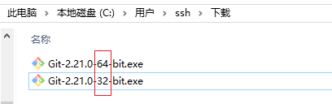

# GIT-目录


1. 能够安装 git
2. 了解 git 的 3 个**区域**
3. 熟练使用 git 的各种**指令**
4. 掌握什么是分支
5. 能够熟练使用**分支**
6. 能够创建 和 使用 **远程仓库**
7. 知道什么是**冲突**和解决

# 问题

阐述一个问题：
大家如何可以开发同一个项目
在公司里边做项目开发，通常是一个团队在开发，不同的人安排开发不同的功能
再做详细划分，有可能同一个功能的同一个 js 程序文件还是要被多人同时进行开发(例如注册功能的 form 表单绘制 和 验证工作 就交给两个人一起开发)
之后大家把开发好的功能程序文件要提交给服务器运行


问题出来了

在同一个时间点(9:00--10:00)，两个人对同一个 js 程序文件(register.js)进行开发，完毕要提交给服务器，这时后提交的文件是要>覆盖先提交文件的


今天学习 git 就是协调团队开发项目，而不会出现文件覆盖问题的

# 介绍

## 什么是

Git 是目前世界上最先进的分布式 源代码 版本控制系统，免费，开源

Git 是一个开源的分布式版本控制系统，用于敏捷高效地处理任何或小或大的项目。
Git 是 Linus Torvalds (林纳斯.托瓦斯) 为了帮助管理 Linux 内核开发而开发的一个开放源码的版本控制软件。
Git 与常用的版本控制工具 CVS, SVN 等不同，它采用了分布式版本库的方式，不必服务器端软件支持。

Git(软件)是 林纳斯.托瓦斯 于 2005 年开发的源代码版本控制系统 ，同时也是 linux 系统内核(1991 年)创始人：


## 同类型产品

- SVN\*\*\*
  全称：Subversion，是一个自由开源的版本控制系统，2000 年开始被开发、应用
  当时产生的背景是 cvs 有明显的缺陷，要找到一个替代品，就是 git

- VSS
  VSS 的全称为 Visual Source Safe 。作为 Microsoft Visual Studio 的一名成员，它主要任务就是负责项目文件的管理，几乎可以适用任何软件项目
  （Visual：可视化的、能看到的）

- CVS
  Concurrent Versions system，是一个常用的代码版本控制软件，现在大多数软件开发公司都使用 git 替代了 CVS（concurrent：协调的、一致的、共同发生的）

svn 和 git 的区别

- **SVN**是集中式版本控制系统，版本库是集中放在R央服务器的，而干活的时候，
  用的都是自己的电脑，所以首先要从中央服务器哪里得到最新的版本，然后干活，干完后，
  需要把自己做完的活推送到中央服务器。集中式版本控制系统是必须联网才能工作，
  如果在局域网还可以，带宽够大，速度够快，如果在互联网下，如果网速慢的话，就纳闷了。

- **Git**是分布式版本控制系统，那么它就没有中央服务器的，每个人的电脑就是一个完整的版本库，
  这样，工作的时候就不需要联网了，因为版本都是在自己的电脑上。既然每个人的电脑都有一个完整的版本库，那多个人如何协作呢？比如说自己在电脑上改了文件 A，其他人也在电脑上改了文件 A，这时，
  你们两之间只需把各自的修改推送给对方，就可以互相看到对方的修改了。

  

## 作用

1. **协同**多人对同一个项目进行开发
2. 解决多人在同时间对相同文件开发的合并**冲突**问题
3. 给每个文件的每次修改操作做**日志标记**，方便后期查找维护

源代码版本控制管理系统 是一个 **时光穿梭机**，可以查看到一个文件之前**某年某月某日某时刻**是什么样子的

# 安装

针对不同操作系统有如下各自的下载安装方式(我们以 windows 系统为主)：

1. Windows 安装

   下载 Git 客户端软件，和普通软件安装方式一样。



​ (根据自己操作位数选取安装，安装步骤选项都设置默认的即可)

​ 安装参考：

​ 

​ 

​ 

​ 

​ 

​ 

​ 

​ 

-

> 文件从版本库更新的 windows 本地，会把其中的行结束符号转变为 win 版的
>
> 文件从本地 commit 提交到版本库后，会把其中的行结束符号会变为 unix 版的
>
> \r\n：是 window 系统换行符号，占据 2 个字节大小 [CRLF]
>
> \n: unix(linux)系统内换行符号，占据 1 个字节大小 [LF]

​ 

​ 

​ 

​ 

​ 安装完毕，鼠标右键会有 git 的相关命令按钮：


# 使用

## 配置用户

给 git 配置账号信息，以便在本地`版本库`中记录各种操作都是那些用户所为

```shell
 git config --global user.name "sunshuhua"
 git config --global user.email "shuhua141@163.com"
```

在 git bash 终端可以实现内容的复制、粘贴

复制：Ctrl+Insert

粘贴：Shift+Insert


## 简单使用

1.创建版本库


2.效果：


3.在 pro01 目录中创建 index.js 文件

​ 

4.利用 git 管理创建好的 index.js 文件

​ 

​ 现在 git 对 index.js 文件已经形成管理

## 三个区域

使用 git 过程中，有三个区域要频繁操作：

1. 工作区：就是自己电脑运行项目文件的目录
2. 暂存区：英文叫 stage, 或 index。一般存放在 ".git 目录下" 下的 index 文件（.git/index）中
3. 版本库：工作区有一个隐藏目录.git，这个不算工作区，而是 Git 的版本库


## 初始化仓库

两种方式:

1. 本地方式，在项目代码目录执行如下指令：

``` shell
git init
```

   > 该命令执行完后会在当前目录生成一个 .git 目录

## 基本操作

### 添加文件到暂存区


```javascript
// 提交单个文件
git add test.txt
// 提交单个目录文件
git add css
// 提交所有文件
git add .|*|-A     // 或.   或*   或-A
```

### 提交文件到版本库


将暂存区**全部**有需要的文件一次性提交到本地**版本库**中。

```javascript
// message 提交的备注信息，方便后期查看维护使用
git commit -m "message";
```


对同一个或多个文件进行多次 commit 后会形成多个版本，每提交一次就形成一个，HEAD(git 的指针，用以指明当前正在使用的版本)默认指向当前最新的版本(当然 HEAD 根据需要也可以指向之前的版本)

## 相关指令

查看文件状态

```shell
git status -s // 简短方式提示日志
git status // 正常提示日志
```

新建、修改的文件通过该指令可以看出对比，

红色表示被 新建/修改，需要执行 add 操作，

绿色表示文件已经处于暂存区，需要执行 commit 操作


> 红色，表示该文件需要执行 add 操作，以便添加到 暂存区


> 绿色，表示该文件目前正处于 暂存区，需要执行 commit，提交到版本库


> 表示 没有文件需要执行 add 或 commit 操作


## 查看操作日志

```shell
git log

看完按q退出
```


# 分支(重要)


在我们的现实开发中，需求往往是五花八门的，同时开发多个需求的情况十分常见，

比如当你正在专注开发一个功能时，突然有一个紧急的 BUG 需要你来修复，

这个时候我们当然是希望在能够保存当前任务进度，再去修改这个 BUG，

等这个 BUG 修复完成后再继续我们的任务。如何实现呢？

通过 Git**创建分支**来解决实际开发中类似的问题。


当前开发的功能先搁浅，立即创建并切换到一个新分支上，并在其上面对一些紧急任务进行处理

这样当前开发任务 和 紧急处理任务 可以不受影响地平行处理

## 什么是git

git 分支是当前开发的一个主线，在该主线上可以通过 add/commit 执行形成多个版本，当不想在该分支开发时，可以创建并切换到另外的一个分支，新分支与之前的分支没有任何关联，两者独立开发，提升开发效率

新分支的内容来至与切换分支，但是与切换分支没有关系了

新分支开发完毕再切换回原分支，文件内容状态还停留在切换之前的样子


## 创建分支 cart

当接到一个新任务时，先创建一个分支，例如购物车功能 git branch cart

新分支会在当前分支原有历史版本的结点上进行创建，我们称其为子分支

```javascript
git branch// 查看所有分支
git branch cart// 创建名称为cart的分支
```

## 切换 cart 分支

```javascript
git checkout cart// 切换到名称为cart的分支上
或
git checkout -b cart// 创建并切换到cart分支上
```


## 在 cart 分支修改操作

对分支内容进行修改，然后 add 和 commit 形成新版本

这次的提交历史版本就会记录在 cart 这个分支上了，并且 HEAD 伴随(cart)在移动


## 切换 master 分支

分支修改提交完毕后，把分支再切换回master 主分支

```shell
git checkout master
```

当我们切换回 master 后，HEAD 指向了离开前的的版本位置，并且发现当前分支的文件内容还是原来的"模样"

HEAD：是指引(指针)，指明当前分支正在使用的版本，默认都是最后的版本，每 commit 一次，就形成一个新版本，HEAD 就会自动向后指明这个版本


注意，版本切换和恢复按照 “从哪来就回哪去” 的原则进行，

例如从 master 的 2 版本切换到 cart 分支的，cart 分支本身也形成了多个版本，那么其再回 master 后，也是原来的 2 版本


体会：

当我们 'git checkout 分支名称'，HEAD 就会指向当前分支的某个版本(可能是最后的版本，也可能是某个)，工作区 中的源码也会随当前分支当前版本发生变化。

这个时候就在当前分支上进行功能开发，而原来分支上的源码并未受到影响。

但是这时的原分支并没有包含进当前分支开发的功能

## 合并 cart 分支

切换回 master 主分支后，使得 cart 分支 与 当前的 master 分支合并，这样 cart 分支的功能代码就融入到 master 主分支里边了

```javascript
git merge cart
```

> git 允许任意两个分支做合并


## 删除 cart 分支

当一个分支的使命完成后，如果失去存在的价值，就可以给其删除掉

```javascript
git branch -d cart
```


小结：

1. 一般项目中 master 主分支不做开发，全部的开发都在分支进行
2. 为了使得 master 分支稳定，会创建一个 develop 分支，并做主要开发，待各个开发好的功能测试没有问题了再合并到 master
3. 一个分支的版本节点可以创建另一个分支，并且分支还可以继续拓扑创建子分支
4. 各个分支的功能开发完毕并测试 ok 后就合并到 master 分支以供访问使用


使用步骤：

1. 查看和创建分支


现在分支情况


每个分支拥有的文件情况：


# 远程仓库(重要)

## 什么是远程仓库

项目开发都是多人协作进行的，目前大家所学的 git 操作都是在本地操作，为了使得多人可以共同开发一个项目和分享彼此的代码就要引入“**远程仓库**”机制


有了远程仓库，开发者在任何电脑上都可以获得到项目的源码并做开发

​ 多人可以针对一个项目贡献代码，并彼此分享，加快项目进度

## 创建远程仓库方式

- 在本地创建
- 通过 github 创建
- 通过 gitlab 创建
- **通过 gitee(码云)创建**

我们采用 gitee 方式 创建远程仓库

码云 Gitee — 基于 Git 的代码托管和研发协作平台

码云(gitee.com)是 OSCHINA.NET 推出的代码托管平台，支持 Git 和 SVN，提供免费的私有仓库托管。目前已有超过 350 万的开发者选择码云

[官网地址<https://gitee.com/>](https://gitee.com/)

## 具体使用

### 注册账号并完善资料

自行注册账号 略过

### 创建共享仓库

1创建仓库


2仓库相关配置


3创建好的仓库


> HTTPS：通过输入码云网站的账号对仓库进行访问使用
>
> SSH：在本地配置秘钥对仓库进行访问使用

## 提交操作

```javascript
git push "远程仓库地址" 分支// 把某一个分支推送到远程仓库
```

> 注意只有 版本库 的文件才可以被 push 推送到远程仓库
>
> 工作区----> 暂存区 -----> 版本库 -----> 远程仓库

通过 gitee 账号，把本地仓库全部版本 push 提交给 gitee 指定仓库


第一次给 gitee 仓库 push 文件会提示输入用户名和密码

此时账号信息会缓存在 windows 系统中，后期操作无需重复输入，如果想要删除该缓存，可以参考下图：


1. 在本地创建版本库和 3 个 js 文件(已经被"add/commit"操作后了)

   

2. 把当前版本库的文件 push 推动到远程仓库

   

3. push 推送好的效果

   

以后工作区每次新建、修改文件都需要执行 add/commit/push3 个操作

## 获取仓库文件

一个远程仓库可以供多个开发者使用，新开发人员加入团队后，首先要执行 git clone 操作，其会把远程仓库的文件 包括 版本库 都复制一份给到当前新开发者

```javascript
git clone "远程仓库地址"// 获取已有仓库的副本到本地
```

通过上述指令，其他用户也可以把 gitee 远程仓库的文件下载到本地(包括.git 版本库也会下载)


现在 pro04 目录已经拥有了项目的文件 和 .git 版本库了


> 上图，已经把 master 子级目录删除了

## 更新本地

git pull 命令的作用是：取回远程仓库某个分支的更新，再与本地的指定分支合并

语法：

```shell
git pull <远程主机名> <远程分支名>:<本地分支名>
```

> git pull 只从远程仓库把本地没有的文件或内容更新下来，不负责下载.git 版本库

```shell
git pull origin master:brantest
```

> 将远程主机 origin 的 master 分支拉取过来，与本地的 brantest 分支合并

```shell
git pull origin master
```

> 表示将远程 origin 主机的 master 分支拉取过来和本地的**当前分支**进行合并


上图：把远程仓库的 master 分支的内容拉取下来与本地的 master 做合并操作

git clone 在一个开发者电脑里边一个项目中执行一次即可

git pull 在一个开发者电脑里边一个项目中执行多次即可

# 冲突 conflict(重要)

## 什么是冲突

用户在 orange 的分支(假设分支名称为 orange)上对 index.js 文件做修改

该用户在 master 分支上还对 index.js 文件做修改

当前分支开发完毕后，当 orange 与 master 主分支合并时，就会有冲突

冲突就是：

- 一个文件被一个人在不同的分支上做修改，当合并时产生的冲撞、融合现象

## 解决步骤

### 创建目标文件

在`master`分支创建 index.js 文件，并初始化内容为如下

```js
aaaaaaaaaa
bbbbbbbbbb
cccccccccc
dddddddddd
eeeeeeeeee
ffffffffff
gggggggggg
```

把这个文件 add/commit 提交到版本库中

```js
git add .
git commit -m 'xxxxxxxx'
```

### 进入其他分支

创建并切换到`apple`分支

```js
$ git checkout -b apple
Switched to a new branch 'apple'
```

并在当前分支修改 index.js 文件内容为如下：

```js
aaaaaaaaaa
bbbbbbbbbb
cccccccccc
ddddddddddmodify by apple
eeeeeeeeee
ffffffffff
gggggggggg
```

add/commit 提交改文件到当前版本库

```js
git add .
git commit -m 'modify by apple'
```

### 切换到 master 分支

```js
$ git checkout master
Switched to branch 'master'
```

> 此时会发现，master 分支的内容还是切换分支之前的

在当前分支修改文件内容为如下：

```js
aaaaaaaaaa
bbbbbbbbbb
cccccccccc
modify by masterdddddddddd
eeeeeeeeee
ffffffffff
gggggggggg
```

add/commit 提交改文件到当前版本库：

```js
git add .
git commit -m 'modify by master'
```

### 合并

现在，`master`分支和`feature1`分支各自都分别有新的提交，变成了这样：


```js
$ git merge apple
Auto-merging index.js
CONFLICT (content): Merge conflict in index.js
Automatic merge failed; fix conflicts and then commit the result.
```

ssh@DESKTOP-SNDUA01 MINGW64 /e/Vue67-68/67/第 11 天/Code/pro05 (**master|MERGING**)

上述：合并失败，告知有**conflict**冲突问题，master|MERGING 提示正在合并

这种情况下，Git 无法执行“合并”操作，因为有两个分支对同一个文件进行修改，现在的文件内容融合为：

上述可知，git 把各自分支对该文件的修改内容都融合到一起，这是一个冲突的现场，

我们需要对冲突内容进行调整，以便消除冲突，具体为：

```js
aaaaaaaaaa
bbbbbbbbbb
cccccccccc
modify by masterddddddddddmodify by apple
eeeeeeeeee
ffffffffff
gggggggggg
```

现在需要对修改后的文件做再次的 add/commit 操作

```js
ssh@DESKTOP-SNDUA01 MINGW64 ~/Desktop/kkk (master|MERGING)
git add .

ssh@DESKTOP-SNDUA01 MINGW64 ~/Desktop/kkk (master|MERGING)
$ git commit -m 'conflict solve'
[master cf41824] conflict solve

ssh@DESKTOP-SNDUA01 MINGW64 ~/Desktop/kkk (master)
```

> 现在"合并"才算完成

现在，`master`分支和`apple`分支的合并变成下图所示：

一次 merge 和一次 commit 两个步骤


合并处理步骤：‘


### 小结

当 Git 无法自动合并分支时，就必须首先解决冲突，再 add/commit 提交，此时 merge 合并才算完成。

解决冲突就是通过 Git 把冲突文件的内容做**融合**，之后手动编辑融合内容区域为我们需要的的样子，再 add/commit 提交。

总结：

1. git 项目源代码版本控制管理软件(svn)

2. 安装使用

3. 常用指令

   1. git add
   2. git commit
   3. git log
   4. git status (-s)

4. 分支

   1. git branch
   2. git branch 名称
   3. git checkout 分支

5. 远程仓库

   1. 码云(github)
   2. git push 主机名 分支
   3. git clone 主机名 分支
   4. git pull 主机名 分支 // 远程仓库内容 与本地当前分支做合并操作

6. 冲突

   1. 一个人在不同的分支对相同的文件进行修改后合并，文件本身有内容**冲撞现场**产生

   2. 解决：手动调整冲撞现场代码为需要的样子，再 add /commit 操作

   3. 真是冲突：A 开发者修改文件提交到 远程仓库

      ​ B 开发者也修改相同文件，再给远程仓库提交时就失败了

      ​ B 就执行 pull 拉取操作，这时候就来冲突了(A 的内容与 B 本地内容做融合操作了)

      ​ B 现在就调整融合内容为需要的样子，在执行 add/commit/push 操作即可

作业：

1. 同座匹配成对
2. A 创建远程仓库，并初始化一些文件到仓库里边
3. B clone A 的远程仓库，也加入开发
4. B 开发文件提交给远程仓库
5. A 尝试 pull 拉取该文件到本地
6. A 和 B 在同一时间对同一个文件**同**一行内容进行修改，A 先提交，B 后提交，B 就失败，自行解决
7. A 和 B 在同一时间对同一个文件**不同**行内容进行修改，A 先提交，B 后提交，B 就失败，自行解决

# 版本切换操作

使用 commit 指令可以不断对文件进行提交操作，同一个文件从创建之日到现在可以被提交 n 次，有时候开发者想要知道这个文件曾经某一个版本的内容是什么，那么可以通过“版本切换”实现

这个版本切换就像`时光穿梭机`一样，可以对 git 使用过程中提交的各个版本进行查看


查看提交历史

git 在使用过程中会经过多次 commit 提交，通过如下指令可以查看提交记录和日志信息。

```javascript
git log// 查看目前有效的commit提交日志
git log --pretty=oneline// 以非常简单的方式显示文件提交日志信息
git reflog// 查看所有commit提交操作的版本号码，包括恢复的
```

> git log 给显示当前版本库全部的历史版本，恢复过的版本不给显示，
>
> git reflog 给显示全部的操作日志，包括恢复的操作

把文件 "版本库" 指定的版本恢复到 "工作区"：

```javascript
git reset --hard 64ff51e      // 把版本号为 64ff51e 的版本恢复到工作区
```

# 客户端图形软件

git 在 windows 系统中有一个图形化软件供使用，非常方便，可以安装使用


根据自己操作系统位数选择安装即可

相关文章

1. [gitee 简明教程](http://www.runoob.com/w3cnote/git-guide.html)
2. [git 鸟哥教程](http://www.runoob.com/git/git-tutorial.html)

## git补充内容

查看远程提交分支:
git remote

remote使用流程:
git init

git add .

git commit -m 'xxx'

设置一次即可
git remote add origin ssh://software@172.16.0.30/~/yafeng/.git

删除远程分支
git remote remove origin

以后可直接推送
git push origin master

remote使用流程2:
git init

git add .

git commit -m 'xxx'

设置一次即可:关联远程master分支,默认推送到master分支上去
git push --set-upstream origin master
