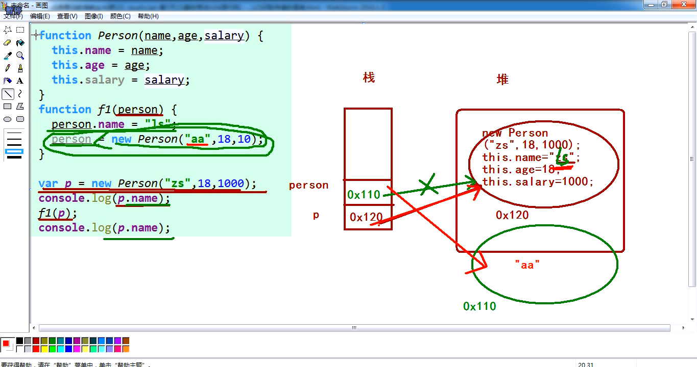

# js 基础

## 1 变量

```js
// 变量的作用：用来操作数据的，可以存储，也可以读取
// 变量的声明： var name;没赋值
// var name='小黑';赋值了
// js声明变量都用var
// js中的每一行代码都要带分号
// js区分大小写
// js中的字符串可以使用单引号和双引号，目前用单引号。

// 变量命名的规范：
// 1.变量名要有意义
// 2.变量名有一定的规范：一般以字母或$符号、下划线开头，中间或后面可以有$符号，字母或数字
// 3.一般是小写
// 4.驼峰命名法：多个单词下，首字母是小写，后面的是大写var bigNumber=10;

// 声明变量并初始化/变量的初始化/声明变量值

var num = 100 //声明了一个num的变量，储存了一个数字100；
alert(num) //弹窗 输出100这个值
console.log(num) //在浏览器的控制台中输出100
```

## 2 五种数据类型

```js
/*
js中的数据类型：number string boolean null undefined object
number数字类型
string字符串类型 一般用单引号或双引号括起来
boolean布尔类型 值有两个：true真（1） false假（0）
null 空类型 一个对象指向为空，此时可以赋值为null
undefined 未定义  值只有一个：undefined
变量声明了但没有赋值时显示该值和函数没有明确返回值，如果接收了，结果也是现实undefined
如果一个变量的结果是undefined和一个数字进行计算，结果：NaN（not a number）
object对象
*/
/*
typeof 的使用语法
typeof 变量名
 */
var num = 10
var str = '小白'
var flag = true
var nll = null
var undef
var obj = new Object()
console.log(typeof num) // 输出为：number
console.log(typeof str) //string
console.log(typeof flag) //boolean
console.log(typeof null) //注意：不是null  是object
console.log(typeof undef) //undefined
console.log(typeof obj) //object
```

### 2.1 数字类型

```js
//进制：
// 八进制 以0开头
// 十进制 就是正常的数字
//  十六进制0x开头

// 数字类型的范围： 最大值和最小值
console.log(Number.MAX_VALUE)
console.log(Number.MIN_VALUE)

//不要用小数验证小数
var x = 0.1
var y = 0.2
var sum = x + y
console.log(sum == 0.3)

//验证NaN
//错误示范：
var num
console.log(num + 10 == NaN)
//如何验证这个结果是不是NaN 用isNaN()
//正确示范：
var num
console.log(isNaN(num)) //不是一个数字？ 不是  输出true
//不是数字为true 是数字为false
```

### 2.2 字符串类型

```js
// var str='10';
//var str="10"; 单引号双引号都可以

//如何看字符串的长度:变量名.length
var str = 'what are you doing'
console.log(str.length)

//转义符：
//html转义符：&lt; &nbsp;
//js中的转义符
//tab是\t
// ' 是\'
//console.log("哈哈哈\t哈哈")

//字符串的拼接：只有一个字符串，那么拼接在一起结果就是数字而不是运算
var str1 = '你好'
var str2 = '我好'
console.log(str1 + str2)

var str3 = '10'
var str4 = '20'
console.log(str3 + str4)
//字符串隐式转换：
var str5 = '10'
var str6 = 5
//浏览器自动将字符串转换为数字，即隐式转换
console.log(str5 - str6)
```

### 2.3 类型间相互转换

```js
//类型转换：
//数字类：
//其他类型转整数
//parseInt();
//console.log(parseInt("10"))     //10
//console.log(parseInt("10sadf"))//10
//console.log(parseInt("gasd10"))//NaN
//console.log(parseInt("10.98"))//10
//console.log(parseInt("10.98sd"))//10
//其他类型转小数
//parseFloat();
//console.log(parseFloat("10"))     //10
//console.log(parseFloat("10sadf"))//10
//console.log(parseFloat("gasd10"))//NaN
//console.log(parseFloat("10.98"))//10.98
//console.log(parseFloat("10.98sd"))//10.98
//其他类型转数字
//Number();
//console.log(Number("10"))     //10
//console.log(Number("10sadf"))//NaN
//console.log(Number("gasd10"))//NaN
//console.log(Number("10.98"))//10.98
//console.log(Number("10.98sd"))//NaN
//总结：想要转整数用parseInt()
//想要转小数用parseFloat()
//想要转数字用Number() 较上两种严格

//其他类型转字符串类型：
//.toString()
var num1 //(无意义)
var num = 10
//若变量有意义，则用.toString()    多数用.toString,但其不能转undefined 和null
console.log(num.toString())
//若变量没意义，则用String()
console.log(String(num1))

//!!!!!!!!!!!!重点记忆，需要判断!!!!!!!!!!!!!!!!!
//其他类型转boolean（值）
// Boolean(值）
console.log(Boolean(1)) //true
console.log(Boolean(0)) //false
console.log(Boolean(11)) //true
console.log(Boolean(-10)) //true
console.log(Boolean('哈哈')) //true
console.log(Boolean('')) //false
console.log(Boolean(null)) //false
console.log(Boolean(undefined)) //false
```

## 3 操作符

```js
//操作符：符号 ，用来计算

//算数运算符： + - * /  %(余数)
//var num=20;
//var result=num%3;
//console.log(result); //2
//除了加法外，减乘除都会进行隐式数据类型转换，转换后仍无法计算,输出值为NaN

/*一元运算符：一个操作数就可以运算的符号
    二元运算符：需要两个操作数进行运算的符号
    三元运算符：三个...


    复合运算符： +=  -=  *=  /=（num=num+10简化写法：num+=10）


    关系运算符： > < >= <=  ==不严格的判断（仅判断值） === 严格（既判断值，又判断类型）    运算的结果是布尔类型。
                          !==   不等于  不严格      !=== 严格
    var str='10';
    var num1=10;
    console.log(str==num1);


    逻辑运算符：
    && 逻辑与 : 一个为false 结果就是false   一假则假
    || 逻辑或 ：一个为true 结果是true       一真则真
    !非 取反
    var num2=10;
    var num3=20;
    console.log(num2==num2&&5>6)
             //false    false     false&&false=false


    /*赋值运算符： = += -= *= /= %= */

/*优先级：
    优先级从高到底
1. ()  优先级最高
2. 一元运算符  ++   --   !
3. 算数运算符  先*  /  %   后 +   -
4. 关系运算符  >   >=   <   <=
5. 相等运算符  ==   !=    ===    !==
6. 逻辑运算符  先&&   后||
7. 赋值运算符  =
  */

//字面量:把一个值直接赋值给一个变量
//var num=10;
//var flag=true;
//var str="哈哈哈"；
//var y=10;    var y=x（不合适称之为字面量）
```

## 4 for 循环

### 4.1 画星星案例

```js
//画星星

//控制行数的---正方形的
for (var i = 0; i <= 5; i++) {
  //控制每一行有几个星星
  for (var j = 0; j <= 5; j++) {
    document.write('★')
  }
  document.write('<br/>')
}

//
//    for(var j=0;j<=2;j++){
//      document.write("★");
//    }

//三角形的---五角星----随着行数的增加,每一行都会比上一行多一个五角星
for (var i = 0; i <= 5; i++) {
  //控制每一行有几个星星
  for (var j = 0; j <= i; j++) {
    document.write('★')
  }
  document.write('<br/>')
}
```

### 4.2 乘法口诀表案例

```js
// for (var i = 1; i <= 9; i++) {
//     for (var h = 1; h <= i; h++) {
//         document.write(h + '*' + i + '=' + h * i);
//     }
//     document.write('<br>')
// }
document.write('<table border=1 colspacing=0 cellspacing=0> ')
for (var i = 1; i <= 9; i++) {
  document.write('<tr>')
  for (var h = 1; h <= i; h++) {
    document.write('<td>')
    document.write(h + '*' + i + '=' + h * i)
    document.write('</td>')
  }
  document.write('</tr>')
}
document.write('</table>')
```

## 5 continue 和 break

### 5.1 break

```js
//break关键字:如果在循环中使用,遇到了break,则立刻跳出当前所在的循环

//    for(var i=0;i<10;i++){
//      while (true){
//        console.log("哈哈");
//        break;//
//      }
//    }
//
//    console.log("哈哈,我出来了");

//找到100到200之间第一个可以被7整除的数字,

for (var i = 100; i <= 200; i++) {
  if (i % 7 == 0) {
    console.log(i)
    break
  }
}
```

### 5.2 continue

```js
//continue:在循环中如果遇到continue关键字,直接开始下一次循环

//    var i=0;
//    while (i<10){
//      console.log("哈哈");
//      //continue;
//      i++;
//    }

//案例:求100-200之间所有的奇数的和（用continue）

//    var sum=0;
//    var i=100;
//    while(i<=200){
//      //判断是不是偶数
//      if(i%2==0){
//       //如果是偶数----->跳过这个数字
//        i++;//102
//        continue;
//      }
//      sum+=i;
//      i++;
//    }
//    console.log(sum);

//案例:求整数100～200的累加值，但要求跳过所有个位为3的数

//    var sum=0;
//    var i=100;
//    while(i<=200){
//      if(i%10==3){
//        //个位数是3,不要
//        i++;
//        continue;
//      }
//      sum+=i;
//      i++;
//    }
//    console.log(sum);

var sum = 0
var i = 1
while (i <= 10) {
  if (i % 10 == 3) {
    //个位数是3,不要
    i++
    continue
  }
  sum += i
  i++
}
console.log(sum)

// console.log(3%10  ==3);
```

## 6 数组

```js
//数组:一组有序的数据
//数组的作用:可以一次性存储多个数据
//数组的定义:
/*
 *
 * 1. 通过构造函数创建数组
 * 语法:
 * var 数组名=new Array();
 * var array=new Array();//定义了一个数组
 * 数组的名字如果直接输出,那么直接就可以把数组中的数据显示出来,如果没有数据,就看不到数据
 *
 * var 数组名=new Array(长度);
 * 如果数组中没有数据,但是有长度---,数组中的每个值就是undefined
 * 构造函数的方式创建数组的时候,如果在Array(一个数字)--->数组的长度(数组元素的个数)
 * 如果在Array(多个值);这个数组中就有数据了,数组的长度就是这些数据的个数
 *
 *
 * 2. 通过字面量的方式创建数组
 *
 * var 数组名=[];//空数组
 * var array=[];
 *
 *
 * 无论是构造函数的方式还是字面量的方式,定义的数组,如果有长度,那么默认是undefined
 *
 * 数组:一组有序的数据
 * 数组元素:数组中存储的每个数据,都可以叫数组的元素,比如:存储了3个数据,数组中3个元素
 * 数组长度:就是数组的元素的个数,比如有3个元素,就说,这个数组的长度是3
 * 数组索引(下标):用来存储或者访问数组中的数据的,索引从0开始,到长度减1结束
 * 数组的索引和数组的长度的关系:长度减1就是最大的索引值
 *
 * 如何设置数组中某个位置的值
 * 数组名[下标]=值;
 * arr[3]=100;
 * 如何获取数组中某个位置的值
 * var result=数组名[下标];
 * console.log(result);
 *
 *
 *
 *
 * */

//通过构造函数的方式定义一个数组
//    var array=new Array(5);//没有数据,空数组
//    console.log(array);
//alert(array);

//就是一个数组---->字面量的方式
//    var arr=[];
//    console.log(arr);

//    var arr1=new Array();//构造函数的方式---空数组
//    var arr2=new Array(5);//构造函数的方式定义了一个数组,数组中有5个元素,数组长度是5,每个数据是undefined
//
//    var arr3=new Array(10,20,1000,40,50,60);
//    console.log(arr3);

//    var arr=new Array(10,20,30,40,100);
//    //console.log(arr[4]);//获取
//    //设置
//    arr[3]=1000;
//    console.log(arr);

//字面量的方式更简单

//    var arr=[10,20,30,40,50,60,70,80,10,20,3043,5];//空数组
//    console.log(arr.length);

/*
 *
 * 请输入班级人数,根据班级人数,输入每个学生的数学成绩,求总成绩,求平均成绩,求最高分,求最低分
 *
 *
 *
 * */
```

注意问题：

```js
//var arr=[10,2,3,4,1];
//长度:5
//索引:0-4
//console.log(arr);
//alert(arr);

//数组中存储的数据类型一定是一样的吗? 类型可以不一样
//    var arr=[10,"哈哈",true,null,undefined,new Object()];
//    console.log(arr);
//数组的长度是不是可以改变呢?
var arr = []
//通过索引来设置数组中的元素的值
arr[0] = 10
arr[1] = 20
console.log(arr.length)
//获取元素的值,通过索引的方式
console.log(arr[2])
//向数组中追加新元素
arr = [1, 2, 3, 4, 5]
arr[arr.length] = 10
arr[arr.length] = 20 //新arr.length代替旧的arr.length
console.log(arr)
//构造函数法和字面量发创建数组长度的区别：
var arr = new Array(4) //4个空元素
console.log(arr)
var user = [4] //一个4
console.log(user)
```

总结数组的基础知识：

```js
/*
 *
 * 数组:存储一组有序的数据
 * 数组的作用:一次性存储多个数据
 * 数组的定义方式:
 * 1.构造函数定义数组: var 数组名=new Array();
 * 2.字面量方式定义数组: var 数组名=[];
 *
 * var 数组名=new Array();空数组
 * var 数组名=new Array(8);定义了数组,有8个长度
 * var 数组名=new Array(值1,值2,值3....);定义数组并且有多个数据
 *
 * var 数组名=[];空数组
 * var 数组名=[值1,值2,值3];有三个数据
 * 数组元素:就是数组中存储的数据
 * 数组长度:就是数组中元素的个数
 * 数组索引(下标):从0开始,到数组的长度减1结束
 * 通过下标设置数组的元素值: 数组名[索引]=值
 * 通过下标访问数组的元素值: 数组名[索引]
 *
 *
 *
 *
 * */

var arr1 = new Array() //空数组
var arr2 = new Array(5) //长度为5的数组,每个数据的值是undefined
var arr3 = new Array(1, 2, 3, 4, 5) //长度为5分数组,
var arr4 = [] //空数组
var arr5 = [1, 2, 3] //长度为3的数组
var arr6 = ['red', 'blue', 'green', 1, true] //数组中元素的值的类型可以不一样

var arr7 = []
//设置数组的元素的值
arr7[0] = 10
arr7[1] = 20
```

## 6.1 冒泡排序

```js
//冒泡排序:把所有的数据按照一定的顺序进行排列(从小到大,从大到下)

var arr = [10, 0, 100, 20, 60, 30]
//循环控制比较的轮数
for (var i = 0; i < arr.length - 1; i++) {
  //控制每一轮的比较的次数
  for (var j = 0; j < arr.length - 1 - i; j++) {
    if (arr[j] < arr[j + 1]) {
      var temp = arr[j]
      arr[j] = arr[j + 1]
      arr[j + 1] = temp
    }
  }
}
console.log(arr)
```

## 7 函数的返回值问题

```js
//函数的返回值:在函数内部有return关键字,并且在关键字后面有内容,这个内容被返回了
//当函数调用之后,需要这个返回值,那么就定义变量接收,即可

/*
 * 如果一个函数中有return ,那么这个函数就有返回值
 * 如果一个函数中没有return,那么这个函数就没有返回值
 * 如果一个函数中没有明确的返回值,那么调用的时候接收了,结果就是undefined
 * (什么是没有明确返回值:函数中没有return,或者函数中有return,但是return后面没有任何内容)
 * 函数没有返回值,但是在调用的时候接收了,那么结果就是undefined,变量声明了,没有赋值,结果也是undefined
 * 如果一个函数有参数,有参数的函数
 * 如果一个函数没有参数,没有参数的函数
 * 形参的个数和实参的个数可以不一致
 * return 下面的代码是不会执行的
 */

//函数定义: 有参数有返回值的函数
function getSum(x, y) {
  return x + y //把和返回
}
//函数调用
var result = getSum(10, 20)
console.log(result + 10)
```

## 8 复习

```js
  /*
     *
     * break:在循环中遇到这个关键字,直接跳出当前所在的循环
     * continue:在循环中遇到这个关键字,直接进行下一次循环
     * 数组:存储一组有序的数据,数据类型可以不一样
     * 数组的作用:一次性存储多个数据
     * 数组元素:数组中存储的每个数据,叫数组元素,存储了5个数据,有5个数组元素
     * 数组的长度:数组的元素的个数,叫数组的长度:数组名.length--->就是长度,数组的长度是可以改变的
     * 索引(下标):存储数组元素的编号,从0开始,到数组的长度-1结束
     * 索引是用来存储和读取数组元素的
     * 遍历数组:通过循环的方式找到数组中的每个数据
     * 冒泡排序:
     * 求数组的和,最大值,最小值,平均值
     *
     * 数组定义的方式:
     * 1. 通过构造函数定义数组
     * var 数组名=new Array();空数组 Array()就是构造函数
     * var 数组名=new Array(长度);是设置数组的初始的长度,长度是可以改变的
     * var 数组名=new Array(值,值,值...);定义数组并设置数组中的元素值
     * 2. 字面量的方式定义数组
     * var 数组名=[];空数组
     * var 数组名=[10];这个数组有一个元素,值是10,长度是1
     * 数组变量
     * for(var i=0;i<数组名.length;i++){
     *
     * }
     *
     *
     * 函数:把一些重复的代码封装起来,在需要的时候直接调用这个函数就可以了
     * 函数作用:代码的重用
     * 函数定义:
     * function 函数名(){
     *     函数体
     * }
     * 函数调用:
     * 函数名();
     *
     * 参数:形参和实参
     * 形参:函数定义的时候函数名字后面的小括号里的变量就是参数,是不需要写var
     * 实参:函数调用的时候小括号里传入的变量或者是值,都是实参
     * 返回值:函数中如果有return,那么这个函数就有返回值
     * 如果函数中没有return,那么这个函数没有返回值
     * 如果函数中有return,但是后面什么内容都没有,这个函数没有明确返回值
     * 如果一个函数没有明确的返回值,函数调用了,并且接收了,那么此时接收的结果undefined
     * 如果直接输出函数名字,那么是这个函数的代码
     * 无参数无返回值的函数
     * function f1(){
     *
     * }
     * 有参数无返回值的函数,2个参数
     * function f2(x,y){
     *
     * }
     * 无参数有返回值的函数
     * function f3(){
     *   return 100;
     * }
     * 有参数有返回值的函数
     * function f4(x){
     *  return "您好";
     * }
     *
     *
     *
     *
     * */


    var arr = [1, 5, 10, 3, 100, 20];
    //循环控制比较的轮数
    for (var i = 0; i < arr.length - 1; i++) {
      //此时只是比较了一次---如果想要比较多次--for循环
      for (var j = 0; j < arr.length - 1 - i; j++) {
        if (arr[j] < arr[j + 1]) {
          var temp = arr[j];
          arr[j] = arr[j + 1];
          arr[j + 1] = temp;
        }
      }
    }
    console.log(arr);
  </script>
  <script>
    //    //隐式全局变量
    //    for( i=0;i<10;i++){
    //      console.log("今天天气真好");
    //    }
  </script>
```

## 9 函数汇总

### 9.1 arguments 伪数组

```js
//计算n个数字的和
//    function f1() {
//      //获取的是函数在调用的时候,传入了几个参数
//      //console.log(arguments.length);
//      //使用arguments对象可以获取传入的每个参数的值
//      console.log(arguments);
//    }
//    f1(10,20,30,40,100,200);//调用

function f1() {
  //arguments----->数组使用------它是一个对象，是一个伪数组
  var sum = 0
  for (var i = 0; i < arguments.length; i++) {
    sum += arguments[i]
  }
  return sum
}
console.log(f1(10, 20, 30))
```

### 9.2 函数的其他定义方式

```js
/*
 * 命名函数:函数如果有名字,就是命名函数
 * 匿名函数:函数如果没有名字,就是匿名函数 !!注意:!!匿名函数表达式后面,赋值结束后,要加分号
 *
 * 函数的另一种定义方式
 * 函数表达式:
 * var f1=function (){};
 * 如果是函数表达式,那么此时前面的变量中存储的就是一个函数,而这个变量就相当于是一个函数,就可以直接加小括号调用了
 * f1();
 */

//函数的自调用,没有名字--声明的同时,直接调用
//不与其他函数冲突，不能重复调用，一次性的------
;(function() {
  console.log('阿涅哈斯诶呦')
})()
;(function() {
  console.log('嘎嘎')
})()

//函数声明
function f1() {
  console.log('助教好帅哦')
}
f1()

function f1() {
  console.log('小苏好猥琐哦') //覆盖上面的，两次fl();都是调用的小苏好猥琐
}
f1()

//函数表达式
var f2 = function() {
  console.log('助教没有小杨帅')
}
f2()
f2 = function() {
  console.log('小杨真的很帅') //两次都能输出
}
f2()
//函数自调用
;(function() {
  console.log('阿涅哈斯诶呦')
})()
;(function() {
  console.log('嘎嘎')
})()

// 函数也是一种数据类型
function f1() {
  console.log('我是函数')
}
//如何获取某个变量的类型? typeof
console.log(typeof f1)
//函数是有数据类型,数据类型:是function 类型的
```

### 9.3 函数作为参数使用

```js
//函数可以作为参数使用,如果一个函数作为参数,那么我们说这个参数(函数)可以叫回调函数
//只要是看到一个函数作为参数使用了,那就是回调函数
function sayHi(fn) {
  console.log('您好啊')
  fn() //fn此时应该是一个函数
}

function suSay() {
  console.log('我猥琐,我邪恶,我龌龊,小苏说')
}
sayHi(suSay)
```

## 10 作用域&全局变量

```js
//作用域:使用的范围
/*
 * 全局变量:声明的变量是使用var声明的,那么这个变量就是全局变量,全局变量可以在页面的任何位置使用
 * 除了函数以外,其他的任何位置定义的变量都是全局变量
 * 局部变量:在函数内部定义的变量,是局部变量,外面不能使用 eg:形参是局部变量
 * 全局变量,如果页面不关闭,那么就不会释放,就会占空间,消耗内存
 *
 * 全局作用域:全局变量的使用范围
 * 局部作用域:局部变量的使用范围
 *
 * 块级作用域:一对大括号就可以看成是一块,在这块区域中定义的变量,只能在这个区域中使用,但是在js中在这个块级作用域中定义的变量,外面也能使用;
 * 说明:js没有块级作用域,只有函数除外
 *
 * 隐式全局变量:声明的变量没有var,就叫隐式全局变量
 * 全局变量是不能被删除的,隐式全局变量是可以被删除的
 * 定义变量使用var是不会被删除的,没有var是可以删除的
 */
```

## 11 作用域链

```js
var num = 10

function f1() {
  var num = 20

  function f2() {
    var num = 30

    function f3() {
      var num = 50
      console.log(num)
    }
    f3()
  }
  f2()
}
f1()
```

## 12 预解析

```js
//预解析:提前解析代码
/*
 *
 * 预解析:就是在解析代码之前
 * 预解析做什么事?
 * 把变量的声明提前了----提前到当前所在的作用域的最上面
 * 函数的声明也会被提前---提前到当前所在的作用域的最上面
 *
 *
 */

//函数调用的时候,把会函数的声明提升到作用域的上面
f1() //调用
var num = 20 //这个变量的声明会提升到变量使用之前
function f1() {
  console.log(num)
  //var num=10;
}
//把变量的声明提前了
var num
console.log(num)
num = 10
function f1() {
  console.log('哈哈,助教好猥琐哦')
}
f1() //报错
```

### 12.1 预解析中的局部作用域

```js
 //预解析中,变量的提升,只会在当前的作用域中提升,提前到当前的作用域的最上面
    //函数中的变量只会提前到函数的作用域中的最前面,不会出去
    //预解析会分段(多对的script标签中函数重名,预解析的时候不会冲突)

//    function f1() {
//
//      console.log(num);//undefined
//      var num=10;
//    }
//    f1();
//    console.log(num);//
    function f1() {
      console.log("哈哈");
    }

  </script>
  <script>
    f1();
    function f1() {
      console.log("嘎嘎");
    }
```

### 12.2 预解析练习题

```js
// var a = 25;

// function abc() {
//   alert(a); //undefined
//   var a = 10;
// }
// abc();
// console.log(a); //25

// var a;

// function a() {
//   console.log('aaaaa');
// }
// console.log(a); //函数的代码

// a = 1;
// console.log(a); //1

// var a = 18;

// function f1() {
//   var b = 9;
//   console.log(a); //undefined
//   console.log(b); //9
//   var a = "123";
// }
// f1();

// function f1() {
//   var a; //局部变量
//   a = 9;
//   //隐式全局变量
//   b = 9;
//   c = 9;
//   console.log(a); //9
//   console.log(b); //9
//   console.log(c); //9
// }
// f1();
// console.log(c); //  9
// console.log(b); // 9
// console.log(a); //报错

f1() //f1 not a function
var f1 = function() {
  console.log(a)
  var a = 10
}
```

复习:

```js
/*
 * 复习:
 * 函数:把一些重复的代码封装在一个地方,在需要的时候直接调用这个地方的代码就可以了
 *
 * 函数作用:代码重用
 *
 * 函数的参数:
 * 1.形参:函数定义的时候,函数名字后面的小括号里的变量
 * 2.实参:函数调用的时候,函数名字后面的小括号里的变量或者值
 *
 * 返回值:
 * 函数中有return，函数有返回值
 * 函数中没有return,函数没有返回值
 * 没有明确返回值:函数中没有return或者return后面没有任何内容
 * 如果一个函数没有明确的返回值,接收这个函数,结果是undefined
 *
 * 无参数无返回值的函数
 * 无参数有返回值的函数
 * 有参数无返回值的函数
 * 有参数有返回值的函数
 *
 * arguments----->可以获取函数调用的时候,传入的实参的个数
 * arguments是一个对象,是一个伪数组
 * arguments.length--->是实参的个数
 * arguments[索引]---->实参的值
 *
 * 作用域:变量的使用范围
 * 全局作用域:全局变量在任何位置都可以使用的范围
 * 局部作用域:局部变量只能在某个地方使用---函数内
 * 作用域链:在一个函数中使用一个变量,先在该函数中搜索这个变量,找到了则使用,找不到则继续向外面找这个变量,找到则使用,一直找到全局作用域,找不到则是undefined
 * 全局变量:只要是在函数外面声明的变量都可以看成或者是理解成是全局变量
 * 局部变量:在函数中定义的变量
 *
 * 预解析:在执行代码之前做的事情
 * 变量的声明和函数的声明被提前了,变量和函数的声明会提升到当前所在的作用域的最上面
 * 函数中的变量声明,会提升到该函数的作用域的最上面(里面)
 * 如果有多对的script标签都有相同名字的函数,预解析的时候是分段的,互不影响
 *
 * */
```

## 13 对象

### 13.1 字面量方式创建对象

```js
var zs = {}
//设置属性1   对象名.键名 = 值;  常用
zs.name = '张三'
zs.age = 30
zs.height = 160
//设置属性2  对象名['键名'] = 值;
zs['weight'] = 170
// 设置对象方法1(行为)  用的是函数
zs.eat = function() {
  console.log(zs.name + '喜欢吃榴莲')
}
// 设置对象方法2(行为)
zs['play'] = function() {
  console.log(zs.name + '喜欢看直播')
}
//调用属性1    对象名.键名
// console.log(zs.age);
// console.log(zs.weight);
// 调用属性2
// console.log(zs['weight']);  对象名['键名']
// console.log(zs['age']);
// 调用对象的方法1
// zs.eat();
// 调用对象方法2
zs['play']()
```

删除和检测属性的方法：

```js
var zs = {
  //字面量构造函数
  name: '张三',
  age: 18,
  height: 170,
  eat: function() {
    console.log(this.name + '喜欢吃榴莲')
  }
}
// 删除对象属性和方法  delete 对象名.键名  delete 对象名['键名']
delete zs.age
console.log(zs.age) //属性已删除，显示undefined
// delete zs.eat;
// zs.eat(); //属性已删除，报错

// 检测是否有某个属性或者方法 如果存在,就返回一个true,不存在返回一个false
var b = zs.hasOwnProperty('play')
console.log(b)
```

### 13.2 自定义构造函数创建对象

```js
//自定义函数构造创建对象:
function Student(name, age, studentNumber, gender, favour, like) {
  this.name = name
  this.age = age
  this.studentNumber = studentNumber
  this.gender = gender
  this.favour = favour
  this.like = like
  this.goodAt = function() {
    console.log(this.name + '喜欢' + this.like)
  }
}
var xm = new Student('小明', 18, 9527, '男', '敲代码', '唱歌')
var xh = new Student('小红', 21, 4816, '女', '敲代码', '跳舞')
var xb = new Student('小白', 22, 4811, '女', '敲代码', '跳广场舞')
var xl = new Student('小绿', 23, 4812, '男', '敲代码', '跳街舞')
var xf = new Student('小粉', 24, 4813, '女', '敲代码', '跳迪斯科')
console.log(xm, xh, xb, xl, xf)
xl.goodAt()
for (var key in xm) {
  console.log(key + '===========' + xm[key])
}
```

new 方法创建对象后做的四件事：JSPRO 中有

add:

```js
/*
 * js是一门什么样的语言?
 * 是一门解释性的语言
 * 是一门脚本语言
 * 是一门弱类型语言,声明变量都用var
 * 是一门基于对象的语言
 * 是一门动态类型的语言:
 * 1. 代码(变量)只有执行到这个位置的时候,才知道这个变量中到底存储的是什么,
 * 如果是对象,就有对象的属性和方法,如果是变量就是变量的作用
 * 2. 对象没有什么,只要点了,通过点语法,那么就可以为对象添加属性或者方法
 */
```

### 13.3 for in 遍历对象

```js
var json = {
  name: '小明',
  age: '10',
  sex: '男'
}
//遍历对象,不能通过for循环遍历,因为对象无序
//key是一个变量,这个变量中存储的是该对象的所有的属性的名字
//遍历可以通过for in循环
for (var key in json) {
  //key表示对象中所有属性的名字
  console.log(json[key]) //不能使用json.key   会让系统误会为某一对象内容
}
```

## 14 复杂数据类型和简单数据类型

```js
/*原始数据类型: number,string,boolean,undefined, null,object{
        1. 基本类型(简单类型), 值类型: number, string, boolean
        2. 复杂类型(引用类型): object Array
        3. 空类型: undefined, null
    }*/

//值类型的值在哪一块空间中存储? 栈中存储
//引用类型的值在哪一块空间中存储?地址在栈上存储，对象在堆上存储,占用了两块空间

//var num=10;//值类型,值在栈上
//var obj={};//复杂类型,对象在堆,地址(引用)在栈

//值类型之间传递,传递的是值
var num = 10
var num2 = num //传递的值
//引用类型之间传递,传递的是地址(引用)即堆上的对象所指向栈的地址
var obj = {
  name: '小明'
}

function f2(obj2) {
  obj2.name = '小红'
}
console.log(obj.name) //
f2(obj)
console.log(obj.name) //
```

## 15 复杂类型的值的传递



## 16 内置对象的方法

Math Date String Array Object
内置对象： js 系统自带的对象

### 16.1 Math 对象

可查 MDN----在线的帮助文档

```js
//实例对象:通过构造函数创建出来,实例化的对象，实例方法必须通过实例对象调用
//静态对象:不需要创建,直接就是一个对象,方法(静态方法)直接通过这个对象名字调用,静态方法必须通过大写的对象调用

//Math.PI----π---
//console.log(Math.PI);
// Math.round(数字);   四舍五入

//Math.E----常数的底数
//console.log(Math.E);

//Math.abs(值)-----绝对值
//    console.log( Math.abs('-1'));//1
//    console.log( Math.abs(-2));//2
//    console.log(Math.abs(null));//---------0  重点
//    console.log(Math.abs("string"));//NaN

//Math.ceil(值)----向上取整
//    console.log(Math.ceil(12.3));   //输出的值均为13
//    console.log(Math.ceil(12.9));
//    console.log(Math.ceil(12.09));
//    console.log(Math.ceil(12.03));
//    console.log(Math.ceil(12.92));

//Math.floor(值)---向下取整
//    console.log(Math.floor(12.3)); //输出的值均为12
//    console.log(Math.floor(12.9));
//    console.log(Math.floor(12.09));
//    console.log(Math.floor(12.03));
//    console.log(Math.floor(12.92));

//找一坨数字中的最大值
//    console.log(Math.max(10,1,9,100,200,45,78));
//找一坨数字中的最小值
//    console.log(Math.min(10,1,9,100,200,45,78));

//随机数：
//console.log(parseInt(Math.random() * 5) + 1); //0-4随机取   没有5   +1后有5
//console.log(parseInt(Math.random() * 100) + 1); //0-100随机取   没有100   +1后有100

// add:
// Math.ceil()---向上取整
// Math.floor()---向下取整
// Math.Pi----圆周率的值
// Math.max()---一组数字中的最大值
// Math.min()---一组数字中的最小值
// Math.abs()----绝对值
// Math.random---随机数字
// Math.sqrt()----开平方
// Math.pow()----一个数字的多少次幂
```

### 16.2 Date 对象

```js
//创建实例对象
// var dt = new Date("2017-08-12");  //此处记得加字符串,也可写作("2017/08/12")
// //传入的时间
// console.log(dt);

//var dt=new Date;//传入的时间
//console.log(dt);

// var dt = Date.now(); //获取时间的对象    //此方法获取到的是以毫秒为单位的当前时间
// console.log(dt);

// var dt = new Date(); //要先传入当前时间

//console.log(dt.getFullYear()); //获取年份

//console.log(dt.getMonth()+1); ///注意！！！！获取月份，得到的数值是从0开始的 真实的月份是需要加1的

//console.log(dt.getDate());//获取日

//console.log(dt.getHours()); //获取小时

//console.log(dt.getMinutes());  //获取分钟

//console.log(dt.getSeconds());//获取秒

//console.log(dt.getDay());////获取星期，注意！！！！星期从0开始的

// 总结：
//var dt=new Date();
//var dt=+new Date();//前面的加号是一种特殊的写法,只适用于这个Date的对象
//console.log(dt);

//dt.getFullYear();//年
//dt.getMonth();//月---从0开始
//dt.getDate();//日
//dt.getHours();//小时
//dt.getMinutes();//分钟
//dt.getSeconds();//秒
//dt.getDay();//星期---从0开始
//dt.toDateString();//日期
//dt.toLocaleDateString();//日期
//dt.toTimeString();//时间
//dt.toLocaleTimeString();//时间
//dt.valueOf();//毫秒
```

### 16.3 String 对象

```js
/*
 * String---->是一个对象
 * 字符串可以看成是字符组成的数组,但是js中没有字符类型
 * 字符是一个一个的,在别的语言中字符用一对单引号括起来
 * 在js中字符串可以使用单引号也可以使用双引号
 * 因为字符串可以看成是数组,所以,可以通过for循环进行遍历
 *
 * 字符串特性:不可变性,字符串的值是不能改变
 *
 * 字符串的值之所以看起来是改变的,那是因为指向改变了,并不是真的值改变了
 *
 */

//    var str="hello";
//    str[1]="W";  字符串可以通过索引访问字符串中的某个值 但是,是可以访问---读取---只读,不能更改

//对象的方式来看待

//    var str="小苏好猥琐";
//    str="小苏好邪恶了";//重新赋值的过程，字符串没发生改变，仅仅是在堆中的指向发生了改变，而不是更改字符串
//    console.log(str);

//String对象

//    string ---->字符串类型----基本类型
//    String---->字符串类型----引用类型

//字符串对象----String对象

//js中没有字符类型
//字符类型
//字符串类型

//    var str="hello";//可以看成是一个字符数组
//    for(var i=0;i<str.length;i++){
//      console.log(str[i]);    //遍历字符串
//    }

// 总结

/*
 *
 * 实例方法---->必须要通过new的方式创建的对象(实例对象)来调用的方法
 * 静态方法---->直接通过大写的构造函数的名字调用的方法(直接通过大写的对象名字调用的)
 *
 * */

//字符串的常用属性:
// .length------>字符串的长度
//console.log(str.length);

// .charAt(索引),返回值是指定索引位置的字符串,超出索引,结果是空字符串
// var str = "whatareyounoshalei";
// var result = str.charAt(10000);
// console.log(result); //空字符串

// String.fromCharCode(数字值,可以是多个参数),返回的是ASCII码对应的值
// var str = String.fromCharCode(83, 79, 83);;
// console.log(str);

// .concat(字符串1,字符串2,...);返回的是拼接之后的新的字符串
// var str = "小苏";
// console.log(str.concat("喜欢", "凤姐", "这是", "真的"));

// .indexOf(要找的字符串,从某个位置开始的索引);返回的是这个字符串的索引值,没找到则返回-1
// var str1 = 'hello amen';
// var index1 = str1.indexOf('e');
// console.log(index1);

// .lastIndexOf(要找的字符串);从后向前找,但是索引仍然是从左向右的方式,找不到则返回-1
// var str = "helo amen";
// var index = str.lastIndexOf("e");
// console.log(index);

// .replace("原来的字符串","新的字符串");用来替换字符串
// var str = "小苏好帅哦,真的好勇敢哦";
// str = str.replace('帅', '丑'); //第一个值为原字符串的值，第二个值是要替换成的值,但是只能字符串中的替换第一个字
// console.log(str);

// .slice提取字符串，(开始的索引,结束的索引)： 从索引5的位置开始提取,到索引为10的前一个结束,没有10，并返回这个提取后的字符串
// var str = "如果有一天我邪恶了,请记住,我曾纯洁过";
// str = str.slice(5, 10);
// console.log(str); //结果：我邪恶了,

// .split("要干掉的字符串",切割后留下的个数);切割字符串
// var str = "乔峰|慕容|凤姐|梅超风|小苏|大蛇丸";
// var str1 = str.split("|");
// console.log(str1); //结果切割成了数组样式的字符串
// for (var i = 0; i < str1.length; i++) {
//   console.log(str1[i]); //遍历数组
// }

// .substr截取新的字符串：(开始的位置,个数);
// var str = "哈哈,小苏真的是好帅哦";
// str = str.substr(5, 5);
// console.log(str); //结果：真的是好帅

// .substring截取新的字符串：(开始的索引,结束的索引)
// var str = "哈哈,小苏真的是好帅哦";
// str = str.substring(5, 9); //不包含第9个
// console.log(str); //结果：真的是好

// .toLocaleLowerCase();转小写
// .toLowerCase();转小写
// var str = "HELLO";
// str = str.toLocaleLowerCase();
// console.log(str);

// // .toLocaleUpperCase()转大写
// // .toUpperCase();转大写
// var str = "hello";
// str = str.toLocaleUpperCase();
// console.log(str);

// // .trim();干掉字符串两端的空格
// var str = "   哦,这    是一个神奇的一天   ";
// str = str.trim();
// console.log(str);
```

### 16.4 Array 对象

```js
// Array.isArray(对象)---->判断这个对象是不是数组
//1.instanceof关键字
// var obj = [];
// console.log(obj instanceof Array); //true
//2.使用数组的
// console.log(Array.isArray(obj)); //true

//!!!!! //  .push(值);--->把值追加到数组中,加到最后---返回值也是追加数据之后的数组长度
// var arr = [10, 20, 30, 40, 50];
// var result = arr.push(100);
// console.log(result); //6，输出的是追加新元素后数组的长度
// console.log(arr); //输出的是追加新元素后的数组

//!!!!! //  .pop();--->删除数组中最后一个元素,返回值就是删除的这个值
// var arr = [10, 20, 30, 40, 50];
// var result = arr.pop();
// console.log(result); //50，输出的是删除的值
// console.log(arr); //输出的是删除元素后的数组

//!!!!! //  .shift();--->删除数组中第一个元素,返回值就是删除的这个值
// var arr = [10, 20, 30, 40, 50];
// var result = arr.shift();
// console.log(result); //10，输出的是删除的值
// console.log(arr); //输出的是删除元素后的数组

//!!!!! //  .unshift();--->向数组的第一个元素前面插入一个新的元素,----返回值是插入后的长度
// var arr = [10, 20, 30, 40, 50];
// var result = arr.unshift(1);
// console.log(result); //6，输出的是追加新元素后数组的长度
// console.log(arr); //输出的是追加新元素后的数组

//  .concat(数组,数组,数组,...) 用来组合一个新的数组
// var arr1 = [10, 20, 30];
// var arr2 = [40, 50, 60];
// console.log(arr1.concat(arr2));

//  .every(函数)--用来筛选数组中的值:函数中进行对比 若每一个值都符合条件 则返回true
//函数中有三个参数,第一个参数是元素的值，第二个参数是索引值,第三个参数是原来的数组(没用)
//返回值是布尔类型,函数作为参数使用，如果这个数组中的每个元素的值都符合条件,最后才返回的是true
// var arr = [1000, 2000, 3000];
// //a----: 元素的值
// //b----: 索引的值
// //c----:谁调用了这个方法,那么c就是谁---->arr
// var flag = arr.every(function (a, b) {
//   return a > 2000; //数组中的每个元素的值都要大于2000的情况,最后才返回true
// });
// console.log(flag); //false

// .some 相当于every翻转 -- 用来筛选数组中的值:函数中进行对比 若有一个符合条件 则返回true

:::tip
currentValue 必选。循环遍历过程中，每个元素的值

index 可选。当前元素的索引值

arr 可选。就是对当前操作的数组；

thisValue 可选。就是指的this；如果不写该值，则在callback中的this指向的时window，如果写了则this指向你写的值；

:::

//  .filter(函数);返回的是数组中每一个元素都符合条件的元素,组成了一个新的数组
// var arr = [1000, 2000, 3000];
// //a----: 元素的值
// //b----: 索引的值
// var flag = arr.filter(function (a, b) {
//   return a > 2000; //筛选数组中大于2000的元素并输出
// });
// console.log(flag); //3000

//  .map(函数);--->数组中的每个元素都要执行这个函数,把执行后的结果重新的全部的放在一个新的数组中
// var numbers = [1, 4, 9];
// var roots = numbers.map(Math.sqrt); //sqrt开根号
// console.log(roots);

//  .forEach(函数)方法---遍历数组用---相当于for循环
// var arr = [10, 20, 30, 40];
// arr.forEach(function (ele, index) { //ele数组的元素值,index元素下标    Orz...其他值也可以
//   console.log(ele + '======' + index);
// });

// //  .indexOf(元素值);返回的是索引,从前往后数,没有则是-1  // lastIndexOf  用法一致，从后往前数索引
// var arr = [10, 20, 30, 40];
// var index = arr.indexOf(400);
// console.log(index); //-1

//  .join("字符串");在数组的每个元素中间加一个字符串----返回的是一个字符串
// var arr = ["小白", "小黑", "小红", "小芳", "小绿", "小苏"];
// var str = arr.join("|");
// console.log(str);


//  .reverse();----->反转数组
// var arr = [10, 20, 30, 40, 50];
// arr.reverse(); //反转数组元素，括号里的值为空
// console.log(arr);

//  .sort();---排序的,可能不稳定,如果不稳定,请写MDN中的那个固定的代码
// var arr = [1, 40, 20, 10, 100];
// arr.sort(function (a, b) { //稳定写法  从小到大
//   return a - b;
// })
// console.log(arr);
// arr.sort(function (a, b) { //稳定写法  从大到小
//   return b - a;
// })
// console.log(arr);

//.slice(开始的索引,结束的索引);------把截取的数组的值放在一个新的数组中
// var arr = [10, 20, 30, 40, 50, 60, 70, 80, 90, 100];
// var newArr = arr.slice(3, 7); //不包括7
// console.log(newArr);

//.splice(开始的位置,要删除的个数,替换的元素的值);一般是用于删除数组中的元素,或者是替换元素,或者是插入元素
// var myFish = [1, 2, 3, 4];
// myFish.splice(2, 0, 'h','i'); // 在索引为2的位置后插入'h'
// console.log(myFish);
```

补充：

```html
<!DOCTYPE html>
<html lang="en">
<head>
  <meta charset="UTF-8">
  <title>Document</title>
</head>
<body>
  <script type="text/javascript">
  /*
    数据相关api
    map
    filter
    some
    forEach
    findIndex
    push
    unshift
    slice
    splice
  */
  var arr = [1,2,3,4,5,6];
  // var arr1 = [];
  // arr.forEach(item=>{
  //   arr1.push(item + 1);
  // });
  // console.log(arr1)

  // map的作用：对数组中原有数据进行加工处理，形成一个新的数组，新数组中包含所有加工之后的数据
  // var arr1 = arr.map(item=>{
  //   // return item + 1;
  //   // return item * item;
  //   return 123;
  // });
  // console.log(arr1)

  // filter的作用：过滤出原有数组中符合条件的数据
  // var arr2 = arr.filter(item=>{
  //   // 返回值表示过滤条件
  //   // return item > 4;
  //   return item > 2 && item < 5;
  // });
  // console.log(arr2)

  // some 作用：判断数组中是否包含符合条件的数，只要有一个就返回true，否则返回false据
  // var flag = arr.some(item=>{
  //   return item > 3;
  // });
  // console.log(flag)
  
  // var currentIndex = null;
  // arr.forEach((item, index)=>{
  //   if(item == 3) {
  //     currentIndex = index;
  //   }
  // });
  // console.log(currentIndex)

  // var currentIndex = null;
  // arr.some((item, index) => {
  //   if(item == 3) {
  //     // 找到了数据，保存对应索引，终止继续遍历
  //     currentIndex = index
  //     // 终止遍历
  //     return true;
  //   }
  //   console.log('------------')
  // })
  // console.log(currentIndex)

  // findIndex 查找符合条件的数据的索引
  var index = arr.findIndex(item=>{
    return item == 3;
  });
  console.log(index)

  </script>
</body>
</html>
```

## 17 基本包装类型

```js
//基本包装类型

//普通变量不能直接调用属性或者方法
//对象可以直接调用属性和方法

//基本包装类型:本身是基本类型,但是在执行代码的过程中,如果这种类型的变量调用了属性或者是方法,
//那么这种类型就不再是基本类型了,而是基本包装类型,这个变量也不是普通的变量了,而是基本包装类型对象
//string number boolean

//    var str="hello";
//    str=str.replace("ll","HH"); //调用了方法 所以就不是基本类型了 而是基本包装类型
//    console.log(str);

//    var str=new String("hello");
//    str=str.replace("ll","HH");
//    console.log(str);
//    str=null;

//    var num=10;//number---->
//    console.log(num.toString());

//布尔值下：
//如果是一个对象&&true,那么结果是true
//如果是一个true&&对象,那么结果是对象
var flag = new Boolean(false)
var result = flag && true //输出为true
//  var result=true&&flag;  //输出为flag对象
console.log(result)

//    var num=10;
//    var num2=Number("10");//转换,没有new---类型转
//    var num3=new Number("10");//基本包装类型
```
