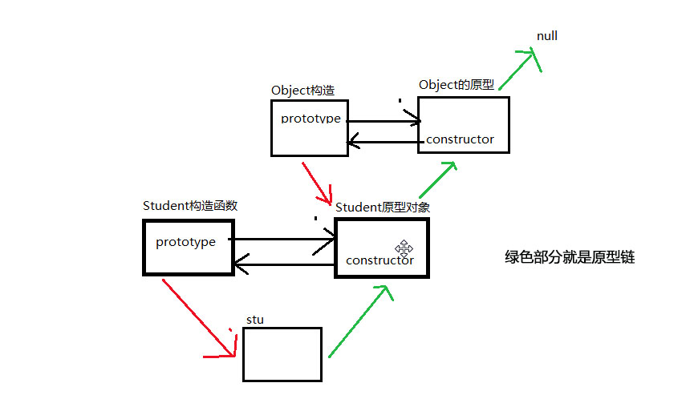
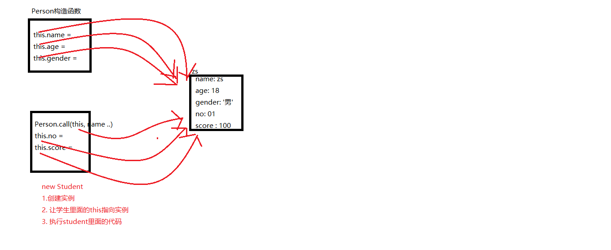
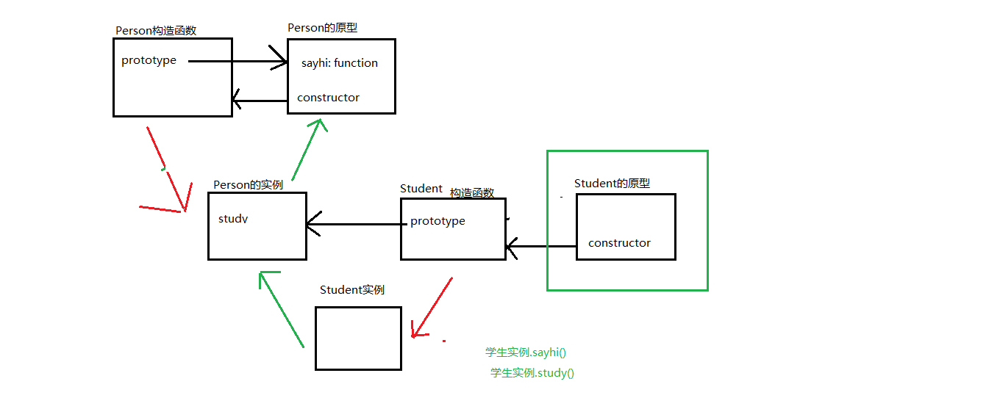
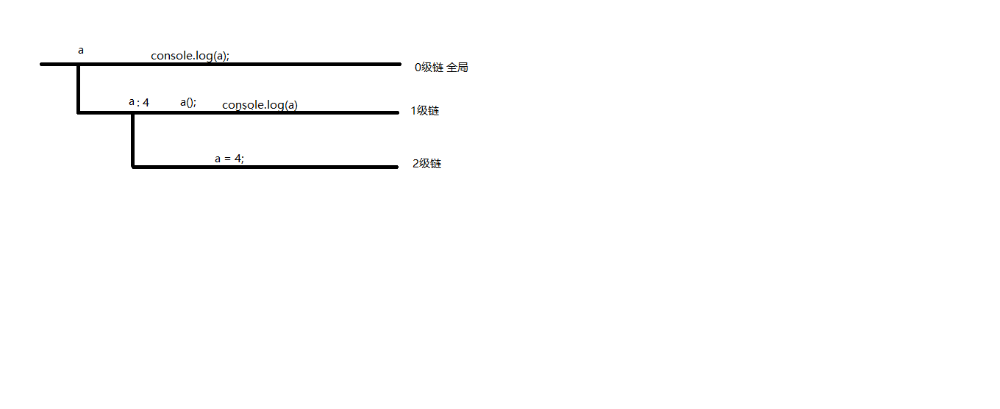
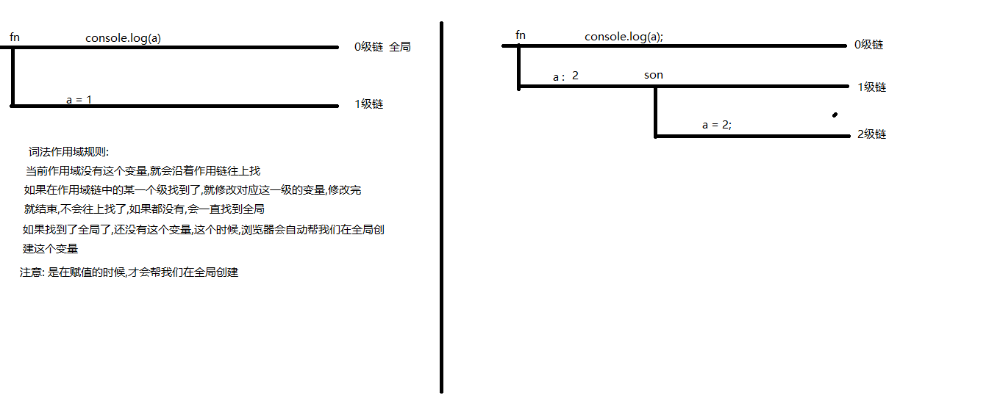

# js 高级

## 1 面向对象理论部分

### 1.1 面向过程和面向对象

- 向过程：关注的是过程中的每一步
- 面向对象：关注的是对象能做什么，通过对象编程
  > PS:面向对象不是替代面向过程，而是对过程的高度封装。

### 1.2 如何面向对象编程

- 面向对象编程的概念：
  Object Oriented Programming，简称 OOP ，是一种编程开发思想 。它将真实世界各种复杂的关系 ，抽象为一个个对象 ，然后由对象之间的分工与合作，完成对真实世界的模拟。
### 1.3 面向对象的好处
- 适合大型项目的开发，提高开发效率
- 易于维护
### 1.4 面向对象的特征
- 封装
- 继承
- 多态

## 2 对象

### 2.1 自定义构造函数创建对象

```javascript
function Student(name, age, gender) {
  // 属性
  this.name = name
  this.age = age
  this.gender = gender
  // 方法
  this.run = function() {
    console.log('我要奔跑了....')
  }
  this.sayHi = function() {
    console.log('我叫' + this.name + ',今年' + this.age)
  }
}
// 调用函数创建一个学生对象
var zs = new Student('张三', 10, '男')
```

### 2.2 构造函数和普通函数的区别

```javascript
var zs = new Student('张三', 10, '男') // 通过new关键字调用，就是构造函数
var zs = Student('张三', 10, '男') // 没有通过new关键字调用就是普通函数
```

函数的性质要依据调用的方式决定

### 2.3 new 关键字的执行过程

- new 关键字的执行过程：

  - 向内存申请一块空间，存放对象数据。
  - 让 this 关键字指向申请的空间，this 代表了当前创建的对象。
  - 通过 this 向内存空间中添加属性和方法
  - 构造函数执行完毕后，把内存地址返回给外部接收的变量

- 对象是一种复杂数据类型
- 对象存储在内存中

### 2.4 创建对象的案例

```javascript
// 每一个学生会自我介绍（叫什么、多大了）、敲代码、唱歌

// 构造函数
function Student(name, age) {
  // 属性
  this.name = name
  this.age = age
  // 方法：
  this.sayHi = function() {
    console.log('我叫' + this.name + '，今年' + this.age)
  }
  this.writeCode = function() {
    console.log('我会前端')
  }
  this.song = function() {
    console.log('我会唱歌')
  }
}

// 第一个学生对象
var zs = new Student('张三', 10)
// 第二个学生对象
var ls = new Student('李四', 20)
// 第三个学生对象
var ww = new Student('王五', 17)

var zs2 = new Student('张三', 10)
console.log(zs === zs2) // false 原因：在内存中的地址是不一样的。
```

## 3 原型

### 3.1 为什么要学习原型

- 2.4 中的代码 从功能上讲没问题，但是存在内存浪费
  属性虽然是不一样的，方法是不变的，但是每一个对象中有相同的方法。
- 解决办法：
  把方法抽取出来，放入到一个【公共的地方-原型】，让所有同类型的对象共享

### 3.2 获取和使用原型

```javascript
// 构造函数
  function Student(name, age) {
    this.name = name
    this.age = age
  }
  // 原型对象：
  Student.prototype.sayHi = function () {
    console.log('我叫' + this.name + '，今年' + this.age)
  }
  Student.prototype.writeCode = function () {
    console.log('我会前端')
  }
  Student.prototype.song = function () {
    console.log('我会唱歌')
  }
  Student.prototype.type = '学生'
  // 构造函数 new出 => 实例对象
  var ww = new Student('王五', 17)
  console.log('实例对象', ww)
  // 实例对象 点__proto__ => 原型对象
  console.log('原型对象', ww.__proto__)
  // 原型对象 点constructor =>构造函数
  console.log('构造函数', ww.__proto__.constructor)
  // 构造函数 点prototype => 原型对象
  console.log('原型对象', Student.prototype)
// 原型作用：被相关的构造函数Student→ 创建的对象（zs，ls，ww）→ 共享（sayHi、song、writeCode）→ 节省内存
```

### 3.3 原型的作用

节省内存。 因为原型中存放的成员（属性或方法），都可以被相关的构造函数所创建的对象共享

### 3.4 实例对象、原型、构造函数、原型链图解



### 3.5 实例对象和原型的关系

```javascript
function Student() {
  this.name = 'zs'
}

Student.prototype.aaa = 456

// 实例:stu 是通过new Student这个构造函数创建出来的,所以,stu一般被称为是Student这个构造函数的实例
var stu = new Student()
stu.aaa = 123

console.log(stu.aaa) //实例没有,原型也没有,Object对象里也没有  则返回undefined  注意：不是null
//如果实例有这个属性,则直接返回,不会去原型上找了
// 如果实例上没有,但是原型上有,则返回原型的结果
```

总结: 实例和原型是父子关系,如果要查找实例身上的某个属性,先去实例上面找,如果实例上面没有,才会去原型上面找

### 3.6 原型链

- 总结: 任何一个对象都是有原型的,所以所有对象都有原型链
- 原型链就是: 对象-->对象的原型-->对象原型的原型-->... -->null;
- 对象属性查找的规则: 先在对象自己身上找,如果找不到则沿着原型链往上找,直到 null  
  ps：找到 null 时输出为 undefied

### 3.6 数组的原型链

- 演示

```javascript
var arr = [1, 2, 3] // new Array(1,2,3)

console.log(arr.toString()) //数组原型上的toString方法 把数组转成字符串
```

- 案例：给数组扩展一个计算数字总和的方法。

:::tip
属性和方法要挂在到原型上 Array.prototype(构造函数点上prototype指向的是原型对象) 挂载后 所有arry数组都能调用这个方法
:::

```javascript
// 所有的数组,都应该可以调用这个求和的方法
// 可以添加到Object的原型上或者到Array的原型上，此案例中应添加到Array原型上


// 1. 明确往哪里添加方法
Array.prototype.getSum = function() {
  // 2. 里面的代码
  // 数组里面有几个值,就应该循环多少次
  // 由于这个方法一定是被某一个数组调用的,所以,this一定指向调用函数的那个数组
  var sum = 0
  for (var i = 0; i < this.length; i++) {
    sum += this[i]
  }
  return sum
}

//小技巧: 给原型添加方法的时候,具体写里面代码之前,先考虑这个方法是被谁调用的
```

### 3.7 原型链不可变

```javascript
function Student(name) {
  this.name = name
}

var zs = new Student('zs')

//注意: 构造函数的原型是由自己的prototype的指向决定的
Student.prototype = {
  aaa: 123,
  // 注意,如果我们自己要把一个自定义对象,赋值给某个函数的prototype,
  // 那么最好加上constructor,保证一个完整的三角关系(不加也不影响代码执行,但是最好加上)
  constructor: Student
}

var ls = new Student('ls')
console.log(zs.aaa)
console.log(ls.aaa)

// :
```

总结：

- 构造函数的原型是由自己的 prototype 属性决定的
- 实例对象创建出来,实例对象的原型链就固定了,不会随着构造函数原型的变化而变化

### 3.8 学生构造函数的标准写法

```javascript
// 以前定义构造函数
function Student(name, age, gender) {
  // 属性
  this.name = name
  this.age = age
  this.gender = gender
  // 方法
  this.sayHi = function() {
    console.log('我叫什么' + this.name) //this代表的是调用方法的对象
  }
  this.writeCode = function() {
    console.log('我会写code')
  }
}
// 创建对象
var zs = new Student('张三', 10, '男')
// 使用对象
zs.writeCode()

//=============================================================

//学习原型之后的优化:
//构造函数中原来都写在一起: 特有的,写在构造函数里,共有的写在原型上
function Student(name, age, gender) {
  this.name = name
  this.age = age
  this.gender = gender
}

Student.prototype.sayHi = function() {
  console.log('大家好,我是' + this.name)
}

Student.prototype.writeCode = function() {
  console.log('我会写代码')
}

var zs = new Student('zs', '男', '18')
var lw = new Student('老王', '男', '38')

zs.writeCode()
lw.sayHi()
```

- 总结:
  - 未来工作中,利用构造函数批量创建对象,使用原型的这种方式
  - 若代码比较多,所以会直接给原型赋值为一个新的对象,要注意原型链不可变的问题
  - 要记得加 constructor

### 3.add:如何把局部变量变换为全局变量

把局部变量赋值给 window 就可以了

```javascript
//页面加载后自调用函数的代码就执行完了
;(function(win) {
  var num = 10 //局部变量
  //js是一门动态类型的语言,对象没有属性,点了就有了
  win.num = num //把num点进了win的对象里，那么win中就有了num变量
})(window)
console.log(num)
```

## 4 继承

### 4.1 什么是继承 为什么要学继承

- 为什么要学习继承:
  由于在工作中,要创建多个构造函数,而这些构造函数之间,可能有很多重复的属性或者是方法如果我们自己一个一个的写,会导致书写代码非常的麻烦,代码量也比较大所以我们需要使用继承来精简我们的代码

- 什么是继承:
  书写代码的一种方法(不光 js 有,很多其他语言中都有)


### 4.2 借用构造函数继承法

- 如果一个构造函数中要继承另一个构造函数的属性,那么我们可以利用：借用构造函数继承法 --> 继承属性的

```javascript
//人的构造函数
function Person(name, age, gender) {
  this.name = name
  this.age = age
  this.gender = gender
}
Person.prototype.sayhi = function() {
  console.log('你好,我是' + this.name)
}
//借用构造函数继承法:
function Student(name, age, gender, no, score) {
  Person.call(this, name, age, gender) //代码调用的一瞬间 让person里面的this-->指向学生的实例
  //call的作用:
  // 1. 调用person里面的代码
  // 2. 让person里面的this,指向call里面的第一个参数
  this.no = no
  this.score = score
}
Student.prototype.sayhi = function() {
  console.log('你好,我是' + this.name)
}
Student.prototype.study = function() {
  console.log('正在努力学习')
}
var zs = new Student('zs', 18, '男', 01, 100)
console.log(zs)
```

案例:

```javascript
function Animate(color, name) {
  this.color = color
  this.name = name
}

function Dog(color, name) {
  //希望能够继承animate里面的属性
  Animate.call(this, color, name)

  this.foodType = '吃屎' //这是属性  不是方法
}

var dog = new Dog('斑点', '马冬梅')
console.log(dog)
//  加了call的new的执行过程：
//  1. 在内存中创建dog实例
//  2. 让Dog中的this,指向Dog的实例
//  3. 执行Dog里面的代码
//  4. 让Animate里面的this指向Dog实例
//  5. 让Animate里面的代码执行
//  6. Animate里面的代码执行完毕之后,继续执行 this.foodType = '吃屎';
```



### 4.3 原型继承法

```javascript
//人的构造函数
function Person(name, age, gender) {
  this.name = name
  this.age = age
  this.gender = gender
}

Person.prototype.sayhi = function() {
  console.log('你好,我是' + this.name)
}

//注意:
// 借用构造函数继承法,只能继承属性,但是不能继承方法
// 所以要继承方法的话,要使用原型继承法

function Student(name, age, gender, no, score) {
  //代码调用的一瞬间 让person里面的this-->指向当前实例对象
  Person.call(this, name) //借用构造函数继承法 继承了name属性
  this.no = no
  this.score = score
}
// 原型继承写法:
Student.prototype = new Person() //继承Person里的原型  看下方的图
Student.prototype.study = function() {
  // 注意: 一定要先原型继承.然后再添加学生特有的方法
  console.log('正在努力学习')
}

var zs = new Student('zs')
zs.sayhi() //如果调用成功,说明继承方法成功
```



> 注意：之所以说下面的两句话,是因为在实际写代码的时候,属性都写在构造函数里, 方法都写在原型上.所以才可以
> 如此总结: 通常是借用构造函数-->继承属性，原型继承-->继承方法，如果,方法都写在了构造函数里, 直接借用构造函数就可以将属性和方法都继承下来

### 4.4 组合继承

组合继承: 借用构造函数继承 + 原型继承

```javascript
//人的构造函数
function Person(name, age, gender) {
  this.name = name
  this.age = age
  this.gender = gender
}
Person.prototype.sayhi = function() {
  console.log('你好,我是' + this.name)
}

function Student(name, age, gender, no, score) {
  Person.call(this, name, age, gender) //借用构造函数继承
  this.no = no
  this.score = score
}
//原型继承，写完原型继承后再写自身的方法
Student.prototype = new Person() //当new Person赋值给Student的原型时，发生了什么？看图06-组合继承
Student.prototype.study = function() {
  console.log('正在努力学习')
}

var ls = new Student('ls', 20, '女', 02, 100)
console.log(ls)
ls.study()
ls.sayhi()
```

### 4.add 关键字在函数中的指向问题

```javascript
// this是函数中的一个关键字

//1-普通调用
function fn() {
  //函数定义的时候,函数里面的this指向是不确定的, 只有当函数被调用的时候,才能确定this指向谁
  console.log(this)
}
fn() //普通调用时 fn()就等于window.fn(); 此时this指向的是window

//2-方法调用
var obj = {}
obj.fn = function() {}
obj.fn() //this -> obj

//3-事件调用: 事件处理函数中的this -> 事件源
// 事件源.on事件名 = fn;

//4-定时器中的回调函数中的this
setTimeout(fn, 1000) //this-->window
//在定时器底层封装的时候,调用我们传入的回调函数,也是像普通调用一样,所以也指向window

//5-构造函数中的this
var zs = new fn() //this --> zs
//构造函数中的this,指向我们创建出来的实例对象

//上下文调用模式 this-->可以自定义指向
function fn(a, b, c) {
  console.log(this)
}
var arr = [1, 2, 3]
//此时希望this指向当前arr数组 可以通过call实现
fn.call(arr, a, b, c) //只有一个参数时arr可以省略 第一个参数是指当前this要指向的对象，后面就是实参
// call的作用  调用前面的函数   让前面函数的this指向call方法中的第一个参数

// 判断this的指向的小技巧:
// 1. 明确this在哪个函数里面
// 2. 判断对应的这个函数是如何调用的
```

## 5 函数的复习

### 5.1 函数的作用域链

函数的作用域链:函数的作用域是在函数定义的时候,确定下来的,跟函数调用无关

```javascript
function a() {
  function a() {
    a = 4
  }
  a()
  console.log(a)
}
console.log(a)
```



### 5.2 函数的预解析

```javascript
var a = 1
function a() {}
console.log(a)
//预解析阶段:先提升变量, 然后提升函数. 如果变量名和函数名重复,则函数覆盖变量
//预解析为：
var a
function a() {}
//代码执行阶段:
a = 1
console.log(a)
```

### 5.3 函数的调用和自调用

### 5.4 隐式全局变量

```javascript
function fn() {
  var a = 1
  function son() {
    a = 2 //隐式全局 注意: 如果不用var声明变量,有可能会成为全局变量
  }
  son()
  console.log(a)
}
fn()
console.log(a)
```



## 6 高阶函数

### 6.1 函数也是对象

```javascript
function OuterFn() {
  //这是为了看caller写的外层函数
  function fn(x, y, z) {
    console.log(fn.arguments) //是一个数组,存储了所有的实参
    console.log(fn.name) //函数的名字   //fn
    console.log(fn.length) //形参的长度  //3
    console.log(fn.caller) //调用者. 注意: 是在哪个函数体里面调用的 对应的外面的函数体
  }
  fn(34, 4, 56)
}
OuterFn()

//声明一个函数时，底层做的事情:
var fn = new Function('x', 'y', 'console.log(x + y);console.log(x)')

fn(3, 5)

console.dir(fn) //对象的形式查看

fn(3, 4, 5, 6, 9)

function fn() {}
// fn就是Function的实例 那么就一定有一个原型对象
console.log(Function.prototype) //ƒ () { [native code] } 这个是底层实现的看不了里面的具体的逻辑

console.dir(Function.prototype)

// 注意: Function.prototype身上有call, apply, bind方法
// 所有的函数都是new Function() 创建出来的.所以所有的函数都可以调用以上方法
// fn.call()
// fn.apply()
// fn.bind();
```

### 6.2 call apply bind 方法(上下文调用模式)

- 继承的时候会用到 -->借用构造函数继承使用到了 call
- 在实际开发的过程中,我们需要让函数里的 this,按照我们自己的想法指向

#### 6.21 call 方法

```javascript
// call的使用:
// 所以要使用call,需要使用函数实例对象调用
function fn() {
  console.log(this)
}
var arr = [1, 2, 3]
//注意: 此时的需求,希望函数中的this --> 指向arr数组
fn.call(arr)
```

小结:(call 需要被函数实例调用)

- call 的作用:
  - 调用前面的函数
  - 让前面的函数的 this,指向 call 方法中第一个参数
- 如何传参:

  - 第一个参数,就是想要指向的对象
  - 后面的参数,按照函数的形参列表传参

- 注解: + 参数列表: 在形参或实参的位置上,传入多个参数.这些参数用逗号隔开 + 形参列表: 在在形参位置上的参数列表 + 实参列表: 在实参位置上的参数里列表

#### 6.22 apply 方法

- apply 方法:
  - 调用前面的函数
- 如何传参:
  - 第一个参数传入谁,那么前面函数里面的 this 就指向谁
  - 第二个参数: 要求必须传入一个数组

```javascript
function fn(info, test) {
  console.log(this)
  console.log(info)
  console.log(test)
}
fn.apply([2, 3, 4], ['fn调用', 'test']) //此处第二个参数必须是一个数组
```

#### 6.23 bind 方法

- bind 方法:
  - 不会调用前面的函数,会根据前面函数,再复制出一个一模一样的新的函数 但是注意: 这个新的函数里面的 this 已经是固定的了
- 如何传参:
  - 第一个参数: 传入谁,返回的新的函数中的 this 就固定了指向谁
  - 后面的参数: 前面的参数需要什么数据,就按照参数列表的形式传进来即可

```javascript
function fn(info, test) {
  console.log(this)
  console.log(info)
  console.log(test)
}
var newfn = fn.bind([2, 3, 4], '调用了', 'test')
newfn() //使用bind方法需要手动调用函数
```

- 总结

  - call 和 apply 都是可以调用函数的
  - call 和 bind 传参的方法都是一样
  - bind 不会调用函数,而是返回一个新的函数.这个新的函数中 this 是 bind 第一个参数决定

- 使用场景
  - call 和 apply :
    - 需要改变 this 的指向
    - 又需要调用前面的函数里面的代码
  - bind:
    - 需要改变的 this 的指向
    - 改变的时候,我们不需要调用里面的函数

```javascript
function fn() {
  //bind使用场景
  // this-->obj
  setInterval(
    function() {
      console.log(this.info)
    }.bind(this),
    1000
  ) //bind里的this是fn()函数里的this 指向的是obj对象,通过bind方法将定时器里指向window的this改为指向obj
}
var obj = {
  info: '哈哈哈哈,我是卖报的小行家'
}
obj.fn = fn
obj.fn()
```

- 拓展: bind 一个注意点:

```javascript
function fn() {
  console.log(this)
}
var newfn = fn.bind({
  //bind传出了一个新的对象  this就指向这个对象了
  a: 1
})
newfn() //此处bind的使用直接创造了一个新的函数
```

```javascript
// //面试题:
function fn() {
  console.log(this)
}
var newfn = fn.bind({
  a: 1
})
//newfn(); 正常情况下此处应直接调用newfn()，但是面试题刻意为难
new newfn() // 不管这个函数是什么,只要new 了,一定指向创建出来的实例.bind创建出来的新的函数也不例外
```

### 6.3 上下文调用模式案例

- 伪数组借用数组的 push 方法实现增加

```javascript
// 伪数组: 伪数组其实是个对象,但是有下标,有length属性,看起来像是一个数组
var obj = {
  0: '哈哈哈',
  1: '呵呵呵',
  2: '嘿嘿嘿',
  length: 3
}
// 1. 要用数组的push方法,先找到这个方法      //push方法是数组中的，数组.push()  伪数组是对象 所以无法直接调用
//Array.prototype.push    Array的push方法在原型身上
// 2. 经过分析,发现push方法,通过this,获取到要往谁身上添加值
// 那么我们通过修改this就可以实现需求
Array.prototype.push.call(obj, '吼吼吼')
console.log(obj)
```

- 使用 Math 对象 max 方法取出数组中的最大数字

```javascript
var arr = [4, 7, 9, 13, 5]
// 1. Math的max方法就在Math身上
// Math.max
// 2. 这个方法如何使用
// Math.max(1,2,3,4,5)
// 3. 我们希望能够调用这个函数,但是要传入的希望是数组.这里也不需要改变this
// 跟this无关,就可以随便写,只要把第一个参数的位置占上就可以了.一般写null
var res = Math.max.apply(null, arr)
console.log(res)
// Math.max底层的实现方法，将数组进行遍历比较
// function max(){
//   for(var i = 0; i < arguments.length; i++){
//     比较
//   }
// }
```

### 6.4 回调函数

- 函数作为函数的参数叫做回调函数(函数可以作为一个参数,传递到另外一个函数里面)
- 回调函数: B 函数当做实参传入到了 A 函数的调用的小括号里,那么 B 就叫做回调函数 回调函数一般命名为 callback

```javascript
function A(fn) {
  fn()
}

function B() {
  console.log('B执行了')
}

A(B)
```

- 函数作为返回值案例：

```html
<!DOCTYPE html>
<html lang="en">
  <head>
    <meta charset="UTF-8" />
    <meta name="viewport" content="width=device-width, initial-scale=1.0" />
    <meta http-equiv="X-UA-Compatible" content="ie=edge" />
    <title>Document</title>
    <style>
      .box {
        width: 100px;
        height: 100px;
        background-color: red;
        position: absolute;
      }
    </style>
  </head>

  <body>
    <button id="btn">按钮</button>
    <div class="box"></div>
    <script>
      //一个简易的动画函数
      function move(element, callback) {
        //callback一般都是回调函数
        //预防多次调用,添加多个定时器的问题
        clearInterval(element.timeid)
        element.timeid = setInterval(function() {
          //获取当前的位置
          var currentPos = element.offsetLeft
          //判断是否到达目标位置
          if (currentPos >= 400) {
            //到达则停止
            clearInterval(element.timeid)
            // 需求： 让盒子变成绿色  在这里要执行一段代码, 并且具体的代码根据要求不同,代码不同, 所以这里不能写死
            // element.style.backgroundColor = 'green';
            callback()
          }
          //未到达,则继续前进
          element.style.left = currentPos + 10 + 'px'
        }, 20)
      }

      var btn = document.querySelector('#btn')
      var box = document.querySelector('.box')

      //目前,move函数可以实现,到达400之后,停止的效果
      btn.onclick = function() {
        move(box, function() {
          box.style.backgroundColor = 'green'
        })
      }
    </script>
  </body>
</html>
```

### 6.5 函数作为返回值

```javascript
function A() {
  console.log('哈哈哈')
  return function() {
    // 注意:由于这个函数要返回出去,那么在外面一定会用变量接受,所以不需要写函数名. 写了也无法使用
    console.log('test')
  }
}

var fn = A()
fn()
```

## 7 闭包

MDN 概念: 函数和函数作用域的结合
自己的理解:内部函数引用了外部函数的自由变量,内部函数就构成了一个闭包

```javascript
function out() {
  var a = 1
  function inner() {
    console.log(a)
  }
}
```

工作中用闭包嘛? 用
用闭包干什么?

- 闭包的作用:
  - 私有化数据
  - 数据保持(上一次操作的结果,保持住)
- 闭包的缺点
  普通函数一旦调用,函数的所有数据会加载到栈里面执行,函数执行完毕就会,这些数据就会消失
  但是如果出现闭包,里面的函数引用了外面函数的变量,所以导致外面的函数执行完毕了之后,也不能把数据清除掉,那么如果这种情况,比较多的话,可能会导致栈溢出

```javascript
var fn = (function() {
  var money = 100

  function queryMoney() {
    return money
  }

  function useMoney(num) {
    money -= num
    return money
  }

  function addMoney(num) {
    money += num
    return money
  }
  return {
    qm: queryMoney,
    um: useMoney,
    am: addMoney
  }
})()

var res = fn()
console.log(res)
console.log(fn)
console.log(fn.qm()) //查询账户余额
console.log(fn.um(50)) //花钱,并且返回余额
console.log(fn.am(200)) //充钱,并且返回余额
```

闭包经典案例：

```html
<!DOCTYPE html>
<html lang="en">
  <head>
    <meta charset="UTF-8" />
    <meta name="viewport" content="width=device-width, initial-scale=1.0" />
    <meta http-equiv="X-UA-Compatible" content="ie=edge" />
    <title>Document</title>
  </head>

  <body>
    <ul>
      <li>1</li>
      <li>2</li>
      <li>3</li>
      <li>4</li>
      <li>5</li>
    </ul>

    <script>
      var lis = document.querySelectorAll('li')

      for (var i = 0; i < lis.length; i++) {
        ;(function(index) {
          // var i;
          lis[index].onclick = function() {
            console.log(lis[index].innerText)
          }
        })(i)
      }
    </script>
  </body>
</html>
```

## 8 递归

- 概念：程序调用自身的编程技巧称为递归（ recursion），一般来说，递归需要有==边界条件== 、==递归前进段== 和==递归返回段== 。当边界条件不满足时，递归前进；当边界条件满足时，递归返回。
- 递归的三个阶段：
  - 递归前进段
  - 递归边界条件
  - 递归返回段
- 递归的作用：减少代码量

```javascript
// 一组有规律的年龄10 、12、14、16、18、20、22、24......，求第n个人的年龄

//fn函数,传入第n个数, 返回对应第n个数的值
// n:1 --> 10
// n: 5: --> 18

function fn(n) {
  if (n == 1) {
    return 10
  } else {
    // 如果n不是1,那么就需要先知道上一次的值是多少 ,然后在上一次的值的基础上 + 2
    return fn(n - 1) + 2
  }
}
fn(2)

//=============================精简的代码-============
function fn(n) {
  //if分支结构中,如果花括号中只有一行代码,那么花括号可以省略
  if (n == 1) return 10
  return fn(n - 1) + 2
}

var res = fn(3)
console.log(res)
```

- 递归的缺点：有可能造成栈溢出

```javascript
var num = 0
function fn() {
  console.log(++num)
  fn()
}

fn() // 递归的缺点: 有可能造成栈溢出
```

## 9 浅拷贝和深拷贝

- 浅拷贝: 如果要拷贝复杂数据类型,只拷贝的是复杂数据类型的地址
- 浅拷贝的问题: 修改某一个对象的复杂数据类型,会导致其他的对象的数据也发生变化

- 深拷贝: 如果要拷贝复杂数据类型,不是拷贝的是复杂数据类型的地址,而是把里面的数据,一个一个的拷贝一份

```javascript
var wjl = {
  name: '老王',
  age: 60,
  cars: ['牛车', '马车', '驴车'],
  houses: {
    bj: '北京顺义别墅',
    sh: '上海浦东别墅'
  }
}

var wsc = {
  name: '小王',
  age: 30
}

//浅拷贝
for (var k in wjl) {
  if (wsc[k] == undefined) {
    wsc[k] = wjl[k]
  }
}

// es6方法实现浅拷贝
var a = {
  name: 'ls',
  age: '18',
  other: {
    name1: '小ls'
  }
}
var b = Object.assign({}, a)
b.other.name1 = '大ls'
console.log(a) // 结果均为大ls
console.log(b) // 结果均为大ls

// JSON转换实现深拷贝

//深拷贝: 循环实现
for (var k in wjl) {
  if (wsc[k] == undefined) {
    //判断wsc里有没有wjl的内容 没有就是undefined
    if (wjl[k] instanceof Array) {
      // 1. 给wsc创建一个数组
      wsc[k] = []
      // 2. 遍历这个数组,把里面的值添加到wsc的cars里面
      for (var key in wjl[k]) {
        wsc[k][key] = wjl[k][key]
      }
    } else if (wjl[k] instanceof Object) {
      // 1. 给wsc创建一个对象
      wsc[k] = {}
      // 2. 遍历这个对象,把里面的值添加到wsc的cars里面
      for (var key in wjl[k]) {
        wsc[k][key] = wjl[k][key]
      }
    } else {
      //基本数据类型,直接复制值
      wsc[k] = wjl[k]
    }
  }
}

//递归实现
function deepCopy(son, far) {
  for (var k in far) {
    if (son[k] == undefined) {
      if (far[k] instanceof Array) {
        son[k] = []
        deepCopy(son[k], far[k])
      } else if (far[k] instanceof Object) {
        son[k] = {}
        deepCopy(son[k], far[k])
      } else {
        son[k] = far[k]
      }
    }
  }
}

deepCopy(wsc, wjl)

console.log(wsc)
wsc.houses.sh = null
console.log(wjl)
```

## 10 正则表达式

- 概念：正则表达式 Regular Expression：，就是定义好一个字符串规则 ，然后根据规则实现对象字符串的匹配、提取、替换等
- 正则表达式的组成
  - 普通字符 abc 123 我爱你
  - 特殊字符(元字符、限定符、中括号)：正则表达式中有特殊意义的字符

[在线测试正则](http://tool.oschina.net/regex/)

- 语法：

```javascript
  //js中正则的使用:
      var reg = /字符/;
      // 在 两个斜杠中间随便写个字符,那么就创建出来一个正则的字面量
      // 在js中, js把正则表达式抽象成了一个对象(在js中正则是一个对象的数据类型)

      reg.test(字符串) // 判断传入的这个字符串,是否符合我们正则的规则,如果符合,则返回true,如果不符合就返回false


      var reg = /abc/; //规则: 只要字符串中有abc连着就行
      var reg = /111/; //规则: 字符串里面要有三个1连着就行

      //特殊字符:
      // 元字符:
      var reg = /\d/; //规则: 字符串中有数字出现即可
      var reg = /\D/; //规则: 字符串中有非数字出现即可
      var reg = /\w/; //规则: 字符串中有数字或字母,或下划线出现即可
      var reg = /\W/; //规则: 字符串中有非数字或非字母,或非下划线出现即可
      var reg = /\s/; //规则: 字符串中只要有空白符即可
      var reg = /\S/; //规则: 字符串中只要有非空白符即可(可以用空，也可以没有)

      // d --> digtal
      // w --> word
      // s--> space

      var reg = /./; //规则: 字符串中只要有非换行符即可

      // 限定符:
      var reg = /^ab$/; //规则: 字符串中只能有ab
      var reg = /^a/; //规则: 字符串中以a开头就行
      var reg = /c$/; //规则: 字符串中以c结尾就行
          var reg = /^a|c$/; //规则: 字符串中以a开头或者以c结尾
      var reg = /^n+$/; //规则: 字符串中以n至少出现一次
      var reg = /^a*$/; //规则: 字符串中以a出现也行,不出现也行
      var reg = /^a?$/; //规则: 字符串中以a可以不出现,但是如果出现只能出现一次

      // * 0~多次
      // + 1 ~ 多次
      // ? 0 ~ 1

      var reg = /^a{2,}$/; //规则: 字符串中a至少出现两次
      var reg = /^a{2}$/; //规则: 字符串中a只能出现两次
      var reg = /^a{2,5}$/; //规则: 字符串中a只能出现两次,最多出现5次

      // 中括号 []
      // 注意: 一个中括号只占一个字符的位置
      var reg = /^[abc]23$/; //规则: 字符串中可以出现一个字符,这个字符是a|b|c
      // 注意:^写在正则的最前面是以什么开头
      // 但是如果写在中括号里,就是取反
      var reg = /^[^abc]23$/; //规则: 字符串中第一个字符是除了abc都可以,后面必须是23

      var reg = /^[0-9]$/; //规则: 字符串中可以出现0~9的任意一个数字
      var reg = /^[a-z]$/; //规则: 字符串中可以出现a~z的任意一个字符
      var reg = /^[A-Z]$/; //规则: 字符串中可以出现A~Z的任意一个字符
      // js使用的是unicode编码,unicode编码中,
      // 大写的字符在前面
      var reg = /^[A-z]$/; //规则: 字符串中可以出现A~z的任意一个字符
      var reg = /^[\u4e00-\u9fa5]$/; //规则: 字符串中出现一个中文

      //或模式:
       var reg = /^a|b|c$/; //规则: 字符串中有一个a|ab|abc|b|bc...
      console.log(reg.test(''));

      // 分组
      var reg = /^(abc){3,5}$/; //规则: 字符串中有一个abc至少出现3次,最多 出现5次
      //注意: 只要是有或模式,一定是从或模式开始,找到最前面,或者是找到最后面
      var reg = /^abc|def$/; //规则:
      //注意: 如果或模式出现在分组中那么就把分组中的分成两个部分
      var reg = /^q(a|b)b$/; //规则: 字符串中有第一个字符必须是q, 第二个字符是a|b,第三个字符必须是b
      /^(a|b)$/ ==> /^[ab]$/

      // 小结: 或模式:
      // 1. 如果写在分组外面,就是把整个正则分成两个部分
      // 2. 如果写在分组中,就是分组分为两个部分

      console.log(reg.test('ab'));


      //修饰符:
      // i : 正则中的修饰符,代表忽略大小写
      var reg = /^a$/i;
      console.log(reg.test('A'));
      // g :  正则中的修饰符,全局查找
      // gi两个可以一起写


      //转义符: \
      // 作用: 可以把普通字符转成特殊字符,也可以把特殊字符转成普通字符

      // .本身是特殊字符,除了换行符,其他都能匹配,实际开发中需要匹配普通.,所以利用 \ 把特殊字符 . 转成普通字符串
      var reg = /^\.$/;
      console.log(reg.test('.'));

```

案例

```javascript
//邮箱的规则
// @前面一般是用户名 长度大于6 ,小于12
// @后面itcast
// itcast后面是.
// .后面是cn/com

var reg = /^\w{6,12}@itcast\.(cn|com)$/
console.log(reg.test('abc123@itcas.cn'))

//匹配手机号
// 13
// 18
// 15
// 17
// 19
var reg = /^1[38697]\d{9}$/
console.log(reg.test('18345678901'))
```

### 10.1 js 中使用正则表达式

- 对象方法创建正则表达式

```javascript
var reg = new RegExp('\\d', 'g') //注意: 如果用这种方法\d前面一定要记得再加一个\
//作用: 把普通字符 \ 和 d 转成特殊字符\d
```

- 字面量或直接量

```javascript
var reg = /\d/g
```

### 10.2 正则的匹配,提取,替换

```javascript
//匹配
// 正则对象.test(字符串) 返回true/false
//提取
// 字符串.match(正则) 返回一个数组
// 注意: g 就是全局的意思 不写就只能获取第一次匹配的部分,写了返回所有匹配的部分
var str = 'ab01c56de9876fg'
var arr = str.match(/\d+/g)
console.log(arr)

//替换
// 字符串.replace(被替换的字符/正则对象, 替换的字符)
var str = 'abc!brg!123'
var newStr = str.replace(/!/g, '-')
console.log(newStr)
```

案例

```javascript
// 一组有规律的数字1、1、2、3、5、8、13....，求第n个数字
//  这个有规则的数列: 1、1、2、3、5、8、13 叫做斐波那契数列
//规律: 第一个值 + 第二个值的和 等于第三个值

function fn(n) {
  //边界条件
  if (n == 1 || n == 2) {
    return 1
  } else {
    //要想知道当前值,需要知道前面两个值的和
    return fn(n - 1) + fn(n - 2)
  }
}

var res = fn(5)
console.log(res)
```
