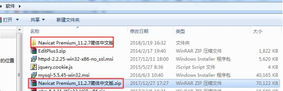
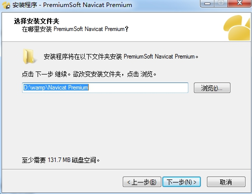
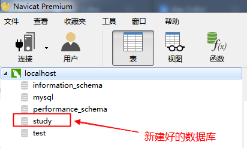
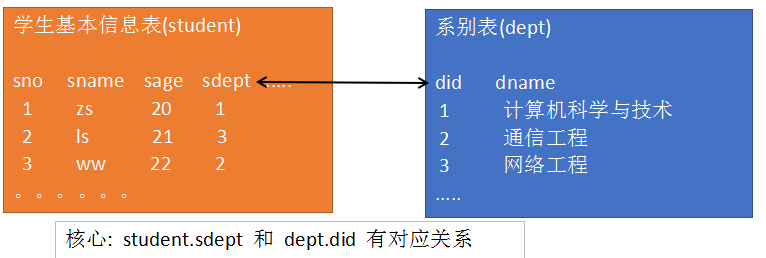

# 3. MySQL 数据库

## 3.1 什么是数据库

存储数据的仓库。

常见的数据库: MySQL、 Oracle、 Sqlserver、 DB2 等。

## 3.2 MySQL 简介

MySQL 是一个关系型数据库管理系统，由瑞典 MySQL AB 公司开发，目前属于 Oracle 旗下产品

MySQL 结构：


数据表的结构和 excel 一模一样：


表结构:

和 excel 表的结构是一样的。
每一列都是一类数据 --- 字段
每一行代表一条数据 --- 记录

## 3.3 安装客户端

MySQL 是一款 C/S 结构的软件。

MySQL 本身是服务器端。

常见的客户端: CMD 、 Navicat、 Sqlyog、 phpmyadmin 等等


1. 解压



2. 选择版本


3. 安装 --- 傻瓜操作

注意： 安装路径不能有中文



4. 安装完成后会在桌面上产生该图标


5. 使用客户端链接 MySQL 服务器

① 点击“链接”按钮 --- 选择要链接的数据库种类


② 配置链接信息

用户名： root 该用户是 MySQL 服务器系统的最高用户，拥有该系统的所有权限
密码： root phpstudy 中 MySQL 系统 root 用户的默认密码


③ 点击“localhost”结果


左侧的 localhost 下的内容都是数据库名称。

==information_schema、mysql、performance_schema 这三个是系统数据库（千万别动）==。
其他的都是自建数据库

看到上图，说明已经使用 navicat 客户端正常链接到了 MySQL 服务器了。

# 4. 使用 navicat 创建数据库

在 'localhost' 上点击鼠标右键， 选择 '新建数据库'


填写数据库名称 和 字符集（建议设置，也可以不设置）




# 5. 使用 navicat 创建数据表

双击 'study' ---> '表'（右键） ---> '新建表'


设置数据表的字段名、数据类型


设置四个字段


- sno: 学号
- sname: 姓名
- snickname: 昵称
- sage: 年龄
- sgender: 性别
- stime: 入学时间

主键： 有两个特点（唯一，非空），能够定位到唯一的一行数据

自动递增： 数字自增长


保存后使用 F5 刷新，能够看到新建好的表


手动添加数据：


# 6. **数据查询**

要操作 MySQL 数据库需要使用到 SQL 语句。 SQL 语句全称是结构化查询语言，使用该语言能够快速的从数据表中读取我们需要的数据，或者添加、删除、修改某条或某些数据。

语法格式:

SELECT 字段名 1, 字段名 2, ......

FROM 表名

     [ WHERE <条件表达式> ]

     [ ORDER BY <字段名> [ ASC|DESC ]]

     [ LIMIT  START, LENGTH]

## 6.1 基本查询

格式: select 字段名 1, 字段名 2,.... from 表名

案例 1: 查询所有学生的学号和姓名

表 : student

字段： sno, sname

```sql
select  sno,sname  from student
```


案例 2: 查询学生的全部信息 (全部字段信息)

表: student

字段: sno,sname,snickname,sage,sgender,stime

            *是通配符，代表所有的字段


## 6.2 带 where 子句的查询

select field1, field2... from 表名 查询表中的所有数据

where 可以使用条件来筛选查询出的结果


案例 3: 查询学号为 2 的学生的所有信息

表： student

字段： 所有字段 \*

筛选条件： sno=2


案例 4: 查询年龄大于等于 25 的学生的学号、姓名、年龄

表： student

字段： sno,sname,sage

筛选条件： sage>=25


案例 5: 查询年龄在 23-28 之间的学生的所有信息

表： student

字段： \*

筛选条件： sage>=23 and sage<=28

                      sage between 23 and 28


## 6.3 模糊查询

通配符:

%: 代表任意长度(包括 0)的任意字符

\_: 代表 1 位长度的任意字符

```
a%b :  ab  abb  a对萨达b
a_b: acb  atb
a_b%:  acb  a&baaad
```

like: 在执行模糊查询时，必须使用 like 来作为匹配条件

案例 1: 查询昵称中包含 x 的学生的信息

表： student

字段： \*

筛选条件： snickname like '%x%'


案例 2: 查询昵称以 a 字符开头并且包含 n 的学生的信息

表： student

字段： \*

筛选条件： snickname like 'a%n%'


查询昵称中第三个字符是 x 的学生的信息

snickname like '\_\_x%'

## 6.4 查询结果排序

order by 可以对查询结果按某个字段进行升序或者降序排列

升序 asc （默认值） ， 降序 desc

可进行排序的字段通常是 整型 英文字符串型 日期型 (中文字符串也行,但一般不用)

案例 1: 查询所有学生信息，并按年龄升序排列

表： student

字段： \*

筛选条件： 无

排序： order by sage asc


案例 2: 查询所有女性的学生信息，并按照入学时间降序排列

表： student

字段： \*

筛选条件： sgender="女"

排序： order by stime desc


## 6.5 限制查询结果

limit 用来限制查询结果的起始点和长度

格式: limit var1, var2

var1: 起始点。 查询结果的索引，从 0 开始。 0 代表第一条数据

var2: 长度


案例 1: 查询年龄最大的 3 名男性学生的信息

表： student

字段： \*

筛选条件： sgender="男"

排序： order by sage desc 按照年龄的降序排列

限制： limit 0,3


# 7. 关系型数据库

## 7.1 关系型数据库简介

案例: 创建一个数据表，能够保存学生的基本信息(学号、姓名、年龄等)和学生每一科的考试成绩

1.  一张表的形式


缺点: 重复数据太多（数据冗余）

2. 关系型数据库:


使用多张数据表联合保存数据。

核心重点： 字段的对应关系

sc 表中的 sno 要和 student 表中的 sno 对应，sc.sno 的值一定要存在于 student.sno

sc 表中的 cno 要和 course 表中的 cno 对应，sc.cno 的值一定要存在于 course.cno

缺点: 表多
优点:
数据耦合性低
每个数据表都能够独立管理

## 7.2 student 和 dept 表

目标: 创建 student 和 dept 表用来存储学生的基本信息、学院基本信息和学生所属的学院信息



student：学生表，所需字段 学号、姓名、性别、年龄、系别

dept：系别表，所需字段 系号 系名

# 8. 多表查询

关键词: join on

语法格式:

select \* from 表 1

join 表 2 on 链接条件

链接条件一定是 表 1 的某个字段 = 表 2 的某个字段

案例 1： 查询学生基本信息，显示系名

表: student、 dept

字段：　 student.\*, dept.dname


