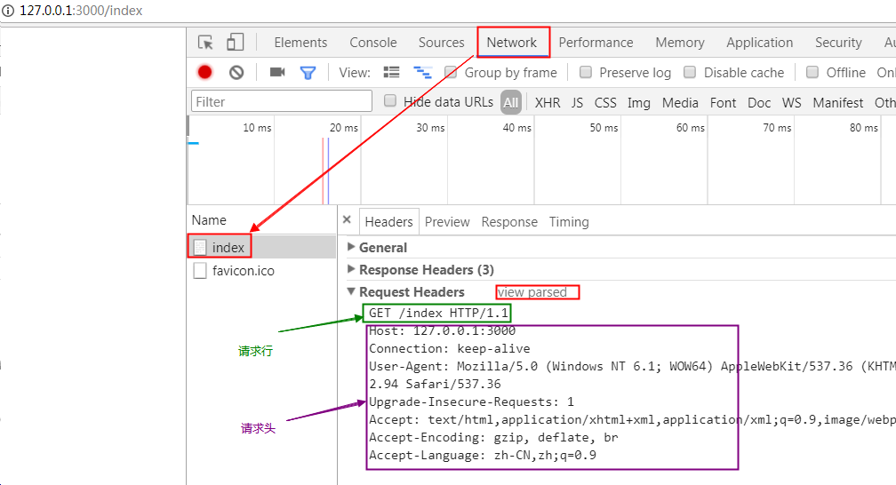
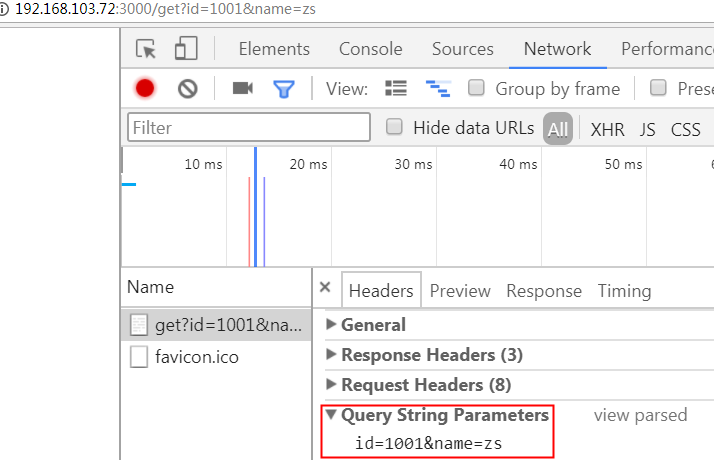
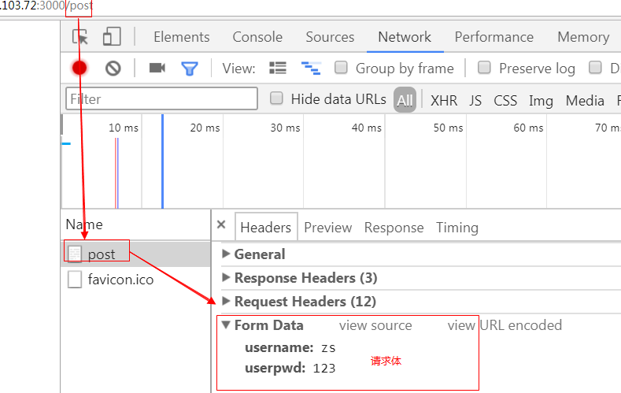
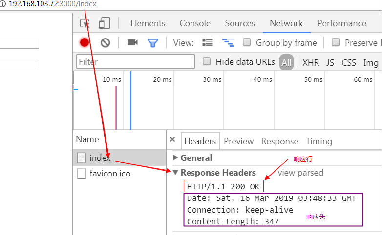
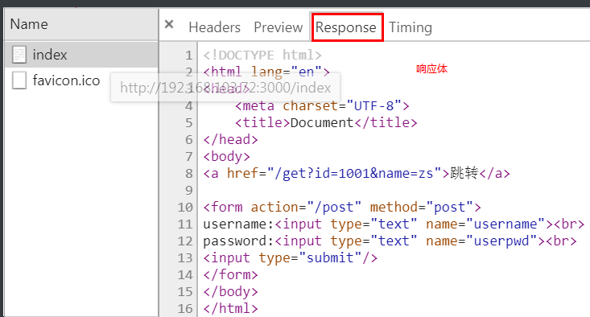
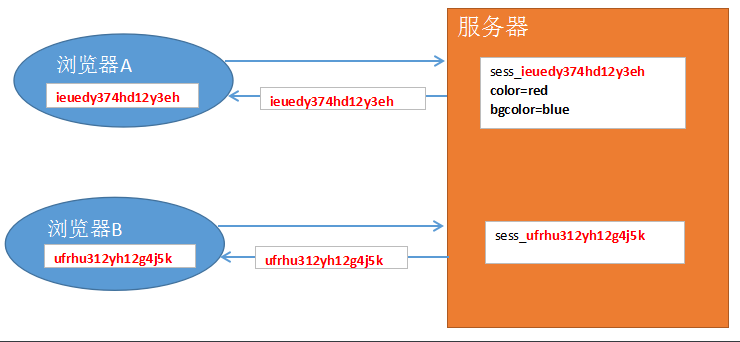
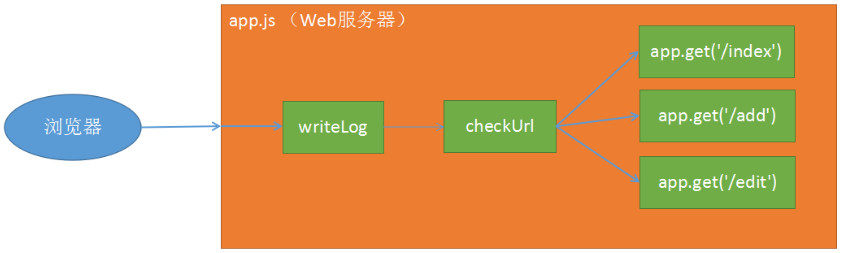

# Nodejs

## 1 cmd 常用命令

- cd： 切换目录
- dir：查看目录下所有文件和目录
- cls：清屏
- exit：退出
- cd .. 返回上级

## 2 Nodejs 系统模块操作

### 2.1 fs.readFile 文件读取

```javascript
// 加载(导入/引入) fs 模块
const fs = require('fs') //require方法是 node 提供的全局成员

// 调用 readFile 方法读取文件内容
/**
 * 参数1: 要读取的文件路径，相对路径和绝对路径均可
 * 参数2: 字符集设置（可选） 默认是二进制显示，设置中文是utf-8
 * 参数3: 文件读取完成之后触发的回调函数，有两个参数  err 和 data
 *    读取成功时:  err就是 null， data就是文件中的内容
 *    读取失败时:  err是错误对象， data是 undefined
 */
fs.readFile('./files/a.txt', 'utf-8', (err, data) => {
  //如果err是对象时，就会被认为是 true
  //err是null时，就会被认为是 false
  if (err) {
    //当err是对象（保存了错误信息）时，进入if
    console.log(err)
  } else {
    //当err是null（data中就是文件内容）时，进入else
    console.log(data)
  }
})
```

### 2.2 fs.writeFile 文件写入

```javascript
const fs = require('fs')
//特点: 覆盖写入; 如果文件不存在时，会尝试创建。
/**
 * 参数1: 要写的文件路径，相对路径和绝对路径均可
 * 参数2: 要写入到文件的内容（字符串）
 * 参数3: 可选。默认是 utf-8
 * 参数4: 写入完成时触发的回调函数，有一个错误对象 err
 */
fs.writeFile('./files/a.txt', '周星驰: 应该是烤鸡翅膀，我最爱吃', err => {
  //写入正确时，err就是 null
  //写入失败时，err就是 错误对象
  console.log(err)
})
```

### 2.3 fs.appendFile 文件追加

```javascript
//特点: 追加写入；如果没有该文件，则尝试创建
/**
 * 参数1: 文件路径
 * 参数2: 要写入的内容
 * 参数3: 可选。字符集，默认是 utf-8
 * 参数4: 写入完成时触发的回调函数，有一个参数 err
 */
const fs = require('fs')
fs.appendFile('./a.txt', '我爱庄小曼', err => {
  console.log(err)
})
```

## 3 Node 创建 Web 服务器

### 3.1 实现代码

```javascript
//加载http模块
const http = require('http')
// 创建服务器对象
const server = http.createServer()
// 启动服务器：设置端口为3000，启动成功后触发回调函数内容
server.listen(3000, () => {
  console.log('服务器正在运行')
})
// 开启监听浏览器请求：
// request（请求），指浏览器发来的请求
// 回调函数的参数：
// req 浏览器的请求对象
// res 服务器的响应对象
server.on('request', (req, res) => {
  res.setHeader('content-type', 'text/html;charset=utf-8')
  // .end()方法是将res的字符串返回给流量器
  res.end('坏女人庄小曼')
})
```

### 3.2 req 中的 URL 属性

```javascript
const http = require('http')
// 加载http模块
const http = require('http')
// 创建服务器对象
const server = http.createServer()
// 启动服务器 并设置端口为3000 设置回调函数返回内容
server.listen(3000, () => {
  console.log('服务器开始已启动')
})
// 监听浏览器请求，并进行处理
server.on('request', (req, res) => {
  const url = req.url //接收req中的url地址 定义为新的url
  res.setHeader('content-type', 'text/html;charset=utf-8')

  if (url === '/index.html') {
    res.end('这是首页')
  } else if (url === '/list') {
    res.end('这是列表页')
  } else {
    res.end('404 not found')
  }
})
```

### 3.3 中文乱码问题

```javascript
res.setHeader('content-type', 'text/html;charset=utf-8')
```

### 3.4 静态资源加载

```javascript
//引入http模板
const http = require('http')
//创建服务器
const server = http.createServer()
//开启服务器  设置端口为3000 回调函数返回值为server is running
server.listen(3000, () => {
  console.log('server is running')
})
//引入fs模板
const fs = require('fs')
// 开启监听浏览器的发送值
server.on('request', (req, res) => {
  //接收req的路径
  const url = req.url
  console.log(url)
  //判断:url调用endsWith方法，判断浏览器发来的url是否是以.html结尾
  if (url.endsWith('.html')) {
    // 读取服务器上的文件，并返回数据给浏览器
    fs.readFile('./public' + url, 'utf-8', (err, data) => {
      if (err) {
        return console.log(err)
      } else {
        res.end(data)
      }
    })
    //请求过后html页面上还会有链接 还会发送请求，所以会走多次
    // 这次是判断浏览器发送来请求的路径是否是以/public开头的
  } else if (url.startsWith('/public')) {
    fs.readFile('.' + url, (err, data) => {
      if (err) {
        return console.log(err)
      } else {
        res.end(data)
        // console.log(data);
      }
    })
  } else {
    res.end('404 not found')
  }
})
```

## 4 绝对路径

### 4.1 绝对路径

相对路径在 node 下运行有缺陷

### 4.2 路径变量

- \_\_dirname：获取当前文件所处目录的绝对路径 不包含文件名
- \_\_filename：获取当前文件的绝对路径 包含文件名

特点： 跨平台， 自动处理路径分隔符 / 和 \

### 4.3 path 模块

- 1. join 方法： 构造 url 地址，能够根据不同参数不同系统组装不同的文件地址
- 2. sep 属性： / 或 \ ， windows 系统下是 \ ; 类 unix 系统下是 /
- 3. dirname(): 获取文件路径 （不包含文件名）
- 4. basename(): 获取文件名 （不包含目录路径）
- 5. extname(): 获取文件后缀
     join 方法:

```js
const path = require('path')

path.join('aaa', 'bbb', 'ccc') // windows: aaa\bbb\ccc    类unix： aaa/bbb/ccc
path.join('d:/', 'node', 'test.js') // d:\node\test.js
path.join('d:\\', 'node/test.js') // d:\node\test.js
path.join(__dirname, 'view', 'index.html') // d:\node\day-2\code\view\index.html
path.join(__dirname, 'view/list.html') // d:\node\day-2\code\view\list.html
```

其他方法：

```js
const path = require('path')

const fpath = 'D:/phpStudy/PHPTutorial/WWW/index.html'

path.dirname(fpath) // D:/phpStudy/PHPTutorial/WWW
path.basename(fpath) // index.html
path.extname(fpath) // .html
path.sep //  windows: \     类unix： /
```

### 4.4 http 创建服务器对进行文件读取

```js
// 完整封装的后端函数
const http = require('http')
const server = http.createServer()
server.listen(4000, () => {
  console.log('server-2 is runnig...')
})
const fs = require('fs')
const path = require('path')

server.on('request', (req, res) => {
  res.sendAsk = function(fpath) {
    fs.readFile(fpath, 'utf-8', (err, data) => {
      if (err) {
        console.log(err)
        return res.end('404 not found.')
      }
      res.end(data)
    })
  }
  const url = req.url
  if (url === '/index') {
    res.sendAsk(path.join(__dirname, 'view', 'index.html'))
  } else if (url === '/post') {
    res.sendAsk(path.join(__dirname, 'view', 'post.html'))
  } else if (url.startsWith('/public')) {
    res.sendAsk(path.join(__dirname, 'view', url))
  } else if (url === '/addpost') {
    //此处是表单提交
    let str = ''
    req.on('data', chunk => {
      str += chunk
    })
    req.on('end', () => {
      console.log(str)
    })
  } else {
    res.end('404 not found...')
  }
})
```

## 5 综合案例

使用模板引擎获取页面中的数据 完整实现代码：

```js
// 引入http模块
const http = require('http')
// 创建服务器
const server = http.createServer()
// 开启服务器 设置端口为3000
server.listen(3000, () => {
  console.log('server is running')
})
//引入fs文件模块
const fs = require('fs')
//引入路径模块
const path = require('path')
// 引入第三方模板引擎模块
const template = require('art-template')
// 监听浏览器请求，  req是浏览器请求 res是服务器响应
server.on('request', (req, res) => {
  // 接收浏览器请求的路径
  const url = req.url
  if (url === '/cate.html') {
    // 获取的obj对象 这可能是其他渠道获取的数据 此处只是简单的模拟
    let obj = {
      list: [
        {
          //注意此处的list:      若不加在这里的话可以加在下面引用的地方
          cate_name: '奇趣事',
          cate_icon: 'fa-leaf',
          cate_ctime: '2019-01-10'
        },
        {
          cate_name: '潮科技',
          cate_icon: 'fa-fire',
          cate_ctime: '2019-01-10'
        },
        {
          cate_name: '会生活',
          cate_icon: 'fa-gift',
          cate_ctime: '2019-01-15'
        },
        {
          cate_name: '美奇迹',
          cate_icon: 'fa-phone',
          cate_ctime: '2019-01-16'
        }
      ]
    }
    // 调用模板引擎   两个参数： 第一个是要更改的文件路径  第二个是传入的对象
    var str = template(path.join(__dirname, 'view', 'cate.html'), obj)
    // 将拼接好的str字符串传入页面中去  至此 模板引擎应用完成
    res.end(str)
  } else if (url === '/addcate.html') {
    fs.readFile(path.join(__dirname, 'view', 'addcate.html'), (err, data) => {
      if (err) {
        console.log(err)
        return res.end('404 not found..')
      } else {
        res.end(data)
      }
    })
  } else if (url.startsWith('/assets')) {
    console.log(url)
    fs.readFile(path.join(__dirname, '/view', url), (err, data) => {
      if (err) {
        console.log(err)
        return res.end('404 not found..')
      } else {
        res.end(data)
      }
    })
    // 此处是提交表单到  /addData目录中去（不论该目录是否存在）
  } else if (url === '/addData') {
    // 定义一个空字符串
    let str = ''
    // 请求对象的data事件,接收表单传过来的数据
    req.on('data', chunk => {
      str += chunk //拼接字符串的过程
    })
    // 处理数据  记住就行
    req.on('end', () => {
      console.log(str)
      res.end(str)
    })
  }
})
```

## 6 art-template 模板引擎

### 6.1 后端使用 art-template 模板引擎

品优购 完整实现代码：

```js
const http = require('http')
const server = http.createServer()
const path = require('path')
const template = require('art-template')
const fs = require('fs')
server.listen(3000, () => {
  console.log('server is runnig...')
})
server.on('request', (req, res) => {
  const url = req.url
  if (url === '/index') {
    let dataArr = [
      {
        goods_name: '阳光美包新款单肩包女包时尚子母包四件套女',
        goods_price: '116.00',
        goods_pic: 'uploads/like_01.png'
      },
      {
        goods_name: '爱仕达 30CM炒锅不粘锅NWG8330E电磁炉炒',
        goods_price: '1161.00',
        goods_pic: 'uploads/like_02.png'
      },
      {
        goods_name: '捷波朗蓝牙耳机',
        goods_price: '116.00',
        goods_pic: 'uploads/like_03.png'
      },
      {
        goods_name: '大方块，不知道是干什么用的',
        goods_price: '2116.00',
        goods_pic: 'uploads/like_04.png'
      },
      {
        goods_name: '三星（G5500）',
        goods_price: '1816.00',
        goods_pic: 'uploads/like_05.png'
      },
      {
        goods_name: '好像是个洗手液',
        goods_price: '3116.00',
        goods_pic: 'uploads/like_06.png'
      }
    ]
    let str = template(path.join(__dirname, 'view', 'index.html'), {
      list: dataArr
    })
    res.end(str)
  } else if (url.startsWith('/style')) {
    fs.readFile(path.join(__dirname, 'view', url), (err, data) => {
      if (err) {
        console.log(err)
        return res.end(err)
      }
      res.end(data)
    })
  } else if (url.startsWith('/images')) {
    fs.readFile(path.join(__dirname, 'view', url), (err, data) => {
      if (err) {
        console.log(err)
        return res.end(err)
      }
      res.end(data)
    })
  } else if (url.startsWith('/uploads')) {
    fs.readFile(path.join(__dirname, 'view', url), (err, data) => {
      if (err) {
        console.log(err)
        return res.end(err)
      }
      res.end(data)
    })
  } else {
    res.end('404 not found')
  }
})
```

### 6.2 模板引擎的继承

后端使用 template 继承

> 注意： 使用 template 继承需要在 node 服务器加载 template 模块，并且监听到路由后返回的页面必须用 res.render 方法

<!-- {{extend}} -->
制作模板页：

```html
<!DOCTYPE html>
<html lang="zh-CN">
  <head>
    <meta charset="utf-8" />
    <title>Dashboard &laquo; Admin</title>
    <link rel="stylesheet" href="/assets/vendors/bootstrap/css/bootstrap.css" />
    <link
      rel="stylesheet"
      href="/assets/vendors/font-awesome/css/font-awesome.css"
    />
    <link rel="stylesheet" href="/assets/vendors/nprogress/nprogress.css" />
    <link rel="stylesheet" href="/assets/css/admin.css" />
    <script src="/assets/vendors/nprogress/nprogress.js"></script>
    <script src="/assets/vendors/art-template/template-web.js"></script>
    {{block 'css'}} {{/block}}
    <!--为了给要加入的css留位置-->
  </head>
  <body>
    <script>
      NProgress.start()
    </script>

    <div class="main">
      <nav class="navbar">
        <button class="btn btn-default navbar-btn fa fa-bars"></button>
        <ul class="nav navbar-nav navbar-right">
          <li>
            <a href="profile.html"><i class="fa fa-user"></i>个人中心</a>
          </li>
          <li>
            <a href="login.html"><i class="fa fa-sign-out"></i>退出</a>
          </li>
        </ul>
      </nav>
      {{block 'body'}} {{/block}}
      <!--此处添加需要加入的模块-->
    </div>

    <div class="aside">
      <div class="profile">
        
        <h3 class="name">布头儿</h3>
      </div>
      <ul class="nav">
        <li>
          <a href="/admin/index.html"><i class="fa fa-dashboard"></i>仪表盘</a>
        </li>
        <li class="active">
          <a href="#menu-posts" data-toggle="collapse">
            <i class="fa fa-thumb-tack"></i>文章<i
              class="fa fa-angle-right"
            ></i>
          </a>
          <ul id="menu-posts" class="collapse in">
            <li><a href="/admin/post/posts.html">所有文章</a></li>
            <li><a href="/admin/post/addpost.html">写文章</a></li>
            <li class="active"><a href="/admin/cate/cate.html">分类目录</a></li>
          </ul>
        </li>
        <li>
          <a href="/admin/comment/comments.html"
            ><i class="fa fa-comments"></i>评论</a
          >
        </li>
        <li>
          <a href="/admin/user/users.html"><i class="fa fa-users"></i>用户</a>
        </li>
        <li>
          <a href="#menu-settings" class="collapsed" data-toggle="collapse">
            <i class="fa fa-cogs"></i>设置<i class="fa fa-angle-right"></i>
          </a>
          <ul id="menu-settings" class="collapse">
            <li><a href="/admin/other/nav-menus.html">导航菜单</a></li>
            <li><a href="/admin/other/slides.html">图片轮播</a></li>
            <li><a href="/admin/other/settings.html">网站设置</a></li>
          </ul>
        </li>
      </ul>
    </div>

    <script src="/assets/vendors/jquery/jquery.js"></script>
    <script src="/assets/vendors/bootstrap/js/bootstrap.js"></script>
    <script>
      NProgress.done()
    </script>
    {{block 'js'}} {{/block}}
    <!--此处为了给后加入的js模块留位置-->
  </body>
</html>
```

应用页调用：

```html
{{extend './layouts/layout.html'}}
<!--调用模板页-->

{{block 'css'}}
<!--对应的位置写出CSS-->
<style>
  body {
    color: red;
  }
</style>
{{/block}} {{block 'body'}}
<div class="container-fluid">
  <div class="jumbotron text-center">
    <h1>One Belt, One Road</h1>
    <p>Thoughts, stories and ideas.</p>
    <p>
      <a class="btn btn-primary btn-lg" href="post-add.html" role="button"
        >写文章</a
      >
    </p>
  </div>
  <div class="row">
    <div class="col-md-4">
      <div class="panel panel-default">
        <div class="panel-heading">
          <h3 class="panel-title">站点内容统计：</h3>
        </div>
        <ul class="list-group">
          <li class="list-group-item">
            <strong>10</strong>篇文章（<strong>2</strong>篇草稿）
          </li>
          <li class="list-group-item"><strong>6</strong>个分类</li>
          <li class="list-group-item">
            <strong>5</strong>条评论（<strong>1</strong>条待审核）
          </li>
        </ul>
      </div>
    </div>
    <div class="col-md-4"></div>
    <div class="col-md-4"></div>
  </div>
</div>
{{/block}} {{block 'js'}} {{/block}}
```

## 7 post 方式提交表单数据

### 7.1 表单提交的必要条件

- 必须有 form 标签
  - action：表单数据提交的位置，必须是一种后端技术来接收
  - method： 表单提交的方式，post（常用）、 get（默认）
  - 每个表单域都要有 name 属性和 value 值
  - 必须要有 submit 按钮

### 7.2 不同表单提交的方式

表单提交就是提交其 value 值

```html
name:<input type="text" value="username" /> password:<input
  type="password"
  value="psd"
/>
<!-- 省略其余Input标签 都是提交起value值 -->
<!-- radio checkbox不设置value值时会自动提交成on -->
<select name="area" id="add">
  <!-- select提交 value值写在option下 若option没有value 则会提交option间的内容-->
  <option value="bj">北京</option>
  <option value="sh">上海</option>
  <option value="sz">深圳</option>
  <option value="gz">广州</option>
</select>
<textarea name="sign" id="111" cols="30" rows="10">
这家伙很懒，什么也没留下</textarea
>
<!-- textarea不用写value 直接提交就可以 -->
<input type="submit" />
```

### 7.3 POST 方式接收

```js
let str = '' //定义一个空字符串 用于接收data事件的值

//1. 监听data事件，循环接收post表单提交的数据
//参数1： 事件类型，data代表接收客户端数据事件
//参数2： 接收时触发的回调函数
// 使用post提交的表单数据可能会非常大，需要切割成一个个的小数据块进行接收
req.on('data', chunk => {
  str += chunk
})
//2. 监听end事件，接收完成后处理接收到数据的事件
//参数1： 事件类型，end代表接收数据完成时触发的回调函数
//参数2： 完成后触发的回调函数，在该函数中可以处理接收到的数据
req.on('end', () => {
  console.log(str)
  eq.body = str //注意：用body-parser模块中 req.body.xxx 就是根据此处封装而成的
})
```

实现代码：看上面

### 7.4 GET 方式接收

- url 模块：使用系统的 url 模块实现表单提交

- url 中的两个重要方法： （/post?name=zs&age=18）
  - pathname: 当前请求的 url 地址 /post
  - query: get 方式提交的参数 name=zs&age=18

简单示例：

```js
// 加载系统中自带的url模块
const url = require('url')
// 调用模块中的parse()方法  用于解析get地址
// parse的两个参数： 1：要解析的地址 2是否自动转换为对象格式输出  false为字符串    返回值中有两个要记住
// 分别是：pathname (解析出来的地址/getData)  query(以对象形式保存了get的参数)：{username:'xm',psd='123456}
let str = 'http://127.0.0.1:3000/getData?username=xm&psd=123456'

console.log(url.parse(str, true))
```

表单使用 get 方式提交数据：

```js
const http = require('http')
const server = http.createServer()
const fs = require('fs')
const path = require('path')
// 加载url系统模块
const url = require('url')
server.listen(3000, () => {
  console.log('server is runnig...')
})
server.on('request', (req, res) => {
  // 使用url中的parse方法，把req.url请求对象的地址转换为对象的方式
  const urlObj = url.parse(req.url, true)
  // 调用parse转出来的urlObjc对象中的pathname方法
  // pathname方法表示当前服务器请求的url地址名
  if (urlObj.pathname === '/index') {
    fs.readFile(path.join(__dirname, 'view', 'index.html'), (err, data) => {
      if (err) {
        console.log(err)
        return res.end(err)
      }
      res.end(data)
    })
  } else if (urlObj.pathname === '/getData') {
    // 调用parse转出来的urlObjc对象中的query方法
    // query方法代表get传输中所提交的参数
    console.log(urlObj.query)
    res.end('data has been upload')
  } else {
    res.end('404')
  }
})
```

### 7.5 POST 和 GET 区别

- 提交方式不同：get 会将提交数据显示在地址栏中 post 不会

- 传递数据的大小有差异：get 受地址栏影响只能传 2k(ie6)或者 8k(chrome),post 最小值 2m 没有上限

- 应用范围不同：get 使用范围较广，链接跳转 传递数据 location.href 中都能使用,post 多用于表单提交

## 8 path 中的 parse()方法

```javascript
//1. 加载 url 模块
const url = require('url')

//2. 在url模块中提供了一个 parse 的方法
//该方法可以解析 /getData?username=xm&userpwd=123456 url地址

// let str = 'http://127.0.0.1:3000/getData?username=xm&userpwd=123456';
let str = '/index'

/**
 * parse: 解析url地址
 * 参数1: 要解析的地址
 * 参数2: true (get参数会自动转为对象) / false (get参数就是一个字符串)
 * 返回值中有两个属性必须记住: pathname 、 query
 *    pathname: 是地址
 *    query: 保存了get参数
 */
console.log(url.parse(str, true))

//  username=xm&userpwd=123456
//  1. 使用 & 将字符串拆分为数组  ['username=xm', 'userpwd=123456'];
//  2. 再使用 = 将每个单元的字符串都进行拆分  username、xm | userpwd、123456
```

##9 字体图标问题的解决

使用 url 模块可以解决该问题

```javascript
const url = require('url')

//2. 在url模块中提供了一个 parse 的方法
//该方法可以解析 /getData?username=xm&userpwd=123456 url地址

// let str = 'http://127.0.0.1:3000/getData?username=xm&userpwd=123456';
let str = '/index'

/**
 * parse: 解析url地址
 * 参数1: 要解析的地址
 * 参数2: true (get参数会自动转为对象) / false (get参数就是一个字符串)
 * 返回值中有两个属性必须记住: pathname 、 query
 *    pathname: 是地址
 *    query: 保存了get参数
 */
console.log(url.parse(str, true))

//  username=xm&userpwd=123456
//  1. 使用 & 将字符串拆分为数组  ['username=xm', 'userpwd=123456'];
//  2. 再使用 = 将每个单元的字符串都进行拆分  username、xm | userpwd、123456
```

实现代码：

```js
const http = require('http')
const server = http.createServer()
server.listen(3000, () => {
  console.log('server is running')
})
const fs = require('fs')
const path = require('path')
const template = require('art-template')
// 引入url模块
const url = require('url')
server.on('request', (req, res) => {
  // const url = req.url;
  const urlObj = url.parse(req.url, true)
  if (urlObj.pathname === '/cate') {
    //urlObj.pathname是服务器请求的路径
    let obj = {
      list: [
        { cate_name: '奇趣事', cate_icon: 'fa-leaf', cate_ctime: '2019-01-10' },
        { cate_name: '潮科技', cate_icon: 'fa-fire', cate_ctime: '2019-01-10' }
      ]
    }
    var str = template(path.join(__dirname, 'view', 'cate.html'), obj)
    res.end(str)
  } else if (urlObj.pathname === '/addcate') {
    //urlObj.pathname是服务器请求的路径
    fs.readFile(path.join(__dirname, 'view', 'addcate.html'), (err, data) => {
      if (err) {
        // console.log(err);
        return res.end('404 not found..')
      } else {
        res.end(data)
      }
    })
  } else if (urlObj.pathname.startsWith('/assets')) {
    //urlObj.pathname是服务器请求的路径
    fs.readFile(path.join(__dirname, '/view', urlObj.pathname), (err, data) => {
      //注意此处更改原有的url，否则报错
      if (err) {
        console.log(err)
        return res.end('404 not found..')
      } else {
        res.end(data)
      }
    })
  } else if (urlObj.pathname === '/addData') {
    //urlObj.pathname是服务器请求的路径
    let str = ''
    req.on('data', chunk => {
      str += chunk
    })
    req.on('end', () => {
      console.log(str)
      res.end(str)
    })
  } else {
    res.end('404')
  }
})
```

## 9 http 协议

### 9.1 http 协议概述

- 协议的两大部分：

  - 请求：访问服务器的任何一个文件都是一次请求
  - 响应：服务器处理请求，将结果返回给浏览器

- 特点：
  - 通常是基于 B/S 结构软件的
  - 无连接: 浏览器向服务器发送一次请求，服务器响应一次，链接即结束
  - 无状态: 无记忆。 服务器不能记住哪个浏览器访问过

### 9.2 请求协议/请求报文

- 请求行: 请求方式、请求 URL 地址、协议版本号
- 请求头: 主机域名和端口号，客户端(浏览器)的信息等
- 请求主体: 发送给服务器的数据，get 和 post 都会通过请求主体将数据发送给服务器

- 主要请求项意思:
  - host： 主机名和端口号，80 端口默认不显示
  - accept：浏览器可接受的程序/文件类型
  - accept-encoding： 浏览器可接受的压缩类型
  - accept-language： 浏览器可接受的语言类型
  - content-type： 浏览器向服务器发送数据时的编码方式

请求行和请求头：

GET 方式提交的请求行、请求头和请求体:

POST 方式提交数据，查看请求行、请求头和请求体


### 9.3 响应协议/响应报文

- 响应行: 协议版本号、响应结果状态码
- 响应头: 主要是服务器端的信息
- 响应主体: 就是从服务器返回给客户端的数据

- 主要请求项意思:
  - content-type： 响应内容类型， content-type:text/html，服务器告诉浏览器，返回的这部分数据是文本类型，使用 html 方式来解析即可。
  - content-length： 响应内容的长度 ，content-length:336, 从服务器返回给浏览器的数据总长度为 336 字节

响应行响应头：

响应体:


### 9.4 常见的状态码

> 200 ok ----- 请求成功

> 302 redirect|Found ----- 重定向 （页面跳转）

> 304 not modified ----- 未修改

> 403 forbidden ----- 禁止访问 （没有权限访问）

> 404 Not Found ----- 未找到页面

> 500 internal server error ----- 服务器内部错误 (可能是服务器本身有问题，或者代码错的太离谱)

## 10 req 请求对象和 res 响应对象

### 10.1 req 请求对象

req.url: 浏览器请求的路径
req.method: 浏览器请求方式
req.headers: 设置请求头信息

### 10.2 res 响应对象

res.setHeader()： 设置响应头信息

> > 不论此处设置了什么信息，都会跟着响应头一起返回给浏览器

```js
res.setHeader('content-type', 'text/html;charset=utf-8')
// 该代码就是服务器告诉浏览器返回的data数据，要以解析html文件的形式来解析
res.setHeader('content-type', 'image/jpeg')
//服务器告诉浏览器，返回的data数据，要以解析jpg图片的形式来解析
```

res.writeHeader()： 设置响应头信息和状态码

```js
// 参数1： 设置返回的状态码   参数2 设置响应头---对象格式
res.writeHeader(404, { 'content-type': 'text/html', 'set-cookie': 'name=zs' })
```

res.write(): 设置响应体(不常用)

> > 写了 write 也得写 end，通常 end 的内容是跟随响应体一起返回给浏览器的

res.end(): 将响应行、响应头、响应体一次性返回给浏览器

## 11 express 框架

### 11.1 使用 express 构造 web 服务器

- 安装：

```node
npm install express
```

实现代码：

```js
// 引入express模块
const express = require('express')
// 调用express模块 设置服务器名为app
const app = express()
// 开启服务器 设置端口号为3000
app.listen(3000, () => {
  console.log('expressServer is running...')
})
app.get('/index', (req, res) => {
  res.sendFile(path.join(__dirname, 'view', 'index.html'), err => {
    console.log(err)
  })
})
```

- 流程：

  - 加载 express 模块 const express = require('express');
  - 创建 express 服务器 const app = express();
  - 开启 express 服务器 app.listen(3000, () => {})
  - 监听路由 app.get(url, callback) app.post(url, callback)

- 依然分两种请求：get 和 post

### 11.2 路由

定义：简单来说，路由就是浏览器中 url 地址和 app.get/app.post 方法中参数 1 的对应的关系
代码举例：

```js
浏览器地址： http://127.0.0.1:3000/index

app.get('/index', (req, res) => { })

浏览器地址： http://127.0.0.1:3000/goods/list

app.get('/goods/list', (req, res) => { })
```

### 11.3 sendFile()方法

直接读取文件内容并返回给浏览器
==重点: 文件路径必须是一个绝对路径。两种方法:1. 参数 1 直接设置为绝对路径；2. 参数 1 和参数 2 组成一个绝对路径==

```js
res.sendFile(var1, var2, var3);
参数1： 要读取的文件路径
参数2： 配置项，可选，一般不用
参数3： 读取完成后的回调函数，该函数中有一个参数 --- 错误对象

参数2示例：
const config = {
    root: __dirname + '/view/',   // 配置模板文件跟路径
    headers: {					  // 配置头信息  不常用
        'content-type':'text/html;charset=utf-8'
    }
}
```

实现代码：

```js
const express = require('express')
const app = express()
app.listen(3000, () => {
  console.log('express-server is running...')
})
const path = require('path')
app.get('/index', (req, res) => {
  res.sendfile(path.join(__dirname, 'view', 'index.html'), err => {
    console.log(err)
  })
})
```

案例： 目标： 显示 view 目录下， index.html 和 login.html 两个页面

                 url地址为  127.0.0.1:3000/index  时显示 index.html

                 url地址为  127.0.0.1:3000/login 时显示 login.html

```js
app.get('/index', (req, res) => {
  res.sendFile(path.join(__dirname, 'view', 'index.html'), err => {
    console.log(err)
  })
})
app.get('login', (req, res) => {
  res.sendFile(path.join(__dirname, 'view', 'login.html'), err => {
    console.log(err)
  })
})
```

### 11.4 统一处理静态资源/静态资源托管

- 使用 app.use()方法
- 统一处理页面中静态资源：css,js,img 等文件

```js
//url地址中以 /public 开头的，都会去 public 目录下读取对应的文件并返回给浏览器
app.use('/public', express.static('./public'))
```

```js
//url地址中所有的文件都和 ./view 拼接路径，并根据拼接好的路径读取文件并返回给浏览器
// 即：浏览器的url和./view拼接后读取文件，然后再返回给浏览器
// http://127.0.0.1:3000/index.html ---> ./view/index.html
// http://127.0.0.1:3000/aaa/bbb.html ---> ./view/aaa/bbb.html
app.use(express.static('./view'))
```

### 11.5 综合案例：显示留言板

```js
// 引入express模块
const express = require('express')
// 调用express模块 设置服务器名为app
const app = express()
// 开启服务器 设置端口号为3000
app.listen(3000, () => {
  console.log('expressServer is running...')
})
const path = require('path')

// // 配置app.get的参数2
// const config = {
//     root: __dirname + '/view'
// }
// // 正常用法不写参数2
// app.get('/index', (req, res) => {
//     res.sendFile(path.join('index.html'), config, (err) => {
//         console.log(err);
//     });
// });

// 开启监听浏览器请求  功能相当于if()else if fs.readFile........
// 如果输入的是/index 返回回调函数
app.get('/index', (req, res) => {
  //读取文件 并发送给服务器  参数1:返回文件的绝对路径 参数2：看上面 参数3：回调函数，储存了错误信息 无错误err是undefined
  res.sendFile(path.join(__dirname, '/view', 'index.html'), err => {
    console.log(err) //没错误的时候err是undefined
  })
})

// 监听post.html页面
app.get('/post', (req, res) => {
  res.sendFile(path.join('post.html'), config, err => {
    console.log(err)
  })
})
// .use方法：所有以/public开头的文件都读取
// 参数1：设置以/public开头的文件
// 参数2：去static()所设置的目录下读取  该参数的路径可以是相对路径 也可以是觉得路径
app.use('/public', express.static(path.join(__dirname, 'view', 'public')))
// app.use(express.static('./view'));//也可以不写第一个参数 （不常用）
```

## 12 express 中使用 art-template

在 Express 框架中不要直接使用 art-template 模板引擎，使用 Express-art-template 中间件来加载。

```javascript
// 要在node中安装template模块
npm i art-template express-art-template
```

实现代码：

```js
let dataArr = [
  {
    goods_name: '阳光美包新款单肩包女包时尚子母包四件套女',
    goods_price: '116.00',
    goods_pic: 'uploads/like_01.png'
  },
  {
    goods_name: '爱仕达 30CM炒锅不粘锅NWG8330E电磁炉炒',
    goods_price: '1161.00',
    goods_pic: 'uploads/like_02.png'
  },
  {
    goods_name: '捷波朗蓝牙耳机',
    goods_price: '116.00',
    goods_pic: 'uploads/like_03.png'
  },
  {
    goods_name: '大方块，不知道是干什么用的',
    goods_price: '2116.00',
    goods_pic: 'uploads/like_04.png'
  },
  {
    goods_name: '三星（G5500）',
    goods_price: '1816.00',
    goods_pic: 'uploads/like_05.png'
  },
  {
    goods_name: '好像是个洗手液',
    goods_price: '3116.00',
    goods_pic: 'uploads/like_06.png'
  }
]
const express = require('express')
const app = express()
const path = require('path')
app.listen(3000, () => {
  console.log('epxerss-server is running...')
})
// 引入express下的模板引擎模块
const template = require('express-art-template')
// 调用模板引擎模块
//参数1: 模板文件的后缀，此处可以随意定义。 定义成什么，模板文件后缀就是什么。一般使用html即可
//参数2: 模板引擎对象
app.engine('html', template)
// 讲其放到get监听下的res中
app.get('/index', (req, res) => {
  // 加入到页面里：第一个参数是要放入的html路径，第二个参数是数据对象
  //render方法是express提供好的方法，不管我们使用什么模板引擎都能使用该方法渲染页面
  //参数1: 模板文件路径
  //参数2: 要渲染到页面的json数据
  res.render(path.join(__dirname, 'view', 'index.html'), {
    list: dataArr
  })
})

app.use('/styles', express.static(path.join(__dirname, 'view', 'styles')))
app.use('/images', express.static(path.join(__dirname, 'view', 'images')))
app.use('/script', express.static(path.join(__dirname, 'view', 'script')))
app.use('/fonts', express.static(path.join(__dirname, 'view', 'fonts')))
app.use('/uploads', express.static(path.join(__dirname, 'view', 'uploads')))
```

## 13 express 中的 get 方式提交数据

### 13.1 使用 query 接收 get 数据

> url 地址： http://127.0.0.1:3000/index?id=10001&name=zs

> req.query 中以对象形式保存了 get 参数： {id：10001, name:"zs"};

> console.log(req.query.id);

> console.log(req.query.name);
> 实现代码:

```js
let dataArr = [
  {
    name: '后羿',
    content: '周日都让我射熄火了',
    date: '2018-10-10'
  }
]
const express = require('express')
const app = express()
const path = require('path')
// 静态资源托管
app.use('/public', express.static(path.join(__dirname, 'view', 'public')))

// 模板引擎使用
const template = require('express-art-template')
app.engine('html', template)

app.listen(3000, () => {
  console.log('express-server is running...')
})
app.get('/index', (req, res) => {
  res.render(path.join(__dirname, 'view', 'index.html'), {
    list: dataArr
  })
})
app.get('/post', (req, res) => {
  res.sendFile(path.join(__dirname, 'view', 'post.html'), () => {})
})

// 监听点击提交按钮后的addpost页面
app.get('/addpost', (req, res) => {
  // req.query中以对象形式保存了get参数： {id：10001, name:"zs"}
  console.log(req.query)
  res.end('data has been upload.')
})
```

### 13.2 使用 params 接收 get 数据

```js
// url地址： http://127.0.0.1:3000/index/10/ls
// req.params中以对象形式保存了get参数

app.get('/index/:id/:name', (req, res) => {
  console.log(req.params.id)
  console.log(req.params.name)
  // req.params = {id:10, name:"ls"}
})

// http://127.0.0.1:3000/index/10/ls 和  /index/:id/:name
// 配合起来就相当于  http://127.0.0.1:3000/index?id=10&name=ls
```

实现代码：

```js
// 监听点击提交按钮后的addpost页面
// 注意！ 注意！：
// html页面要写对应的id和name 此方法多用于连接跳转
<form action="/addpost/12/11" method="GET">
app.get('/addpost/:id/:name', (req, res) => {
    // req.query中以对象形式保存了get参数： {id：10001, name:"zs"}
    console.log(req.params);
    res.end('data has been upload.')
});
```

## 14 express 中的 post 方式提交数据

使用 body-parser 第三方模块
安装模块:npm i body-parser
实现代码：

```js
const bodyParser = require('body-parser')
// 注册中间件：{extended：false} 代表使用node的 querystring 模块来解析表单数据
app.use(bodyParser.urlencoded({ extended: false }))
// 使用post方法监听myLogin地址
app.post('/myLogin', (req, res) => {
  // req.body对象存储了表单数据
  console.log(req.body)
  res.end('data has been upload.')
})
```

## 15 mysql 模块

### 15.1 mysql 模块的作用

第三方模块，用来操作 mysql 数据库，可以进行增(creat)删(delete)改(update)查(read)

```shell
npm i mysql
```

### 15.2 查询 --- read

```js
// 引入mysql模块
const mysql = require('mysql')
// 创建链接对象
const conn = mysql.createConnection({
  host: '127.0.0.1',
  user: 'root',
  password: 'root',
  database: 'school'
})
// 链接mysql服务器
conn.connect()

// 定义sql
const sql = 'select * from student'
// 执行sql语句
conn.query(sql, (err, result) => {
  if (err) return console.log(err)
  console.log(result)
})

// 关闭连接
conn.end()
```

### 15.4 添加 --- create

```js
const mysql = require('mysql')
const conn = mysql.createConnection({
  host: '127.0.0.1',
  user: 'root',
  password: 'root',
  database: 'school' //要创建的数据库名称
})
conn.connect()
const sql = 'insert into student values(null, "纯子", ?, ?, "2019-03-21")' //student是要修改的表名称
conn.query(sql, ['女', 22], (err, result) => {
  if (err) return console.log(err)
  console.log(result)
})
conn.end()
```

### 15.5 修改 --- update

```js
const mysql = require('mysql')
const conn = mysql.createConnection({
  host: '127.0.0.1',
  user: 'root',
  password: 'root',
  database: 'school'
})
conn.connect()
const sql = 'update student set sname="小顾",sage=19 where sno=9'
conn.query(sql, (err, result) => {
  if (err) return console.log(err)
  console.log(result)
})
conn.end()
```

### 15.6 删除 --- delete

```js
const mysql = require('mysql')
const conn = mysql.createConnection({
  host: '127.0.0.1',
  user: 'root',
  password: 'root',
  database: 'school'
})
conn.connect()
const sql = 'delete from student where sno=6'
conn.query(sql, (err, result) => {
  if (err) return console.log(err)
  console.log(result)
})
conn.end()
```

## 16 node 模块化

### 16.1 module.exports 导出属性和方法

```js
//1. 加载 mysql 模块
const mysql = require('mysql')

//2. 创建 mysql 链接对象
const conn = mysql.createConnection({
  host: '127.0.0.1',
  user: 'root',
  password: 'root',
  database: 'school'
})

//3. 链接mysql服务器
conn.connect()

//4. 将conn 导出
module.exports = conn
// 也可导出为多个
// module.exports = {conn1,conn2}
```

使用时：

```js
const conn = require('./database.js') //上面的文件名路径
```

### 16.2 留言板列表案例

```js
// 加载express模块
const express = require('express')
// 开启express
const app = express()
// 开启监听 端口3000
app.listen(3000, () => {
  console.log('server is running at 3000 port')
})
// 加载path模块
const path = require('path')
// 静态资源托管
app.use('/public', express.static(path.join(__dirname, 'view', 'public')))

// 加载模板引擎模块
const template = require('express-art-template')
// 开启模板引擎
app.engine('html', template)
// 加载mysql模块
const mysql = require('mysql')
// 创建mysql对象
const conn = mysql.createConnection({
  host: '127.0.0.1',
  user: 'root',
  password: 'root',
  database: 'commentsData'
})
// 开启链接
conn.connect()
// 定义sql
const sql = 'select * from comments'
// 执行sql语句
conn.query(sql, (err, result) => {
  if (err) return console.log(err)
  // 监听路由
  app.get('/index', (req, res) => {
    // 模板引擎调用 动态渲染到html中
    res.render(path.join(__dirname, 'view', 'index.html'), {
      list: result
    })
  })
})
```

## 17 案例：学生系统

app.js 部分：

```js
const express = require('express')

const app = express()

app.listen(3000, () => {
  console.log('stu-server is running')
})

//加载模板引擎
app.engine('html', require('express-art-template'))

// 加载body-parser模块
const bodyP = require('body-parser')
// 中间件
app.use(
  bodyP.urlencoded({
    extended: false
  })
)

// 到处router模块  注册为中间件
const router = require('./router')
app.use(router)
```

router.js 部分：

```js
// 加载express模块
const express = require('express')

// 创建路由对象
const router = express.Router()

const path = require('path')
const moment = require('moment')
const db = require('./db.js')

// 执行sql  实现index.html页面显示
router.get('/index', (req, res) => {
  // 定义sql语句
  const sql = `select infomation.*,school.schoolName from infomation
     join school on infomation.sdept=school.sid order by sno;`
  db.query(sql, (err, result) => {
    if (err) return console.log(err)
    res.render(path.join(__dirname, 'view', 'index.html'), {
      list: result
    })
  })
})

// 增加数据功能部分

//获取增加数据页面
router.get('/add', (req, res) => {
  const sql = 'select * from school'
  db.query(sql, (err, result) => {
    if (err) return console.log(err)
    res.render(path.join(__dirname, 'view', 'add.html'), {
      list: result
    })
  })
})

// 提交表单功能

// post方式提交表单数据
router.post('/addInfo', (req, res) => {
  // req.body
  const data = {
    sname: req.body.name,
    sgender: req.body.gender,
    sage: req.body.age,
    stime: moment().format('YYYY-MM-DD'),
    sdept: req.body.dept
  }
  const sql = 'insert into infomation set ?'
  db.query(sql, data, (err, restul) => {
    if (err) return console.log(err)
    res.redirect('/index')
  })
})

// 删除数据功能部分
router.get('/delstu', (req, res) => {
  // 接收get提交的值 作为删除的依据
  // req.query.sno
  const data = req.query.sno
  const sql = 'delete from infomation where sno=?'
  db.query(sql, data, (err, result) => {
    if (err) return console.log(err)
    res.redirect('/index')
  })
})

//编辑页面功能部分

// 获取编辑页面数据
router.get('/edit', (req, res) => {
  const sno = req.query.sno
  const sql = 'select * from infomation where sno=?'
  db.query(sql, sno, (err, result) => {
    if (err) return console.log(err)
    db.query('select * from school', (err2, result2) => {
      if (err) return console.log(err2)
      const data = {
        data1: result[0],
        data2: result2
      }
      res.render(path.join(__dirname, 'view', 'edit.html'), data)
    })
  })
})

// 修改编辑页面数据
router.post('/changeStu', (req, res) => {
  // 接收post传来的参数
  const data = {
    sname: req.body.name,
    sgender: req.body.gender,
    sage: req.body.age,
    sdept: req.body.dept
  }
  // 接收当前点击的行数 用于数据库查询
  const sno = req.body.no
  // 定义sql
  const sql = 'update infomation set ? where sno=?'
  // 执行sql修改数据
  db.query(sql, [data, sno], (err, result) => {
    if (err) {
      console.log(err)
      return res.redirect('/edit?sno=' + sno)
    } else {
      res.redirect('/index')
    }
  })
})

// 登录页面

// 加载登录界面
router.get('/login', (req, res) => {
  res.render(path.join(__dirname, 'view', 'login.html'), {})
})

// 获取数据和数据库进行对比
router.post('/login', (req, res) => {
  const u = req.body.username
  const psd = req.body.password
  const sql = 'select * from user where user=? and password=?'
  db.query(sql, [u, psd], (err, result) => {
    if (err || result.length != 1) {
      return res.redirect('/login')
    } else {
      res.redirect('/index')
    }
  })
})

// 到处router模块
module.exports = router
```

全部案例在 node day8

##18 会话控制

> 会话控制就是解决 http 无记忆的缺陷的。能够将数据持久化的保存在客户端(浏览器)或者服务器端，从而让浏览器和服务器进行多次数据交换时，产生连续性。

- 会话控制的分类
  - cookie： 将数据持久化保存到客户端（浏览器）
  - session： 将数据持久化保存到服务器端

##18 cookie 技术

- 核心：cookie 是随着响应头返回给浏览器的

- 设置 cookie 的核心思想： 使用 res.setHeader 或者 res.writeHeader 将 cookie 信息设置在响应头中

- 原理：

  - 浏览器第一次访问带有 cookie 设置的路由时，服务器会将 cookie 信息通过响应头返回给浏览器

  - 之后浏览器每次访问服务器时都会将 cookie 信息通过请求头发送给服务器

实现代码：

### 18.1 设置 cookie

```js
//4.设置cookie
app.get('/setck', (req, res) => {
  // 三个方法任选其一 不能都写

  //方法一：使用setHeader设置cookie
  //参数1: 在设置cookie时，此处必须是 set-cookie
  //参数2: 必须是一个 key=value 的格式。
  //  key就是cookie的名字；value就是该名称对应的值
  res.setHeader('set-cookie', 'keywords=phone')
  res.setHeader('set-cookie', ['keywords=phone', 'name=ls', 'age=14'])

  //方法二：使用writeHeader设置cookie
  //参数1: 给浏览器的状态码
  //参数2: 对象，响应头信息都写在该配置项中
  res.writeHeader(200, {
    'content-type': 'text/html;charset=utf-8',
    'set-cookie': 'type=xiaomi'
  })
  //方法三： 使用express模块的方法 res.set();
  res.set('set-cookie', ['color=red', 'bgcolor=green'])
})
```

### 18.2 读取 cookie

```js
//设置好cookie后 浏览器再次访问服务器的时候，cookie的信息就会跟着请求头一起发送给服务器
console.log(req.headers.cookie) //注意！req ! headers!

//cookie是以字符串形式保存在请求头中的，使用的话需要转换成对象
// 'goodsname=xiaomi8; goodsprice=2999'

//1. 加载querystring模块
const qs = require('querystring')

//2. 调用parse方法拆解字符串

//参数1: 要拆解的字符串
//参数2: 第一次拆分使用的字符标记
//参数3: 第二次拆分使用的字符标记
//返回值： 拆分好的对象
let obj = qs.parse(req.headers.cookie, '; ', '=') //注意：拆分 ; 时，后面需要加一个空格
console.log(obj) //{keywords:"phone", type:"xiaomi", id:1001, name:"zs", ..}

// 根据浏览器通过cookie发送过来的关键词，查询数据表，返回相关的数据
const sql = `select * from sp_goods where goods_name like "%phone%"` //obj中带phone 所以要查询phone相关
db.query(sql, (err, result) => {
  res.render(fpath, { list: result })
})
```

### 18.3 cookie 的有效期

- cookie 失效的两种情况：
  - 设置了 expires 则有效期到 expires 指定的时间
  - 未设置 expires 则关闭浏览器 cookie 即消失

```js
    app.get('/setc', (req, res) => {
    //注意：要使用UTC时间，使用 toUTCString()方法转换
    let time = new Date(Date.now() + 10000).toUTCString();
    //设置age时，同时设置有效期,有效期过后age作废，其他还在
    res.setHeader('set-cookie', ['age=18;expires=' + time, 'name=ifls', 'gender=nu', 'home=shenyang']);
});
}
```

## 19 session 技术



- 原理： - 浏览器第一次访问带有 session 设置的路由时，服务器会自动产生一个 sessionId（一个很长的随机字符串），该 sessionId 有两个作用 - 随着 cookie 返回给浏览器，保存在浏览器中 （相当于一把钥匙） - 在服务器开辟一块内存并以该 sessionId 命名，将数据保存在该内存中 （相当于一个箱子） - 浏览器之后每一次访问服务器时，sessionId 都会随着请求头发送给服务器，服务器就能根据 sessionId 做出响应动作
  ### 19.1 设置/读取/删除

```shell
npm i express-session  需要第三方模块
```

实现代码：

```js
const express = require('express')
const app = express()
app.listen(3000, () => {
  console.log('running...')
})

//1) 加载 express-session 模块
const session = require('express-session')
//2) 配置项，并将其注册为中间件
app.use(
  session({
    secret: '2fh73f1edh47g5d', //加密字符串。 使用该字符串来加密session数据，自定义
    resave: false, //强制保存session即使它并没有变化
    saveUninitialized: false //强制将未初始化的session存储。当新建了一个session且
    //未设定属性或值时，它就处于未初始化状态。
  })
)

// session 设置
app.get('/sets', (req, res) => {
  //使用 req.session 设置session  key=value形式
  req.session.isLogin = true
  req.session.userInfo = { name: 'zs', pwd: '123', age: 20 }
  req.session.keywords = ['phone', 'tel', 'aaa']

  // 可以直接写值：
  req.session.name = 'zs'
  req.session.pwd = '123'
})

// session 获取
app.get('/gets', (req, res) => {
  console.log(req.session.userInfo.name) //zs
  console.log(req.session.keywords[1]) //tel
})

// session 删除
app.get('/dels', (req, res) => {
  req.session.destroy()
  res.end('destroy-ok')
})
```

### 19.2 session 有效期

- 浏览器关闭后 session 消失
- session 储存在服务器内存中，服务器重启 session 也消失

### 20 案例:学生系统-完善登录功能

实现代码：
app.js

```js
const express = require('express')

const app = express()

app.listen(3000, () => {
  console.log('stu-server is running')
})

//加载模板引擎
app.engine('html', require('express-art-template'))

// 加载body-parser模块
const bodyP = require('body-parser')
// 中间件
app.use(
  bodyP.urlencoded({
    extended: false
  })
)

// 加载session模块
const session = require('express-session')
app.use(
  session({
    secret: '2384y8sd9yr382',
    resave: false,
    saveUninitialized: false
  })
)

// 到处router模块  注册为中间件
const rt = require('./router')
app.use(rt)
```

router.js

```js
// 加载express模块
const express = require('express')

// 创建路由对象
const router = express.Router()

const path = require('path')
const moment = require('moment')
const db = require('./db.js')

// 执行sql  实现index.html页面显示
router.get('/index', (req, res) => {
  if (!req.session.isLogin) {
    return res.redirect('/login')
  }

  // 定义sql语句
  const sql = `select infomation.*,school.schoolName from infomation
     join school on infomation.sdept=school.sid order by sno;`
  db.query(sql, (err, result) => {
    if (err) return console.log(err)
    res.render(path.join(__dirname, 'view', 'index.html'), {
      list: result
    })
  })
})

// 增加数据功能部分

//获取增加数据页面
router.get('/add', (req, res) => {
  if (!req.session.isLogin) {
    return res.redirect('/login')
  }
  const sql = 'select * from school'
  db.query(sql, (err, result) => {
    if (err) return console.log(err)
    res.render(path.join(__dirname, 'view', 'add.html'), {
      list: result
    })
  })
})

// 提交表单功能

// post方式提交表单数据
router.post('/addInfo', (req, res) => {
  // req.body
  const data = {
    sname: req.body.name,
    sgender: req.body.gender,
    sage: req.body.age,
    stime: moment().format('YYYY-MM-DD'),
    sdept: req.body.dept
  }
  const sql = 'insert into infomation set ?'
  db.query(sql, data, (err, restul) => {
    if (err) return console.log(err)
    res.redirect('/index')
  })
})

// 删除数据功能部分
router.get('/delstu', (req, res) => {
  // 接收get提交的值 作为删除的依据
  // req.query.sno
  const data = req.query.sno
  const sql = 'delete from infomation where sno=?'
  db.query(sql, data, (err, result) => {
    if (err) return console.log(err)
    res.redirect('/index')
  })
})

//编辑页面功能部分

// 获取编辑页面数据
router.get('/edit', (req, res) => {
  if (!req.session.isLogin) {
    return res.redirect('/login')
  }
  const sno = req.query.sno
  const sql = 'select * from infomation where sno=?'
  db.query(sql, sno, (err, result) => {
    if (err) return console.log(err)
    db.query('select * from school', (err2, result2) => {
      if (err) return console.log(err2)
      const data = {
        data1: result[0],
        data2: result2
      }
      res.render(path.join(__dirname, 'view', 'edit.html'), data)
    })
  })
})

// 修改编辑页面数据
router.post('/changeStu', (req, res) => {
  // 接收post传来的参数
  const data = {
    sname: req.body.name,
    sgender: req.body.gender,
    sage: req.body.age,
    sdept: req.body.dept
  }
  // 接收当前点击的行数 用于数据库查询
  const sno = req.body.no
  // 定义sql
  const sql = 'update infomation set ? where sno=?'
  // 执行sql修改数据
  db.query(sql, [data, sno], (err, result) => {
    if (err) {
      console.log(err)
      return res.redirect('/edit?sno=' + sno)
    } else {
      res.redirect('/index')
    }
  })
})

// 登录页面

// 加载登录界面
router.get('/login', (req, res) => {
  res.render(path.join(__dirname, 'view', 'login.html'), {})
})

// 获取数据和数据库进行对比
router.post('/loadLogin', (req, res) => {
  const u = req.body.username
  const psd = req.body.password
  const sql = 'select * from user where user=? and password=?'
  db.query(sql, [u, psd], (err, result) => {
    if (err || result.length != 1) {
      return res.redirect('/login')
    } else {
      // 用session定义true 如果登录了 isLogin就是true 没登录就是false
      // 用以If来判断
      req.session.isLogin = true
      // 接收登录信息（此处无用）
      req.session.userInfo = result[0]
      res.redirect('/index')
    }
  })
})

// 到处router模块
module.exports = router
```

## 20 中间件

中间件：express 中间件是一个特殊的 url 地址处理函数

- 该函数中有三个基本参数， req、res、next
  - req 就是回调函数中的 req 对象
  - res 就是回调函数中的 res 对象
  - next：当该中间件执行完成后自动进入下一个中间件

### 20.1 自定义中间件

案例：要求 1：制作记录日志的中间件 要求 2：自定义 url 检测中间件，不存在的 url 地址直接显示 404

```js
const express = require('express')
const fs = require('fs')
const path = require('path')
const app = express()

// 调用中间件
app.use(checkUrl)
app.use(writeLog)

app.listen(3000, () => {
  console.log('middle-server is running...')
})
app.get('/index', (req, res) => {
  res.end('index-OK')
})
app.get('/list', (req, res) => {
  res.end('list-OK')
})
app.get('/add', (req, res) => {
  res.end('add-OK')
})

// 设置中间件
function writeLog(req, res, next) {
  let str = req.url + new Date(Date.now()) + '\n'
  fs.appendFile(path.join(__dirname, 'run.log'), str, (err, data) => {
    if (err) return console.log(err)
  })
  next()
}

function checkUrl(req, res, next) {
  if (req.url == '/index' || req.url == '/list' || req.url == '/add') {
    next()
  } else {
    res.end('404 not found')
  }
}
```

> 注册顺序需要谨慎，先注册哪个中间件就会先执行哪个中间件

案例中间件图解：


### 20.2 案例：检测登录状态中间件

方法：在每个路由中都要检测 isLogin 的状态，除了 /login 和 /checkLogin

### 20.3 中间件类别

- express 有五种类别的中间件(了解即可)：

  - 应用级别的中间件： 挂载到 app 上的中间件，例如：app.use()
  - 路由级别的中间件： 挂载到 router 对象上的中间件，例如：router.get()、 router.post
  - 错误级别的中间件： 回调函数中，有四个参数 app.use((err, req, res, next)=>{})
  - 内置中间件： express.static() ， express 提供的唯一内置中间件
  - 第三方中间件： 非 express 框架提供的，需要程序员手动安装才能使用的中间件；body-parser 解析 post 表单数据

## 21 前后端整的 ajax 流程

案例：下拉列表案例
后端代码：

```JS
const express = require('express');
const app = express();
app.listen(3000, () => {
    console.log('goods-server has been active on 3000');
});

// 加载mysql模块
const mysql = require('mysql');
// 创建mysql对象并配置
const conn = mysql.createConnection({
    host: '127.0.0.1',
    user: 'root',
    password: 'root',
    database: 'goods'
});
// 创建链接
conn.connect();


const path = require('path');

// 加载模板引擎
app.engine('html', require('express-art-template'));

//静态资源托管
app.use('/images', express.static(path.join(__dirname, 'view', 'images')));
app.use('/js', express.static(path.join(__dirname, 'view', 'js')));
app.use('/style', express.static(path.join(__dirname, 'view', 'style')));
app.use('/Uploads', express.static(path.join(__dirname, 'view', 'Uploads')));

// 渲染页面
app.get('/index', (req, res) => {
    res.sendFile(path.join(__dirname, 'view', 'index.html'), () => {})
});

const db = require('./db.js');

// 监听ajax请求地址
app.get('/getData', (req, res) => {

    // 接收ajax请求数据
    const inputVal = req.query.val;
    console.log(inputVal);
    // 定义模糊查询
    const sql = `select * from goods_key where key_name like '%${inputVal}%'`;
    db.query(sql, (err, result) => {
        console.log(result);
        if (err) return console.log(err);
        res.send({
            text: '数据请求成功',
            msg: result
        });
    });
});
```

```js
$('.txt').on('input', function() {
  // 获取当前input框中的val值  用来发送ajax请求
  var inputVal = $(this).val()

  // 解决bug：输入空格的时候也会发送ajax请求，用trim方法能去除字符串的空格
  inputVal = inputVal.trim()

  // 解决bug: 当输入框为空的时候，也会显示内容：判断inputVal的长度，如果长度等于0的话就是没输入内容
  // 然后就停止下面发送ajax请求的代码
  if (inputVal.length == 0) {
    $('.addbox').hide()
    return false
  }
  $.ajax({
    url: '/getData',
    type: 'get',
    dataType: 'json',
    data: {
      val: inputVal
    },
    success: function(data) {
      // 每次向盒子追加内容之前清空原有的内容
      $('.addbox').empty()

      // data.msg是后端返回给前端的数据 是数组形式的 [].forEach是循环数组
      // item 是单元的值  index是下标

      data.msg.forEach(function(item, index) {
        // 当拿到数据的时候显示盒子
        console.log(item)
        $('.addbox').show()

        // 将从后端接收的数据动态渲染到页面中
        $(`<div class="goodInfo">${item.key_name}</div>`).appendTo('.addbox')

        // 实现鼠标移入选项颜色变红
        $('.goodInfo').mouseenter(function() {
          $(this)
            .css({
              color: 'red',
              cursor: 'default'
            })
            .siblings()
            .css('color', '')
        })

        // 实现点击选项内容进入input框中
        $('.goodInfo').on('click', function() {
          $('.txt').val($(this).text())
          $('.addbox').hide() //实现点击选项后隐藏盒子
        })
      })
    }
  })
})
```

## 22 Ajax 跨域

> 简单来说，就是网站 A 去调用网站 B 的数据，但是浏览器的同源策略（为了安全）会影响跨域请求

跨域问题：A 服务器显示 index.html 页面，在 index.html 页面中向 B 服务器发送 Ajax 请求，此时 B 服务器虽然有响应，但是会被浏览器阻止。

### 22.1 cors 跨域

要用到第三方模块 npn i cors 网站 A 请求网站 B 的数据， cors 是写在网站 B 中的

实现代码：

app1.js

```js
const express = require('express')
const app = express()
app.listen(3000, () => {
  console.log('server A is running')
})
const path = require('path')
app.use('/node_modules', express.static('../node_modules'))
app.get('/index', (req, res) => {
  res.sendFile(path.join(__dirname, 'view', 'index.html'))
})
```

app2.js

```js
const express = require('express')
const app = express()
app.listen(4000, () => {
  console.log('server B is running')
})

//加载cors模块
const cors = require('cors')
// 注册cors模块为中间件
app.use(cors())
// 若没cors 那么index.html无法获取到app2服务器中的数据

app.get('/getData', (req, res) => {
  res.send({
    code: 'code is ok',
    data: 'this is a lot of data'
  })
})
```

在 html 页面发送 ajax 请求

```js
$.ajax({
  url: 'http://127.0.0.1:4000/getData',
  type: 'get',
  dataType: 'json',
  success: function(data) {
    console.log(data)
  }
})
```

### 22.2 jsonp 跨域

> 浏览器虽然有同源策略，但是 src 和 href 两个属性却可以跨域访问。 可以利用这一“漏洞”来请求另一个网站的页面。

此为演示，并没有用到 ajax

实现代码：
app1.js

```js
const express = require('express')
const app = express()
app.listen(3000, () => {
  console.log('app1 is running')
})
const path = require('path')
app.get('/index', (req, res) => {
  res.sendFile(path.join(__dirname, 'view', 'index.html'))
})
```

app2.js

```js
const express = require('express')
const app = express()
app.listen(4000, () => {
  console.log('app2 is running')
})
app.get('/getData', (req, res) => {
  //send发送的字符串，以函数fn({})形式发送给index页面，经过页面的函数调用从而拿到对象的值
  res.send('fn({code:"ni zl gj uf me",mgs:"wo ye bu zi dk"})')
})
```

index 页面：

```html
<!-- 知识点：因为后端/getData返回了一个aaa；相当于前端script标签请求得到的结果就是aaa；此时aaa被认为成一个变量，所以才要用函数的形参接收 -->
<body>
  <h1>jsonp方法</h1>
  <script>
    function fn(agr) {
      console.log(agr)
    }
  </script>
  <script src="http://127.0.0.1:4000/getData"></script>
</body>
```

### 22.3 ajax 的 jsonp 跨域请求

> 注意： $.post  $.get $.ajax都能发送跨域请求。但是，$.post 和$.get是要依靠cors方式的，只有$.ajax 能使用 jsonp 方式

实现代码：

服务器渲染页面：

```js
const express = require('express')
const app = express()
app.listen(3000, () => {
  console.log('sevser A has been active')
})

const path = require('path')

app.use('/node_modules', express.static('../node_modules'))

app.get('/index', (req, res) => {
  res.sendFile(path.join(__dirname, 'view', 'index.html'))
})
```

页面发送请求：

```html
<body>
  <h3>ajax通过jsonp方式发送跨域请求</h3>
  <script src="../../node_modules/jquery/dist/jquery.js"></script>
  <script>
    $.ajax({
      url: 'http://127.0.0.1:4000/getData',
      type: 'get',
      dataType: 'jsonp', //要求服务器返回的格式是jsonp
      jsonp: 'callback', //定义jsonp名称，约定俗成为callback
      success: function(msg) {
        console.log(msg) //注意：接收回来的数据是一个对象形式
        $('.box').text(msg.a)
      }
    })
  </script>
</body>
```

服务器 2 响应：

```js
const express = require('express')
const app = express()
app.listen(4000, () => {
  console.log('sevser B has been active')
})

app.get('/getData', (req, res) => {
  // 接收ajax请求的数据
  const data = req.query.callback

  // jsop实现思路：通过ajax发送callback数据，服务器2接收callback数据 然后拼接上要返还给页面的数据返还给页面

  //将接收的数据和要返还给前端的数据拼接在一起  注意+号后面的写法'({})'
  res.send(data + '({a:"hello,silly jsonp", b:"world"})')
})
```

天气案例：
服务器 1

```js
const express = require('express')
const app = express()
app.listen(3000, () => {
  console.log('server is running')
})

app.use('/node_modules', express.static('../node_modules'))

const path = require('path')

app.get('/index', (req, res) => {
  res.sendFile(path.join(__dirname, 'view', 'index.html'))
})
```

页面：

```html
<!DOCTYPE html>
<html lang="en">
  <head>
    <meta charset="UTF-8" />
    <meta name="viewport" content="width=device-width, initial-scale=1.0" />
    <meta http-equiv="X-UA-Compatible" content="ie=edge" />
    <title>Document</title>
  </head>

  <body>
    <table>
      <thead>
        <tr>
          <th>城市</th>
          <th>30°</th>
          <th>风力</th>
        </tr>
      </thead>
      <tbody></tbody>
    </table>
    <script src="../../node_modules/jquery/dist/jquery.js"></script>
    <script src="../../node_modules/art-template/lib/template-web.js"></script>
    <script type="text/html" id="tmp">
      <td>{{city}}</td>
      <td>{{tem}}</td>
      <td>{{wind}}</td>
    </script>
    <script>
      $.ajax({
        url: 'http://127.0.0.1:4000/getData',
        type: 'get',
        dataType: 'jsonp',
        jsop: 'callback',
        success: function(msg) {
          console.log(msg)
          var str = template('tmp', msg)
          $('tbody').html(str)
        }
      })
    </script>
  </body>
</html>
```

服务器 2：

```js
const express = require('express')
const app = express()
app.listen(4000, () => {
  console.log('sevser B has been active')
})

const path = require('path')

app.get('/getData', (req, res) => {
  // 接收ajax请求的数据
  const data = req.query.callback

  // jsop实现思路：通过ajax发送callback数据，服务器2接收callback数据 然后拼接上要返还给页面的数据返还给页面

  //将接收的数据和要返还给前端的数据拼接在一起  注意+号后面的写法'({})'
  res.send(data + '({city:"北京",tem:"30°",wind:"bigwind"})')
})
```

## 23 MVC 开发模式

阿里百秀项目中有代码

### 23.1 什么是 MVC 开发模式

MVC 开发模式是现在最常用的一种开发模式（也可以叫软件架构）。将一个应用程序分成了三个部分

- M（model）模型： 一般是指数据表模型，专门进行数据表的增删改查操作
- V（view）视图： 就是呈现给最终用户浏览的 html 文件，一般是前端程序员开发
- C（controller）控制器： 控制程序执行流程（加载哪个模型，显示哪个页面）

实现代码：

```js
// 加载模块
const db = require('../db')
const path = require('path')
let index = (req, res) => {
  res.render(path.join(rootPath, 'view', 'admin', 'cate', 'cate.html'))
}
// cate首页加载列表请求
let cate_ask = (req, res) => {
  // 定义sql语句
  const sql = 'select * from ali_cate'
  // 执行sql语句
  db.query(sql, (err, result) => {
    if (err || result.length == 0)
      return res.send({ code: 201, msg: '数据请求失败' })
    res.send({ code: 200, data: result })
  })
}
// 导出为模块
module.exports = {
  index,
  cate_ask
}
```

路由监听页：

```js
// 加载controller_cate模块
const c_cate = require('../controller/controller_cate')
// cate首页路由            使用模块明.方法的操作
router.get('/admin/cate/cate', c_cate.index)
// cate首页加载列表请求
router.get('/getCate', c_cate.cate_ask)
```

## 24 Promise

### 24.1 回调地狱

回调函数写多了代码看着恶心

### 24.2 Promise 概述

Promise 本身不是异步的，但是其内部的执行程序是异步的

- Promise 是一个构造函数，可以 new 操作得到一个实例对象
- Promise 对象中包含 reject 和 resolve 两个方法
  - reject： 失败时的回调函数
  - resolve：成功时的回调函数

代码详解：

```js
const fs = require('fs')
// Promise是一个构造函数，可以new 一个对象
// Promise的回调函数参数中有两个参数  resolve 和 reject
// resolve就是成功的回调函数
// reject就是失败的回调函数
// Promise对象中有一个then方法，该方法能够接收到成功(resolve)和失败(reject)的回调函数
let p = new Promise(function(resolve, reject) {
  fs.readFile('../async/1.txt', 'utf-8', (err, data) => {
    if (err) {
      return reject(err) //失败的回调函数能够被then方法的参数2接收到
    }
    resolve(data) //成功的回调函数能够被then方法的参数1接收到
  })
})
//p对象(Promise)的then方法能够接收到Promise内部异步操作结果
//then对应resolve函数
//catch对应 reject 函数
p.then(function(data) {
  console.log(data)
}).catch(function(err) {
  console.log(err)
})
```

### 24.3 Promise 读取文件

```js
// 定义Promise函数
const fs = require('fs')
function pReadFile(fPath) {
  let p = new Promise(function(resolve, reject) {
    fs.readFile(fPath, 'utf-8', (err, data) => {
      if (err) {
        return reject(err) //失败的回调函数能够被then方法的参数2接收到
      }
      resolve(data) //成功的回调函数能够被then方法的参数1接收到
    })
  })
  //将new出来的 Promise 对象返回
  return p
}

// 链式调用
pReadFile('../async/1.txt')
  .then(function(data) {
    console.log(data)
    return pReadFile('../async/2.txt')
  })
  .then(function(data) {
    console.log(data)
    return pReadFile('../async/3.txt')
  })
  .then(function(data) {
    console.log(data)
  })
```

### 24.4 Promise 封装 MySQL 操作

实现代码

```js
// 封装部分
const mysql = require('mysql')
const conn = mysql.createConnection({
  host: '127.0.0.1',
  user: 'root',
  password: 'root',
  database: 'alishow'
})

conn.connect()

function query(sql, args) {
  return new Promise(function(resolve, reject) {
    conn.query(sql, args, (err, result) => {
      if (err) {
        conn.end()
        return reject(err)
      }
      conn.end()
      resolve(result)
    })
  })
}
module.exports = query
// 调用部分  //通常拆分为两个文件
const db = require('./mysql.js')

db('select * from ali_cate where cate_id=?', '1')
  .then(function(data) {
    console.log(data)
  })
  .catch(function(data) {
    console.log(data)
  })
```

### 24.5 await 和 async 关键词

Promise 的 then 方法和 catch 方法依然有点奇怪，因为通常来讲一个函数都会使用 return 返回一个数据，
调用该函数后可以使用一个变量来接收返回值。await 和 async 关键词能够帮助我们实现该模式。
同时该方式还能让我们使用异步调用的方法，按照同步方式放回数据。

- await 和 async 是 es7 扩展出的关键词，功能接收 Promise 中 resolve 或者 reject 的返回值
- async 用来修饰有 Promise 返回值的函数
- await 用来修饰调用 Promise 返回值的函数

案例 1

```js
//顺序读取a.txt, b.txt, c.txt 三个文件
//如果在函数中调用了使用Promise封装的函数时，可以使用async来修饰该关键词
async function aaa() {
  //调用Promise封装的函数时使用 await进行修饰
  //这时，不管是错误回调中的结果还是正确回调中的结果
  //都能以返回值的形式抛出（return），所以就能使用变量来接收
  const a = await read('./a.txt')
  const b = await read('./b.txt')
  const c = await read('./c.txt')
  const m = await sql('select * from ali_cate')
  console.log(a)
  console.log(b)
  console.log(c)
  console.log(m)
}
aaa()
```

案例 2

```js
function add(x, y) {
  return x + y
}

async function bbb() {
  const a = add(10, 20)
  console.log(a)

  const b = await read('./c.txt')
  console.log(b)
}

bbb()
```
