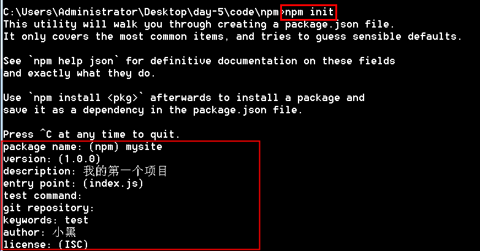
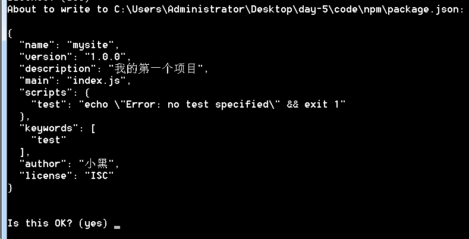
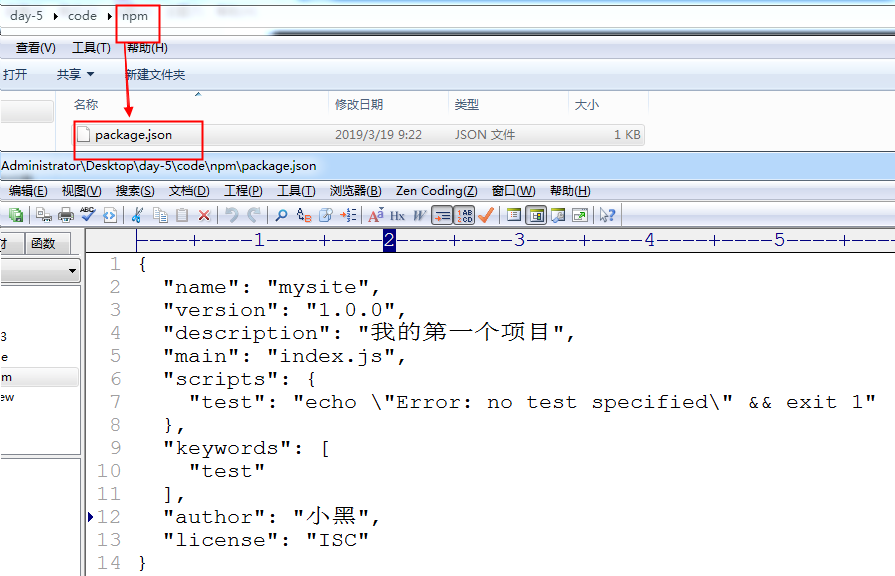
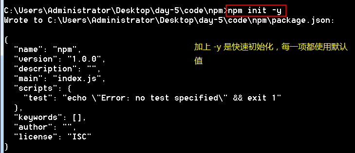
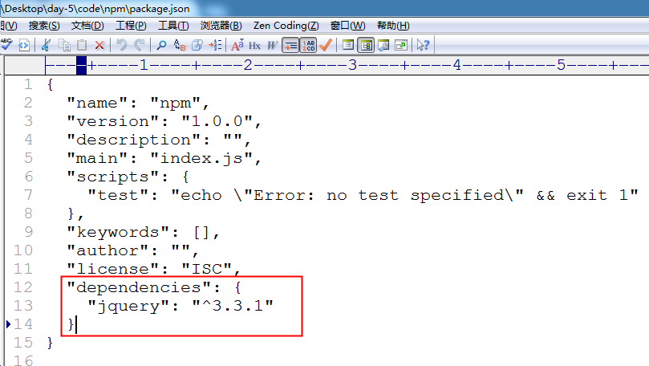
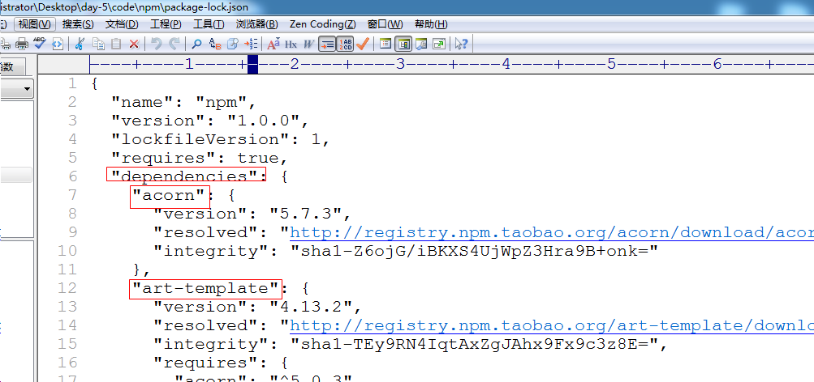
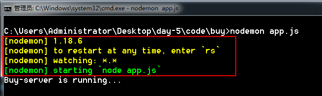
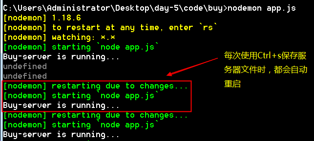
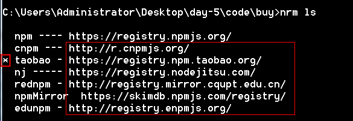
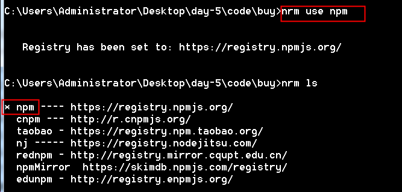

# npm

## 1 什么是 npm


npm （Node Packeage Manager）： Node 包管理器。是一个 Node 第三方模块(第三方包)管理工具，会随着 node 一起被安装。使用该工具能够简单方便的管理项目中所需要的第三方模块

官网： www.npmjs.com

官网管理了所有第三方包，例如：jquery、art-template 等，我们只要使用 npm 命令就能快速下载相关的包

## 2 项目初始化 --- init

使用 init 参数可以配置项目的基本信息

```shell
# 初始化：使用 init 参数
npm init

# 快速初始化，一切配置项使用默认值
npm init -y
npm init --yes
```

配置项：

- package name： 项目名称（包名）
- version：版本号
- description： 项目描述（包功能描述）
- main：入口文件
- test command：命令
- git repositroy：git 发布地址
- keywords：项目关键词
- author：作者
- license：许可证号
- 最后使用 yes 来确定配置项

使用 npm init 后会在当前目录下产生一个 package.json 文件，该文件中保存的就是初始化的内容

如果使用 npm init -y | --yes 就能快速生成，全部使用默认值。









## 3 基本安装 --- install

```shell
# 安装:  使用 install 或者 i 参数
npm install 包名
npm i 包名

# 示例： 安装 jquery
npm i jquery
npm install jquery
```

1. 使用 npm 安装 jquery

   使用 npm 安装第三方包时，会在当前目录下自动创建一个 node_modules 目录，将第三方包存入该目录中

2) package.json 文件补充说明

- 如果使用的是 5.x 版本的 npm，则安装完成后，在 package.json 文件中会自动产生一个 `dependencies`，用来记录该项目所依赖的包；
- 如果使用的是 3.x 版本的 npm，则需要增加 --save|-S，来指定依赖关系（npm i jquery --save|-S）



3.  package-lock.json 文件

        	该文件中记录了项目依赖的所有包信息， 有了该文件，即使我们删除了 node_modules 目录，也能通过 npm i 下载回所有需要依赖的第三方包



## 4 卸载

```shell
# 卸载：使用 uninstall 参数
npm uninstall 包名

npm uninstall jquery
```

npm 5.x 版本会同时删除 node_modules 目录中的包，也会删除 package.json 和 package-lock.json 中的配置项

## 5 安装指定版本的包

```shell
# npm默认会安装最新版本的包，如果想安装指定版本的包需要使用 @ 符号
npm i jquery@1.11.0
```

## 6 同时安装多个包

```shell
npm i 包名1 包名2 ...
npm install  包名1 包名2 ...
npm i jquery@1.11.0 art-template mysql body-parser
```

## 7 全局安装

有一些工具软件（非开发使用的第三方包）我们希望在任何地方都能使用，就可以使用 -g (global)参数来全局安装

所有全局安装的工具都会放在 C:\Users\Administrator（用户名）\AppData\Roaming\npm 目录下

```shell
npm i 工具名  -g
```

安装 nodemon

nodemon 是一款第三方提供的软件，安装该软件后我们就不必每次修改 http.js 文件之后再重启服务器了。nodemon 会帮我们自动重启。

```shell
# 使用 -g 全局安装之后，再任何目录下都可以使用
npm i nodemon -g
```

```shell
#使用  nodemon 命令来开启web服务器
nodemon app.js
```





## 8 解决下载缓慢问题

- 我们使用 npm 是从国外的网站下载第三方包，所以速度可能不是很理想。

- 一些组织和个人制作了 npm 的镜像网站，我们从这些网站上下载速度可能会快于官网网站

  例如：淘宝镜像 http://npm.taobao.org/

1.  使用 npm config 设置下载网站地址

npm 命令默认从官网进行下载，可以使用该命令设置为从 淘宝下载

```shell
npm config set registry https://registry.npm.taobao.org
```

2.  全局下载淘宝的 cnpm 程序，使用该程序进行下载

```shell
# 下载cnpm命令，全局安装
npm i cnpm -g
```

```shell
# 使用cnpm下载第三方包，cnpm命令的使用方式和npm一样
cnpm i art-template
```

3. 使用 nrm 一次性设置多个镜像网站地址

```shell
# 下载 nrm，全局安装
npm i nrm -g

# 查看已存在的镜像网站地址
nrm ls

# 切换默认使用的源
nrm use [name]
```





## 9 npm补充

### 常用命令

```shell
// 全局
npm install nodemon --global (-g)
npm uninstall nodemon --global
// 开发环境安装
npm install gulp --dev (-D) 
// 生产环境安装(默认npm i jquery等同于npm i jquery -S)
npm install jquery --save (-S)
// 查看node_modules中的依赖管理
npm list
// 查看某个依赖的版本
npm view jquery versions
// 查看依赖是否过时
npm outdated
```

### 版本号

```js
vue: 3.2.11
major: 主版本号 3 
minor: 次版本号 2 
path: 补丁 11 (通常事情下 单数为不稳定版补丁 双数为稳定版补丁)
```

### package.json中的符号意义

```js
{"gulp": "^4.0.2"} // 表示只锁定主版本号 4
{"gulp": "~4.0.2"} // 锁定主版本号和次版本号 4.0
{"gulp": "4.0.2"} // 版本号必须为4.0.2
{"gulp": "*"} // 默认装最新
```