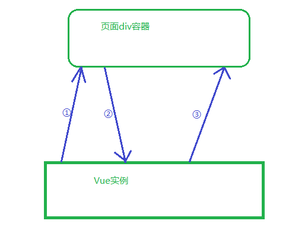
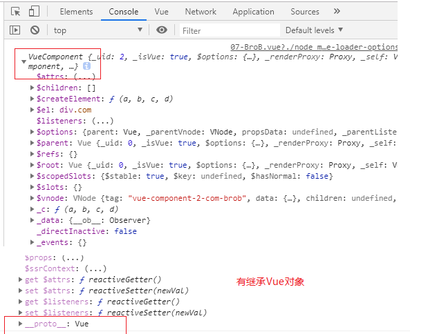
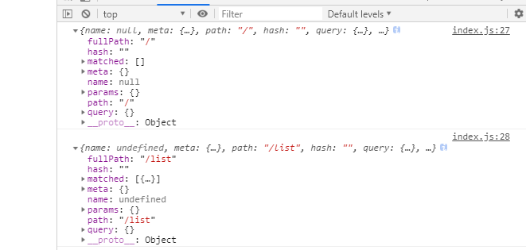
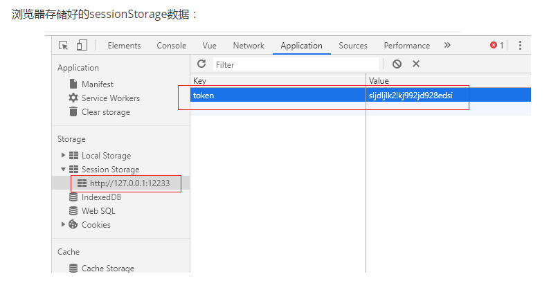

# Vue

## 1 了解 MVVM 设计模式

MVVM 设计模式(了解)

vue 本身有自己固定的代码结构，其也是 mvvm 设计模式的体现

M:model 数据操作部分 (vue 的 data 部分)

v:view 视图展示部分 (div 容器部分)

vm: view & model 视图和数据的关联部分 (el 和 data 通过实例化 new Vue 关联)

## 2 Vue 相关指令

### 2.1 插值表达式


{{}}可以使用 delimiters 更换


```js
// 和data methods平级下写
delimiters: ['@', '@'],
```

```html
<!-- 标签里写花括号 -->
<div id="app">
  <!--直接写差值表达式网速慢的时候会出现闪烁 推荐使用v-text-->

  {{ msg }}

</div>
<script>
  var vm = new Vue({
    el: '#app', //对应的选择器
    data: {
      mgs: 'hello Vue!'
    }
  })
</script>
```

### 2.2 v-text 和 v-html

> 可以写 算术、比较、逻辑、三元运算，变量等

```js
// 注意: v-test/v-html里面不能包裹内容 下面写法不正确
<div v-text="num">
  <div>111</div>
</div>
```

### 2.3 v-bind 属性绑定

#### 2.31 普通绑定

```html
<!-- 绑定id -->
<div v-bind:id="xxx">全写</div>
<div :id="xxx">简写，推荐用此</div>

<!-- 绑定图片路径 -->

<script>
    var vm = new Vue({
        el: '#app',
        data: {pic: '1.jpg'}
    });
</script>

<!-- a标签的路径 -->
<a :href="src">
<script>
var vm = new Vue({
    el：'#app',
    data:{
        src:'http://www.baidu.com'
    }
})

</script>

```

#### 2.32 绑定 class 属性

```html
<!-- true表示设置为属性 false表示不设置 -->
<div :class="{ 'apple': true, 'pear': false, 'orange':true}"></div>
```

#### 2.33 绑定 style 属性

```html
<!-- 传入对象 -->
<div :style="{color:'red',fontSize:'12px'}"></div>
<!-- 传入数组 -->
<div :style="[{color:'red',fontSize:'12px'}]"></div>
```

#### 2.34 开关灯小案例

```html
<!DOCTYPE html>
<html lang="en">
  <head>
    <meta charset="UTF-8" />
    <meta name="viewport" content="width=device-width, initial-scale=1.0" />
    <meta http-equiv="X-UA-Compatible" content="ie=edge" />
    <title>Document</title>
    <script src="./vue-2.6.10.js"></script>
    <style>
      * {
        padding: 0;
        margin: 0;
      }

      html,
      body,
      #app {
        height: 100%;
        background-color: #fff;
      }
    </style>
  </head>

  <body>
    <!-- 优化写法 -->
    <!-- <div id="box" :style="{ background: myswitch ? black : white }"> -->
    <!-- 旧写法 -->
    <div id="app" :style="myswitch?open:close">
      <button @click="myswitch =! myswitch">控制按钮</button>
    </div>
    <script>
      var vm = new Vue({
        el: '#app',
        data: {
          open: {
            backgroundColor: '#fff'
          },
          close: {
            backgroundColor: '#000'
          },
          myswitch: true
        }
      })
    </script>
  </body>
</html>
```

#### 2.35 简易计算器效果

利用 v-model、事件 指令实现 简易计算器 效果

```html
<!DOCTYPE html>
<html lang="en">
  <head>
    <meta charset="UTF-8" />
    <meta name="viewport" content="width=device-width, initial-scale=1.0" />
    <meta http-equiv="X-UA-Compatible" content="ie=edge" />
    <title>Document</title>
    <script src="./vue-2.6.10.js"></script>
  </head>

  <body>
    <div id="app">
      <input type="text" v-model="num1" /> +
      <input type="text" v-model="num2" />
      <input type="button" value="=" />
      
      <span>{{ cal() }}</span>
      
    </div>
    <script>
      var vm = new Vue({
        el: '#app',
        data: {
          num1: 0,
          num2: 0
        },
        methods: {
          cal() {
            return this.num1 - 0 + (this.num2 - 0)
          }
        }
      })
    </script>
  </body>
</html>
```

#### 2.36 文字框计数效果

利用 v-model 实现、length 文本框 字数计算效果

```html
<!DOCTYPE html>
<html lang="en">
  <head>
    <meta charset="UTF-8" />
    <meta name="viewport" content="width=device-width, initial-scale=1.0" />
    <meta http-equiv="X-UA-Compatible" content="ie=edge" />
    <title>Document</title>
    <script src="./vue-2.6.10.js"></script>
  </head>

  <body>
    <div id="app">
      <p>个人简介：</p>
      <textarea id="" cols="30" rows="10" v-model="num"></textarea>
      
      <p>共计{{num.length}}个字</p>
      
    </div>
    <script>
      var vm = new Vue({
        el: '#app',
        data: {
          num: 0
        }
      })
    </script>
  </body>
</html>
```

### 2.4 v-on 事件绑定

```html
<div v-on:click="事件处理函数"></div>
<div @click="事件处理函数"></div>
```

在 vue 中声明事件处理函数:

```html
<button @click="del">删 除</button>

<script>
  var vm = new Vue({
    el: '#app',
    data: {},
    // 给vue设置可以调用的方法，这些方法也可以支撑事件的调用
    methods: {
      del: function() {
        alert('删除成功')
      }
    }
  })
</script>
```

绑定事件处理函数并传参：

```html
<!-- 调用了没传参 -->
<input @click="show1()" />
<!-- 直接调用函数名 -->
<input @click="show2" />
<!-- 调用并传参 -->
<input @click="show3('ok')" />

<script>
  var vm = new Vue({
    el: '#app',
    data: {},
    // 给vue设置可以调用的方法，这些方法也可以支撑事件的调用
    methods: {
      show1: function(arg) {
        console.log(arg) // undefined
      },
      show2: function(arg) {
        console.log(arg) // 事件对象
      },
      show3: function(arg) {
        console.log(arg) // 传入的实参ok
      }
    }
  })
</script>
```

this 关键字问题

```html
<button v-on:click="getInfo">获取数据</button>

<script>
  var vm = new Vue({
    el: '#app',
    data: {
      address: '天津'
    },
    methods: {
      getInfo: function() {
        //简便写法中  :function可以省略
        // 通过 this关键字  this指向vue对象
        console.log(this.address + '是一个大城市')
      }
    }
  })
</script>
```

### 2.5 v-model 双向数据绑定

主要操作表单相关的属性，只能绑定 value 属性 针对 input select textarea

v-bind 是单向绑定 v-model 是双向绑定



```html
<!-- 绑定多个复选框 -->
吃饭：<input type="checkbox" value="eat" v-model="hobby" /><br />
睡觉：<input type="checkbox" value="sleep" v-model="hobby" /><br />
敲代码：<input type="checkbox" value="qiao" v-model="hobby" /><br />

{{ hobby }}

<script>
  var vm = new Vue({
    el: '#app',
    data: {
      hobby: []
    }
  })
</script>
```

### 2.6 v-for

- 遍历的时候 html 标签也会被多次创建

- :key 的问题：v-for 必须使用 key 来用以跟踪标签节点元素，:key="节点的唯一属性" 3 品牌案例中有详解

数组遍历：

```html
<div id="app">
  
  <li v-for="item,index in color">{{item}}++++{{index}}</li>
  
</div>
<script>
  var vm = new Vue({
    el: '#app',
    data: {
      color: ['red', 'pink', 'green']
    }
  })
</script>
```

对象遍历：

```html
<div id="app">
  
  <li v-for="(item, index) in cat">{{ item }}----{{ index }}</li>
  
</div>
<script>
  var vm = new Vue({
    el: '#app',
    data: {
      cat: { name: 'kitty', leg: 4, yanse: 'white' }
    }
  })
</script>
```

### 2.7 v-if 和 v-show

根据 v-if/v-show 中的布尔值来控制标签的显示和隐藏

```html
<div id="app">
  <button @click="beauty=!beauty">切换</button>
  <!-- v-if是通过动态添加和删除元素实现的，占用资源更多 -->
  <div v-if="beauty">山上风景好</div>
  <!-- v-show是通过css样式控制的，占用资源更少 -->
  <div v-show="beauty">山下风景美</div>
</div>

<script>
  var vm = new Vue({
    el: '#app',
    data: {
      beauty: true
    }
  })
</script>
```

### 2.8 v-if v-else-if 和 v-else

```html
<div id="app">
  <div v-if="month < 4">spring</div>
  <div v-else-if="month < 7">summer</div>
  <div v-else-if="month < 10">autumn</div>
  <div v-else>winter</div>
</div>
<script>
  var vm = new Vue({
    el: '#app',
    data: {
      month: 3
    }
  })
</script>
```

## 3 品牌列表案例

删除，筛选，增加

```html
<!DOCTYPE html>
<html lang="en">
  <head>
    <meta charset="UTF-8" />
    <meta name="viewport" content="width=device-width, initial-scale=1.0" />
    <meta http-equiv="X-UA-Compatible" content="ie=edge" />
    <title>Document</title>
    <script src="../vue-2.6.10.js"></script>
  </head>

  <body>
    <div id="app">
      <table border="1" width="500" style="text-align: center;margin: 0 auto;">
        <caption>
          品牌列表管理系统
        </caption>
        <tr>
          <td></td>
          <td>序号</td>
          <td>名称</td>
          <td>创建时间</td>
          <td>操作</td>
        </tr>
        <tr v-for="item,index in search()" :key="item.id">
          <td><input type="checkbox" /></td>
          
          <td>{{ item.id }}</td>
          <td>{{ item.name }}</td>
          <td>{{ item.ctime | getTime }}</td>
          
          <td><button @click="del(item.id)">删除</button></td>
        </tr>
        <tr>
          <td colspan="3">
            <input
              type="text"
              v-model="newOne"
              placeholder="在此输入添加内容"
            />
          </td>
          <td>
            <input
              type="text"
              v-model="keywords"
              placeholder="在此输入搜索内容"
            />
          </td>
          <td colspan="2"><button @click="add()">添加</button></td>
        </tr>
      </table>
    </div>
    <script>
      Vue.filter('getTime', function(origin) {
        var time = new Date(origin)
        var YYYY = time.getFullYear()
        var MM = time
          .getMonth()
          .toString()
          .padStart(2, 0)
        var DD = time
          .getDate()
          .toString()
          .padStart(2, 0)
        var hh = time
          .getHours()
          .toString()
          .padStart(2, 0)
        var ii = time
          .getMinutes()
          .toString()
          .padStart(2, 0)
        var ss = time
          .getSeconds()
          .toString()
          .padStart(2, 0)
        return `${YYYY}-${MM}-${DD} ${hh}:${ii}:${ss}`
      })
      var vm = new Vue({
        el: '#app',
        data: {
          brands: [
            { id: 10, name: '宝马', ctime: Date.now() },
            { id: 11, name: '奔驰', ctime: Date.now() },
            { id: 12, name: '奥迪', ctime: Date.now() }
          ],
          i: 12,
          newOne: '',
          keywords: ''
        },
        methods: {
          add() {
            // 新建一个对象，和原数据中的项一一对应
            var newObj = {
              id: ++this.i,
              name: this.newOne,
              ctime: Date.now()
            }
            // 将自定义的新对象加入到数据中
            this.brands.unshift(newObj)
            // 清空newOne来实现清空输入框
            this.newOne = ''
          },
          del(id) {
            //注意此处是形参应该从html中传来id
            if (!confirm('确定删除吗？')) return false
            // findIndex方法：找到传入对象的索引值并输出  该方法能循环传入的对象并找到目标条件
            var index = this.brands.findIndex(function(items) {
              //
              //items.id是brands所以小项的id    id是传入的id值 是从button中接收的
              return items.id === id
            })
            // 根据索引值删除数据
            this.brands.splice(index, 1)
          },
          search() {
            // .filter str字符串筛选方法 自己看吧 记得写return就行
            var result = this.brands.filter(items => {
              return items.name.includes(this.keywords)
            })
            return result
          }
        }
      })
    </script>
  </body>
</html>
```

## 4 Vue 过滤器

<!-- 注意：不论是全局还是私有过滤器，过滤器函数内必须要写 return

过滤器只可以用在两个地方： 插值表达式{{  |  }}和 :冒号 属性绑定表达式
 -->

### 4.1 全局过滤器

注意：过滤器必须放在 Vue 上面

```html
<div id="app">
  
  {{ time | myfilter }}
  
</div>
<script>
  var vm = new Vue({
    el: '#app',
    data: {
      time: Date.now()
    }
  })

  // 第一个参数是过滤器名   origin形参代表要被过滤的数据
  Vue.filter('myfilter', function(origin) {
    var tm = new Date(origin) // 根据被处理的"时间戳"信息重新实例化一个时间对象
    var yyyy = tm.getFullYear()
    var mm = (tm.getMonth() + 1 + '').padStart(2, '0') // padStart ECMA6 语法 笔记中有详解
    var dd = (tm.getDate() + '').padStart(2, '0')

    var hh = (tm.getHours() + '').padStart(2, '0')
    var ii = (tm.getMinutes() + '').padStart(2, '0')
    var ss = (tm.getSeconds() + '').padStart(2, '0')

    return `${yyyy}-${mm}-${dd} ${hh}:${ii}:${ss}` //最后 必须 return 返回值
  })
</script>
```

### 4.2 私有过滤器

注意： 全局过滤器 filter 私有过滤器 filters
二者权重：全局私有同时存在 并且名字相同 以私有为准 私有使用的更多

```html
<div id="app">
  
  {{ time | myfilter }}
  
</div>
<script>
  var vm = new Vue({
    el: '#app',
    data: {
      time: Date.now()
    },
    filters: {
      myfilter(origin) {
        var tm = new Date(origin)
        var yyyy = tm.getFullYear()
        var mm = (tm.getMonth() + 1 + '').padStart(2, '0')
        var dd = (tm.getDate() + '').padStart(2, '0')

        var hh = (tm.getHours() + '').padStart(2, '0')
        var ii = (tm.getMinutes() + '').padStart(2, '0')
        var ss = (tm.getSeconds() + '').padStart(2, '0')

        return `${yyyy}-${mm}-${dd} ${hh}:${ii}:${ss}` //最后 必须 return 返回值
      }
    }
  })
</script>
```

### 4.3 过滤器的参数

过滤器中可以有多个参数

```html
<div id="app">
  <h2>过滤器</h2>
  
  <p>{{ msg }}</p>
  <!-- <p>{{ msg | toBig(实参,实参,实参...) }}</p> -->
  <p>{{ msg | toBig(5) }}</p>
  
</div>

<script>
  // Vue.filter('toBig',function(origin要修改的数据,形参,形参,形参...){
  Vue.filter('toBig', function(origin, num) {
    // 需求：根据参数使得字符串的前 num 位变为大写
    // substr(下标[，长度])字符串截取函数
    return origin.substr(0, num).toUpperCase() + origin.substr(num)
  })

  var vm = new Vue({
    el: '#app',
    data: {
      msg: 'hellobeijing'
    }
  })
</script>
```

### 4.4 同时应用多个过滤器

```html
<div id="app">
  <h2>过滤器(多个)</h2>
  
  <p>{{ msg }}</p>
  <!-- <p>{{ msg | toBig(实参,实参,实参...) }}</p> -->
  <p>{{ msg | toBig(5) }}</p>
  <p>{{ msg | toBig(5) | toSmall(2) }}</p>
  
</div>

<script>
  // Vue.filter('toBig',function(origin,形参,形参,形参...){
  Vue.filter('toBig', function(origin, num) {
    // 根据参数使得字符串的前 num 位变为大写
    // substr(下标[，长度])字符串截取函数
    return origin.substr(0, num).toUpperCase() + origin.substr(num)
  })
  Vue.filter('toSmall', function(origin, num) {
    // 根据参数使得字符串的前 num 位变为小写
    return origin.substr(0, num).toLowerCase() + origin.substr(num)
  })

  var vm = new Vue({
    el: '#app',
    data: {
      msg: 'hellobeijing'
    }
  })
</script>
```

## 5 Vue 生命周期

### 5.1 Vue.\$mount() 动态挂载实例

```js
var vm = new Vue({
  // el:'#app',  // 挂载容器
})
vm.$mount('#app') //可以不写el转而用vm.$mount挂载
```

### 5.2 template 和 render 覆盖问题

```html
<div id="app">
  <h2>生命周期</h2>
  
  <p>{{ msg }}</p>
  
</div>

<script>
  var vm = new Vue({
    el: '#app',
    data: {
      msg: 'today is Saturday'
    },
    // 对容器进行"覆盖式"渲染，会覆盖掉div容器
    template: '<p>okokok</p>',
    // 渲染方法，也会"覆盖式"渲染容器全部内容(比template优先级还高)
    render(create) {
      // return create(参数1：标签名称, 参数2：标签内容区域的信息)
      return create('span', 'yyyyyyyyyyyy')
    }
  })
  // vm.$mount('#app')  // (el不生效)使得vm实例 与 容器联系
</script>
```

```js
// 设置样式、类名
//效果  <p class="foo bar" style="color:red;font-size:14px" id="foo">hello</p>
render(create){
  return create('p'，{
    class: { foo: true, bar: true},
    style: { color: 'red', fontSize: '14px'  },
    attrs: { id: 'foo'},
  }, 'hello')
}
// 简写
render:(c)=>c(app)

// 嵌套使用
// 语法：render(){return create('div',[div内容,要嵌套的元素)}
render(){
  return create(){'div',[
    '我是div中的内容',
    create(){'div',[
      '我是下级div中的内容',
        create('span','我是span内容')
    ]}
  ]}
}
```

### 5.3 console.log()拓展

```js
// group()可以使得信息进行"分组"显示
console.group('前端')
console.log('tom')
console.log('linkn')
console.log('mary')

console.group('java')
console.log('aobama')
console.log('trump')
console.log('小泉')

// 给输出内容做"颜色"样式设置
// %c: 表示要设置样式，具体与第二个参数关联
// %s: 表示的是输出字符串  ，具体与第三个参数关联
console.log('%c%s', 'color:red', 'hello北京')
console.log('%c%s', 'color:green', 'hello上海')
```

### 5.4 生命周期函数

```html
<div id="app">
  <p>生命周期</p>
</div>
<script>
  var vm = new Vue({
    // 注意： Vue中想获取el data methods等 要用this.$el获取，而data methods中的方法数据则直接可以this.msg
    beforeCreate() {
      console.log(this.$el) //undefined
      console.log(this.$data) //undefined     所有数据都是undefined
    },
    created() {
      // 此阶段常用，第一个重要的函数，
      // ！！！！！此时el和data已经被创建 可以被访问，在此处非常适合做data数据初始化操作！！！！！！
    },
    beforeMount() {
      // 容器内容已经被Vue获取到，但是未解析 此时Vue实例被称为Virtual DOM(虚拟容器)
    },
    mounted() {
      // 此阶段常用，第二重要的函数
      //！！！！！！！ 挂载el完成，页面渲染完成，在此处适合进行DOM操作！！！！！！！！
      // 创建阶段完毕
    },
    beforeUpdate() {
      // 根据data中的新数据重新渲染页面，数据不变此步骤不执行
      // 此时Vue拿到新数据，但未渲染
    },
    updated() {
      // Vue进行页面渲染
      // 运行阶段完毕
    },
    beforeDestory() {
      // 将要销毁 实例仍可用
    },
    Destoryed() {
      // 销毁完成 实例不可用
      // 销毁阶段完毕
    },
    el: '#app',
    data: {
      msg: '我是一条信息'
    }
  })
</script>
```

## 6 Promise

什么是 Promise：异步编程的解决方案，ES6 语法，解决了回调地狱的问题

Promise 使用

```js
function getFileCont(filename) {
  // 第一个参数：读取成功的"函数"形参 第二个参数：读取失败的"函数"形参
  // 这两个参数可以对结果进行逻辑封装，
  return new Promise(function(successCb, errorCb) {
    fs.readFile(filename, 'utf8', function(err, data) {
      if (err) {
        return errorCb('文件读取错误' + err)
      }
      successCb(data)
    })
  })
}
// async和await关键字有对Promise对象做简化操作(不用调用then方法),同时可以保证各个异步调用按照先后"顺序"执行
// async和await介入，优化"异步/顺序"执行代码
// 一个函数A内部如果有调用其他函数B，并且其他函数B的返回结果是Promise对象
// 那么函数A的前边就可以使用"async关键字"声明,内部的函数B调用之前可以声明await关键字
// 被await声明的函数B的返回结果就由原先的"Promise对象"变为 "successCb的实参"了
async function getThreeFileCont() {
  try {
    //try{}catch(err){} 是async和catch错误处理异常机制 有错误执行catch 没错误不执行catch
    console.log(await getFileCont('./files/01.txt')) //await修饰的结果必须是Promise对象
    console.log(await getFileCont('./files/02.txt')) //此处的getFileCont返回的就是Promise对象
    console.log(await getFileCont('./files/03.txt'))
  } catch (e) {
    // 捕捉try里边产生的错误
    // e：代表错误对象信息
    console.log(e)
  }
  console.log('aaaa') // 后续代码
}
getThreeFileCont()
```

## 7 axios (ajxa 的封装插件)

```js
官网地址 https://www.npmjs.com/package/axios
```

### 7.1 发送 Get 请求

使用 axios 中的 get 方式提交表单：（post 方式用法基本一致，不用写 params）

```html
<div id="app">
  <p>axios初体验</p>
  <button @click="requestGet()">按钮</button>
</div>
<script>
  var vm = new Vue({
    el: '#app',
    data: {},
    methods: {
      //  axios.get返回的是一个Promis对象 可以写async和await
      async requestGet() {
        // axios发送get请求:
        // 第一个参数：申请的路由
        // 第二个参数：{params必写：{key:value,key:value}}，会被自动拼接成:
        // axios.get()有返回结果，具体是“Promise对象”
        var { data: dt } = await axios.get('http://127.0.0.1:3006/api/get', {
          // http://127.0.0.1:3006/api/get?name=zs&age=18&gender=女
          params: {
            name: 'zs',
            age: 18,
            gender: '女'
          }
        })
        // var {data:dt}  使用了结构赋值以及别名 ECMA6新增语法
        console.log({ dt })
        console.log(dt.data.name)
        console.log(dt.data.age)
        console.log(dt.data.gender)
      }
    }
  })
</script>
```

### 7.2 配置项

```js
// 设置默认跟地址：
axios.defaults.baseURL = 'http://127.0.0.1:3006';

// 把axios配置给Vue并成为其一个子成员，每次需要通过Vue触发axios调用(axios自己不要贸然执行)
Vue.prototype.$http = axios;   //将axios挂载到Vue对象原型上
使用时：this.$http或者vm.$http

```

### 7.3 拦截器 interceptors

实现代码：(等待案例)

```html
<div id="app">
  <h3 style="color: white">interceptors</h3>
  <button @click="getAsk()">发送get请求</button>
  <div v-if="flag">
    
  </div>
</div>

<script>
  axios.defaults.baseURL = 'http://127.0.0.1:3006'
  Vue.prototype.$http = axios
  var vm = new Vue({
    created() {
      // 请求拦截
      var _this = this
      this.$http.interceptors.request.use(
        function(config) {
          // 注意此处的this!!!!  可在外面接收  也可以将use(function(config))改造成箭头函数
          _this.flag = true
          return config
        },
        function(error) {
          return Promise.reject(error)
        }
      )
      // 响应拦截
      this.$http.interceptors.response.use(
        function(response) {
          _this.flag = false
          return response
        },
        function(error) {
          return Promise.reject(error)
        }
      )
    },
    el: '#app',
    data: { flag: false },
    methods: {
      async getAsk() {
        var { data: dt } = await axios.get('/api/getprodlist', {
          params: { name: 'zs', age: 18 }
        })
        console.log(dt)
      }
    }
  })
</script>
```

## 8 品牌管理案例改造

```html
<div id="app">
  <table border="1" width="500" style="text-align: center;margin: 0 auto;">
    <caption>
      品牌列表管理系统
    </caption>
    <tr>
      <td></td>
      <td>序号</td>
      <td>名称</td>
      <td>创建时间</td>
      <td>操作</td>
    </tr>
    <tr v-for="item,index in search()">
      <td><input type="checkbox" /></td>
      
      <td>{{ item.id }}</td>
      <td>{{ item.name }}</td>
      <td>{{ item.ctime | dataForm}}</td>
      
      <td><button @click="del(item.id)">删除</button></td>
    </tr>
    <tr>
      <td colspan="3">
        <input type="text" v-model="content" placeholder="在此输入添加内容" />
      </td>
      <td>
        <input type="text" placeholder="在此输入搜索内容" v-model="keywords" />
      </td>
      <td colspan="2"><button @click="add()">添加</button></td>
    </tr>
  </table>
</div>

<script>
  axios.defaults.baseURL = 'http://127.0.0.1:3006'
  Vue.prototype.$http = axios

  Vue.filter('dataForm', function(origin) {
    var tm = new Date(origin) // 根据被处理的"时间戳"信息重新实例化一个时间对象
    var yyyy = tm.getFullYear()
    var mm = (tm.getMonth() + 1 + '').padStart(2, '0') // padStart ECMA6 语法 笔记中有详解
    var dd = (tm.getDate() + '').padStart(2, '0')

    var hh = (tm.getHours() + '').padStart(2, '0')
    var ii = (tm.getMinutes() + '').padStart(2, '0')
    var ss = (tm.getSeconds() + '').padStart(2, '0')
    return `${yyyy}-${mm}-${dd} ${hh}:${ii}:${ss}` //最后 必须 return 返回值
  })

  var vm = new Vue({
    created() {
      this.getList()
    },
    el: '#app',
    data: {
      content: '',
      brands: [],
      keywords: ''
    },
    methods: {
      // 从服务器端获取数据
      async getList() {
        var { data: dt } = await this.$http.get('/api/getprodlist')
        // 将获取到的数据赋值给brands
        this.brands = dt.message
      },
      // 添加功能
      async add() {
        // 判断若输入的内容为空 则不执行下面的代码
        if (this.content.trim().length === 0) {
          layer.msg('请输入要添加的内容')
          return false
        }
        // 发送axios请求 携带content中的值提交到服务器
        var { data: dt } = await this.$http.post('/api/addproduct', {
          name: this.content
        })
        // 根据服务器返回的数据判断是否提交成功并且给用户提示
        if (dt.status != 0) return false
        layer.msg(dt.message)
        // 重新获取页面列表（ajax页面无刷新技术）
        this.getList()
        // 清空input框的内容
        this.content = ''
      },
      // 删除功能
      async del(id) {
        // 携带参数的写法是文档中提供的  id是在页面上获取到的
        var { data: dt } = await this.$http.get('/api/delproduct/' + id)
        if (dt.status == 0) {
          layer.msg(dt.message)
        }
        this.getList()
      },
      // 检索功能
      search() {
        // 使用filter函数进行筛选，filter函数会循环查找brands数组中的数据
        // 注意此时的this使用问题,this指向了filter函数，可以使用箭头函数或者外面接收this值解决
        var result = this.brands.filter(items => {
          // 当items中的name包含keywords关键字时把值返回
          return items.name.includes(this.keywords)
        })
        // 返回result结果  注意：功能的实现让v-for循环search的返回值
        return result
      }
    }
  })
</script>
```

## 9 ES6 模块化

优点：相同的代码被重复使用，提高了代码开发的效率，增强项目的维护性

### 9.1 commonjs 的模块化

commonjs 中的模块化是民间方法(非正式)，能运行在 node 中，不能再 html 中运行

而 ES6 的模块化可以运行在 html 中，不能运行在 node 中

```js
modules.exports = routers

const routers = require('./文件路径')
```

### 9.2 默认导入导出

```js
// 默认导出：一次性把文件的全部内容导出
export default {name:'zs',age:18,gender:'女'}
// 默认接收
import obj form './导出模块的路径'

```

### 9.3 按需求导出

```js
// 按需导出：
export const a = 10
const b = 20
export const c = 30
// 按需接收
import { a, c } from './导出模块的路径'
```

### 9.4 按需和默认同时

```js
// 导出
export const a = 10;
export const b = 20;
export default const obj = {name:'zs',age:18,gender:'女'}
// 导入
import  obj,{a,b} from './导出模块的路径'  //接收时注意书写顺序，要先接收default的值
import obj as obj111, {a, b} from '../js/02-es6按需导出.js'   //别名的设置使用as的形式

```

### 9.5 无导出，仅导入

```js
// 正常文件
for (var i = 0; i < 5; i++) {
  console.log(i)
}
// 导入文件
import './导出模块的路径'
```

## 10 webpack

### 10.1 作用

- 打包文件
- 编译转码、降级高级技术标准为普通或通用的
- 模块化开发
- 编译图片为 base64 格式(字符串)，减少网络请求次数

### 10.2 webpack 配置

```js
// 在项目根目录中，新建一个 webpack.config.js 配置文件，内容如下
const path = require('path')

module.exports = {
  // 给webpack配置打包模式
  mode: 'development', // production压缩，线上模式     development 开发模式

  // 配置"被打包文件路径名"的【输入】
  // resolve()会自动获得目标文件之前的完整路径名，会自动找到__dirname并拼装 等同于:
  // entry:path.join(__dirname , './src/index.js')
  entry: path.resolve('./src/index.js'), // 通过绝对路径定义被打包文件

  // 配置"打包文件的路径名"的【输出】
  output: {
    filename: 'bundle.js', // 输出文件名字，默认是main.js
    path: path.resolve('./dist') // 打包文件输出目录，默认是dist
  }
}
```

### 10.3 相关命令

```js
// 初始化package.json:
// 配置名字时可能会出现问题 可手动更改package.json和package-lock.json中的name
npm init -y

// 安装jquery
npm install jquery

// 创建目录和文件
js文件放在src目录
输出的main.js默认输出在dist

//配置 打开 package.json文件，在 scripts 节点中，新增名称为 pack 的成员：
"scripts": {
  "test": "echo \"Error: no test specified\" && exit 1",
  "pack": "webpack"
}

// 安装命令  -D 表示通过开发依赖形式安装webpack  ，全称为 --save-dev
npm install webpack webpack-cli --save-dev

// 导入jquery  将jquery倒入到index.js中
const $ = requrie('jquery')

// 打包/运行
npm run pack
```

### 10.4 运行和开发依赖

```js
// 安装运行依赖包(dependencies)
npm install XXX    // 直接装包，没有任何其他参数 axios、jquery都是运行包
// 安装开发依赖包(devdependencies)
npm install XXX --save-dev    //设置额外参数--save-dev(简称为-D) 开发包是我们自行更改的包


// 运行依赖包需要在index.js中用require引入 开发依赖则不用
```

### 10.4 打包 html 模板页

html-webpack-plugin
webpack 默认只对 src 中的 js 文件进行打包,不会处理 html 文件,该模块可以自动打包 html 并引入 js 文件

```js
// 安装开发包 html中不用再引入js文件了，该模块可以自动引入
npm install html-webpack-plugin --save-dev

// 配置webpack.config.js
const  HtmlWebpackPlugin  =  require('html-webpack-plugin')

// 放在module.exports = {}中
plugins:  [
  new  HtmlWebpackPlugin({
    template:  path.resolve('./src/index.html') // 要打包的html模板文件路径名
  })
]

// 重新运行打包命令
npm run pack

```

### 10.5 实时打包工具

webpack-dev-sever 在使用的过程中，不会打包文件在目录中，而是运行在内存中，要保存还得运行打包命令

这个工具可以实时处理 js、实时处理 html 模板、实时查看效果，显著提高生产率

```js
// 安装开发包
npm install --save-dev webpack-dev-server

// 配置webpack.config.js
devServer: {
  host: '127.0.0.1', // 服务器主机名地址
  port: 12233, // 服务器端口号码
  open: true, // 自动开启浏览器
  compress: true // 服务器的虚拟文件以压缩方式提供，使得速度比较快
},

// 在package.json中定义启动指令
"scripts": {
  "line": "webpack-dev-server"
}

// 执行
npm run line

```

### 10.6 webpack loader

webpack 本身是打包程序，但应对具体代码内容的处理能力有限，需要引入 loader(装载器)进行转码，降级，编译等处理

loader:webpack 细分下来的模块处理程序，打包过程中需要 loader 来处理不同格式的文件

| 不同内容 | loader 处理器                           |
| -------- | --------------------------------------- |
| css      | style-loader 和 css-loader              |
| less     | less-loader 和 less(less-loader 的依赖) |
| 图片     | url-loader 和 file-loader               |
| ES6/ES7  | babel-loader                            |
| ...      | ...                                     |

#### 10.6.1 loader-for css

```js

// 解析css文件所需的依赖包
npm install style-loader css-loader --save-dev

// webpack.config.js配置
module.exports = {
  module: {
    // 设定loader的各种使用规则
    rules: [

      {
        // 告知遇到.css结尾的文件就找当前的loader处理
        test: /\.css$/,
        // style-loader: ，并把css通过<style>标签的形式提供到模板(index.html)页面中去
        // css-loader：使得项目通过模块化(import/require)方式引入css样式文件, 对css内容做编译处理(把css内容给融入到打包的js内容中去)
        // style-loader和css-loader必须保持该顺序，但执行时css-loader在前，style-loader在后
        use: ['style-loader', 'css-loader']
      }
        // 注意 ： 此处再用其他的时候要放在其他对象中

    ]
  }
}

// 最后导入到index.js中
import './css路径'

// 再重新运行

```

#### 10.6.2 loader-for less

```js
// 解析less文件所需的依赖包
npm install --save-dev less-loader less
// 配置 webpack.config.js
{ test: /\.less$/, use: ['style-loader', 'css-loader', 'less-loader'] }
```

#### 10.6.3 loader-for img

此处的 img 是 css 中的背景图之类的 img，若 html 中有 img 图片标签，webpack 不会处理，仅仅把 img 的 src 当做 html 标签的普通属性值处理了

```js
// 安装解析img格式文件所需依赖包
npm install --save-dev file-loader url-loader
// 配置webpack.config.js
{
  test: /\.(png|jpg|gif)$/,
  use: [
    {
    // file-loader是url-loader内部的依赖，下载即可，会自动配置
    // url-loader功能：当文件体积“小于等于”8192个字节时(8k)，将图片转换为base64字符串传输(不占用http资源),若文件提交大于8k，
    // 则file-loader发挥作用，文件直接输出在dist目录中
      loader: 'url-loader',
      options: {
        limit: 8192, //阀值
        outputPath: '/images'//设置file-loader的输出路径
      }
    }
  ]
}

```

小问题：

```js
// ps:file-loader也是有最大限制的，若图片大于244k，编译时会提示warning，如下设置可解决
module.exports = {
  performance: {
    //此代码和mode同级
    hints: false
  }
}
// 或者把webpack mode设置为development也可解决
module.exports = {
  mode: 'development'
}
```

#### 10.6.4 loader-for es6/es7

依赖 webpack 下的 babel-loader 实现，babel-loader 下自带 preset 插件，preset（是常用 plugin 的集合）处理不全时可以自行安装 preset 下的 plugin 处理

常规 preset 处理：

```js
// 安装babel-loader    @babel/core 核心   @babel/preset-env babel下的preset
npm install --save-dev babel-loader @babel/core @babel/preset-env

// 在 webpack.config.js 中配置
{
  test: /\.js$/,
  // 给指定的目录做排除处理(不要处理)
  exclude: /node_modules/,
  use: 'babel-loader'
}

// 创建.babelrc文件 为了使得babel-loader找到preset插件集合帮忙处理es6/es7内容
{
  "presets": ["@babel/preset-env"],
}
```

preset 不够时，添加 plugin 处理：

```js
// 处理class声明类 es7代码
  // static方式声明静态成员 es6已经可以通过class声明类了，但如果类中有static静态成员，preset处理不了，
  // 还需要额外再安装plugin插件 @babel/plugin-proposal-class-properties
class Person{
  static country = "中国"
}
console.log(Person.country);

// 安装
npm install --save-dev @babel/plugin-proposal-class-properties

// 在.babelrc配置文件中给插件做配置
{
  "plugins": ["@babel/plugin-proposal-class-properties"]
}


```

## 11 webpack 中使用 vue

了解：

- wwebpack 中 vue 文件的说明：
  - vue.common.js // 属于: 基于 CommonJS 的完整构建
  - vue.esm.js // 属于: 基于 ES Module 的完整构建
  - vue.js // 属于: 基于 UMD 的完整构建，可在浏览器端直接使用
  - vue.min.js // 和 vue.js 一样, 属于压缩后版本
  - vue.runtime.common.js // 属于: 基于 CommonJS 的运行时构建
  - vue.runtime.esm.js // 属于: 基于 ES Module 的运行时构建
  - vue.runtime.js // 属于: 基于 UMD 的运行时构建
  - vue.runtime.min.js //和 vue.runtime.js 一样, 属于压缩后版本

知道：
runtime: 运行时类型，内部没有 tempalte 成员，较比完整性(vue.js)功能上有缺失
new Vue{'el':XXX, render(c){return c(xxxxx)}} ----->webpack 环境下： 当有 render 时可以使用 runtime 类型，没有 render 时只能使用完整的 vue.js
浏览器环境下：使用完整的 vue.js vue.min.js

```js
// 安装vue
npm install vue

// 引入vue 到index.js
import Vue from 'vue'  //此种写法默认引入vue.runtime.common.js运行类型的Vue
import Vue from '../node_modules/vue/dist/vue.js'

// 使用
var vm =new Vue({});

```

## 12 组件 Component

什么是组件：就是有一定功能的 html css js 的集合体，可重复利用非常方便，提高开发效率

### 12.1 全局组件

```js
// 组件的使用和过滤器使用性质一样，必须要配合new Vue({})使用，并且写在其上面

// 参数1：自定义的组件名 ，参数2：组件的配置成员对象
Vue.component('my-com', {

  template: `
        <ul>
            <li>{{ prov }}</li>  
            <li>[1]</li>  
            <li>2</li>  
            <li>[3]</li>  
            <li>{{ next }}</li>  
        </ul>
    `, //注意：在template组件的结构中，只能有唯一的根标签(ul下不能有其他标签)

  data() {
    return { prov: '上一页', next: '下一页' }
  }
})
var vm = new Vue({
  el: '#app'
})
```

```html
<!--在html页面进行使用-->
<div id="app">
  <my-page></my-page>
</div>
```

### 12.2 私有组件

```js
var xm = new Vue({
  components: {
    'my-com': {
      template: `<ul></ul>`
    }
  }
})
```

### 12.3 组件的成员

组件是特殊的 Vue 实例，拥有 Vue 中所有的成员(过滤器、生命周期、data、methods)

注意：

- Vue 实例中：data 成员可写做 data：{}字面量或者 data(){}函数形式
- 组件中：data(){}必须写作函数形式

```js
Vue.component('my-com',{
  created(){
    console.log(123)
  },
  template:`<ul></ul>`,
  data(){    //注意此处的data写法  必须写return
    return {prev:'上一页',next:'下一页'}
  },
  methods:{
    add(){};
    del(){};
  }

})
```

## 12 Vue 单文件组件

### 12.1 单文件使用

单文件：在 src 下创建 components 文件夹，放置 component.vue

```html
<template>
  <ul>
    <li>1</li>
    <li>2</li>
    <li>3</li>
    <li>4</li>
    
    <li>{{ msg }}</li>
    
  </ul>
</template>

<script>
  export default {
    data() {
      return { msg: '正在学习vue单文件组件' }
    },
    methods: {},
    components: {},
    filters: {},
    created() {}
  }
</script>

<style lang="less" scoped>
  /* 问题：默认情况下，vue单文件组件的style样式是全局的，可能遇到样式覆盖
   解决方法：在style标签中添加scoped属性
   lang可以设定语言，为了让编译器不报错*/
  ul {
    li {
      list-style: none;
    }
  }
</style>
```

```js
// 安装
npm install vue-loader vue-template-compiler --save-dev

// 配置webpack.config.json
const VueLoaderPlugin = require('vue-loader/lib/plugin')

module.exports = {
  plugins: [
    // 配置这个是为了保证Vue单文件中能解析css img less es6、7
    new VueLoaderPlugin()
  ],
  module: {
    rules: [
      {
        // 配置vue-loader解析
        test: /\.vue$/,
        use: 'vue-loader'
      }
    ]
  }
}
```

```js
// 讲配置好的component.vue文件导入index.js
import Vuecomponent from './components/component.vue'

// 调用组件
// 全局组件调用方式
Vue.component('my-com', Vuecomponent)

// 私有组件调用方式
var vm = new Vue({
  components: {
    // 自定义名称 : 组件名称
    'my-com': Vuecomponent
  },
  data: {
    msg: 'Vue单页面使用'
  }
})
```

```html
<!-- 在html中使用 -->
<div id="app">
  
  {{ msg }}
  
  <my-com></my-com>
</div>
```

### 12.2 组件嵌套使用

使用步骤：

```html
<!--  定义两个vue文件 son.vue和father.vue -->

<!-- son.vue -->
<template>
  <ul>
    <li>1</li>
    <li>2</li>
    <li>3</li>
    <li>4</li>
    <li>5</li>
  </ul>
</template>
<script></script>
<style lang="less" scoped>
  ul {
    li {
      list-style: none;
    }
  }
</style>

<!-- father.vue -->
<template>
  <div>
    <h4>fathers</h4>
    <my-son></my-son>
  </div>
</template>
<script>
  import son from './son.vue'
  export default {
    components: {
      'my-son': son
    }
  }
</script>
<style lang="less" scoped>
  div {
    margin: 0 auto;
  }
</style>
```

```js
// 在index.js中引入并使用father组件
import Vue from '../node_modules/vue/dist/vue.js'

import father from './components/father.vue'

var vm = new Vue({
  components: {
    'my-father': father
  },
  el: '#app' //注意：此处要和html页面上的div挂载上
})
```

```html
<!-- 在html页面使用index.js定义的组件 -->
<div id="app">
  <com-fat></com-fat>
</div>
```

## 13 Vue 组件间数据传递

### 13.1 父向子传值

父页面 Vue：

```html
<template>
  <div id="father">
    <p>我是父元素</p>
    <!-- 此处的:hao="qq"是v-bind单向绑定，可获取data中的值 -->
    <my-son money="200块" car="脚踏车" hourse="天桥下" :hao="qq"></my-son>
  </div>
</template>
<script>
  import son from './son.vue'
  export default {
    data() {
      return { qq: '100级QQ号' }
    },
    components: {
      // 自定义名：上面导入的文件变量名
      'my-son': son
    }
  }
</script>
<style lang="less" scoped>
  #father {
    width: 800px;
    height: 600px;
    background-color: pink;
  }
</style>
```

子页面 Vue：

```html
<template>
  <div id="son">
    <p>我是子元素</p>
    
    <p>爸爸给的钱：{{ money }}</p>
    <p>爸爸给的车：{{ car }}</p>
    <p>爸爸给的房：{{ hourse }}</p>
    <p>爸爸给的号：{{ hao }}</p>
    
  </div>
</template>
<script>
  export default {
    /* 用来接收父元素发来的值 可在template中直接使用 */
    props: ['money', 'car', 'hourse', 'hao']
  }
</script>
<style lang="less" scoped>
  #son {
    width: 400px;
    height: 400px;
    background-color: skyblue;
  }
</style>
```

### 13.2 子向父传值

父元素 Vue:

```html
<template>
  <div id="father">
    <p>我是父元素</p>
    <!-- 自定义绑定事件back 将back传送给子元素 -->
    <my-son @back="report"></my-son>
  </div>
</template>
<script>
  import son from './case2-son.vue'
  export default {
    components: {
      'my-son': son
    },
    methods: {
      // 在methods方法中定义report方法，并写形参进去
      report(case1, case2, case3) {
        console.log(`儿子给父亲报告情况1：${case1}和${case2}还有${case3}`)
      }
    }
  }
</script>
<style lang="less" scoped>
  #father {
    width: 800px;
    height: 600px;
    background-color: skyblue;
  }
</style>
```

子元素 Vue:

```html
<template>
  <div id="son">
    <p>我是子元素</p>
    <!-- 注册点击事件，正常调用自定义的函数 -->
    <button @click="ask()">按钮</button>
  </div>
</template>
<script>
  export default {
    methods: {
      ask() {
        // 子元素使用this.$emit方法接受back参数，并且写入实参传送给父元素
        this.$emit('back', '情况1', '情况2', '情况3')
      }
    }
  }
</script>
<style lang="less" scoped>
  #son {
    width: 400px;
    height: 400px;
    background-color: pink;
  }
</style>
```

### 13.3 同级间传值

```js
// 要通过第三个js文件来实现
import Vue from 'vue'
export default new Vue()
```

发送数据方：

```html
<template>
  <div id="box">
    <p>我是box1</p>
    <!-- 注意此处要注册点击事件来实现数据的发送 -->
    <button @click="send()">111111</button>
  </div>
</template>

<script>
  import car from './car.js'
  export default {
    methods: {
      // 自定义了一个send函数
      send() {
        // 通过$emit方法把数据发送到car的Vue实例中去
        car.$emit('selfDefine', '参数1', '参数2')
      }
    }
  }
</script>

<style lang="less" scoped>
  #box {
    width: 200px;
    height: 100px;
    background-color: skyblue;
  }
</style>
```

接受数据方：

```html
<template>
  <div id="box">
    <p>我是box2</p>
  </div>
</template>

<script>
  import car from './car.js'
  export default {
    created() {
      // 在car的Vue实例中使用on方法获取数据
      // 参数1:自定义名称 参数2：回调函数（arg1,arg2，arg3）
      car.$on('selfDefine', (arg1, ag2) => {
        alert(`收到Vue1的数据，${arg1},${arg2}`)
      })
    }
  }
</script>

<style lang="less" scoped>
  #box {
    width: 200px;
    height: 100px;
    background-color: skyblue;
  }
</style>
```

### 13.4 扩展部分

#### 13.4.1 组件中的 this

```html
<script>
  export default {
    created() {
      // 组件中的this指向Vuecomponent对象，同时用__proto__的方式继承Vue对象，使用方式与Vue对象一致
      console.log(this)
    }
  }
</script>
```



#### 13.4.2 获取页面元素、组件

```html
<!-- 获取 -->
<h2 ref="html1"></h2>
<!--获取h2标签-->
<same-box1 ref="com"></same-box1>
<!--获取整个component组件-->
```

```js
// 使用
mounted() {
  console.dir(this.$refs.html1)
  console.log(this.$refs.com.send()) //直接调用same-box1组件中的send()方法
}
```

## 14 组件切换

### 14.1 底层方式实现

> 通过 component 实现

part main

```html
<template>
  <div id="box1">
    <p>核心组件</p>
    <button @click="show='part-one'">part1</button>
    <button @click="show='part-two'">part2</button>
    <button @click="show='part-three'">part3</button>
    <div>
      <component :is="show"></component>
    </div>
  </div>
</template>
<script>
  import PartOne from './PartOne.vue'
  import PartTwo from './PartTwo.vue'
  import PartThree from './PartThree.vue'
  export default {
    data() {
      // 单向绑定的数据，用于控制显示哪一个的
      return { show: 'part-one' }
    },
    components: {
      // 将各个小组件注册到总组件中
      'part-one': PartOne,
      'part-two': PartTwo,
      'part-three': PartThree
    }
  }
</script>
<style lang="less" scoped>
  #box1 {
    width: 400px;
    height: 400px;
    background-color: skyblue;
  }
  p {
    text-align: center;
  }
</style>
```

part1

```js
<template>
  <div>
    <p>Part-one</p>
  </div>
</template>
<script>
export default {}
</script>
<style lang="less" scoped>
div{width: 200px;height: 200px;background-color: maroon;}
</style>
```

part2

```js
<template>
  <div>
    <p>Part-two</p>
  </div>
</template>
<script>
export default {}
</script>
<style lang="less" scoped>
div{width: 200px;height: 200px;background-color: lightcoral;}
</style>
```

part3

```js
<template>
  <div>
    <p>Part-three</p>
  </div>
</template>
<script>
export default {}
</script>
<style lang="less" scoped>
div{width: 200px;height: 200px;background-color: green;}
</style>
```

index

```js
import Vue from 'vue'
import Part from './Part.vue'
var vm = new Vue({
  el: '#app',
  render: c => c(Part)
})
```

### 14.2 SPA 方式实现

- 单页应用-SPA-特点

1. SPA项目->单页面应用程序->网站的所有内容在一个页显示

2. SPA项目->特点

   1. 优点
      1. 完全实现前端组件化
      2. 用户体验更好
      3. 前后端分离的
   2. 缺点
      1. 首屏加载慢->一次性的加载所有资源->路由懒加载+配置cdn
      2. 不利于SEO->不利于搜索引擎优化
         1. 搜索引擎只能找到网站中非局部刷新的内容
         2. SPA网站的内容都是局部刷新的
         3. 解决:把网站的内容服务端渲染(node项目:express-art-tempalte)->把vue项目使用服务端渲染->Nuxt.js->开发vue的SSR项目
      3. 开发难度相对较高:必须学习一些框架(vue/react/angular)

代码其他部分同上面一样，此处略掉

part main

```html
<template>
  <div id="box1">
    <p>核心组件</p>
    <a href="#/p1">part1</a>
    <a href="#/p2">part2</a>
    <a href="#/p3">part3</a>
    <div>
      <component :is="show"></component>
    </div>
  </div>
</template>
<script>
  import PartOne from './PartOne.vue'
  import PartTwo from './PartTwo.vue'
  import PartThree from './PartThree.vue'
  export default {
    created() {
      var _this = this
      // window.onhashchange是一个事件，当url地址栏的锚点信息变化后会触发执行
      window.onhashchange = function() {
        // window.location.hash 可以用于获取变化后的 锚点信息
        var show = window.location.hash
        console.log(show)
        if (show === '#/p1') {
          _this.show = 'part-one'
        } else if (show === '#/p2') {
          _this.show = 'part-two'
        } else {
          _this.show = 'part-three'
        }
      }
    },
    data() {
      return { show: 'part-one' }
    },
    components: {
      'part-one': PartOne,
      'part-two': PartTwo,
      'part-three': PartThree
    }
  }
</script>
<style lang="less" scoped>
  #box1 {
    width: 400px;
    height: 400px;
    background-color: skyblue;
  }
  p {
    text-align: center;
  }
</style>
```

### 14.3 router 路由方式实现(重要)

index.js

```js
import Vue from 'vue'
// 导入vue-router模块
import VueRouter from 'vue-router'
// 使用use注册
Vue.use(VueRouter)
import pMain from './p-main.vue'
import p1 from './p1.vue'
import p2 from './p2.vue'
import p3 from './p3.vue'
var router = new VueRouter({
  // 注意此处routes的写法
  routes: [
    // 当路由是/ 重定向到/p1去
    { path: '/', redirect: '/p1' },
    { path: '/p1', component: p1 },
    { path: '/p2', component: p2 },
    { path: '/p3', component: p3 }
  ]
})
var vm = new Vue({
  router: router,
  el: '#app',
  render: c => c(pMain)
})
```

p-main

```html
<template>
  <div id="box1">
    <p>核心部分</p>
    <!-- vue会根据router-link渲染成a标签 to内填写路由(不带井号) -->
    <router-link to="/p1">part1</router-link>
    <router-link to="/p2">part2</router-link>
    <router-link to="/p3">part3</router-link>
    <div>
      <!-- 组件位置显示的地方，替代component -->
      <router-view></router-view>
    </div>
  </div>
</template>
<script>
  export default {}
</script>
<style lang="less" scoped>
  #box1 {width: 400px;height: 400px;background-color: skyblue;}
  p {text-align: center;}
  .router-link-active{选中的项的类名，可以按需更改}
</style>
```

p1 p2 p3 省略

### 14.4 router 路由嵌套(重要)

嵌套关系：均要链入 index.js 内

- p-main 在此处配置 p p1 p2 p3 的 router-link 和 router-view
  - p1 在此处配置 p1.1 p1.2 p1.3 的 router-link 和 router-view
    - p1.1
    - p1.2
    - p1.3
  - p2
  - p3

index.js

```js
import Vue from 'vue'
import VueRouter from 'vue-router'
Vue.use(VueRouter)
import p1Main from './p-main.vue'
import p1 from './p1.vue'
import p2 from './p2.vue'
import p3 from './p3.vue'
// 二级嵌套也要在index.js中注册
import p11 from './p1/p1.1.vue'
import p12 from './p1/p1.2.vue'
import p13 from './p1/p1.3.vue'
// 注意此处是nwe VueRouter
var router = new VueRouter({
  routes: [
    { path: '/', redirect: '/p1' },
    {
      path: '/p1',
      component: p1,
      children: [
        { path: '/p1/', redirect: '/p1/p12' },
        { path: '/p1/p11', component: p11 },
        { path: '/p1/p12', component: p12 },
        { path: '/p1/p13', component: p13 }
      ]
    },
    { path: '/p2', component: p2 },
    { path: '/p3', component: p3 }
  ]
})
var vm = new Vue({
  router,
  el: '#app',
  render: c => c(p1Main)
})
```

p-main:

```html
<template>
  <div id="box1">
    <p>核心组件</p>
    <router-link to="/p1">part1</router-link>
    <router-link to="/p2">part2</router-link>
    <router-link to="/p3">part3</router-link>
    <div>
      <router-view></router-view>
    </div>
  </div>
</template>
<script>
  export default {}
</script>
<style lang="less" scoped>
  #box1 {
    width: 400px;
    height: 400px;
    background-color: skyblue;
  }
  p {
    text-align: center;
  }
  .router-link-active {
    background-color: orange;
    color: red;
  }
</style>
```

p1-vue:

```html
<template>
  <div id="box1">
    <p>p1</p>
    <router-link to="/p1/p11">p1.1</router-link>
    <router-link to="/p1/p12">p1.2</router-link>
    <router-link to="/p1/p13">p1.3</router-link>
    <div>
      <router-view></router-view>
    </div>
  </div>
</template>
<script>
  export default {}
</script>
<style lang="less" scoped>
  #box1 {
    width: 200px;
    height: 200px;
    background-color: pink;
  }
  p {
    text-align: center;
  }
</style>
```

## 15 路由 router

### 15.1 路由传参

index.js 页面：

```js
import Vue from 'vue'
import VueRouter from 'vue-router'
Vue.use(VueRouter)
import index from './index.vue'
import detail from './detail.vue'
import list from './list.vue'
var router = new VueRouter({
  routes: [
    { path: '/', redirect: '/list' },
    { path: '/list', component: list },
    // 第一步：路径处添加props：true属性
    { path: '/list/detail/:id', component: detail, props: true }
  ]
})
var xm = new Vue({
  router: router,
  el: '#app',
  render: c => c(index)
})
```

list.vue 页面:

```html
<template>
  <div id="box-li">
    <p>列表页</p>
    <!-- 第二步：拼接好list页面链接(别忘了自定义tag属性) -->
    <router-link
      :to="'/list/detail/'+item.id"
      v-for="item in datalist"
      :key="item.id"
      tag="li"
    >
    
      {{ item.id }}+++++{{ item.name }}
    
    </router-link>
  </div>
</template>
<script>
  export default {
    data() {
      return {
        // 数组对象集 数据成员
        datalist: [
          { id: 101, name: '我不是药神' },
          { id: 102, name: '我不是赌神' },
          { id: 103, name: '我不是股神' },
          { id: 104, name: '我是码神' }
        ]
      }
    }
  }
</script>
<style lang="less" scoped>
  #box-li {
    width: 300px;
    height: 180px;
    border: 1px solid red;
  }
</style>
```

detail.vue 页面：

```html
<template>
  <div id="box-de">
    <!-- 第四步：直接把接收的id用于界面上即可 -->
    
    <p>详情页+++++++{{ id }}</p>
    
  </div>
</template>
<script>
  export default {
    // 第三步:使用props接收
    props: ['id']
  }
</script>
<style lang="less" scoped>
  #box-de {
    width: 300px;
    height: 180px;
    border: 1px solid red;
  }
</style>
```

vm.\$route.params 方式:

```html
不需要在path后面定义props:true 不需要接收props:[]
直接在需要id的地方写$route.params.id
```

### 15.2 编程式导航

- 什么是：
  - router-link 是通过静态方式把所有用于显示的组件通过超链接按钮声明好，单击哪个按钮就显示哪个组件，其也被称为声明式导航
  - 有的时候一个组件被显示出来并不能通过单击超链按钮实现，例如判断用户是登录状态就显示业务组件页面，否则显示登录组件页面，这时候需要通过“编程式导航”实现，其本质是通过编程方式实现组件切换显示

语法:

```js
this.$router.push(内填写路由地址)
this.$router.go() //和window.histroy.go()相似
this.$router.forward() //  window.history.forward()
this.$router.back() // window.history.back()
```

案例：

```html
<template>
  <div id="box-de">
    
    <p>详情页+++++++{{ $route.params.id }}</p>
    
    <button @click="back()">后退(back)</button>
    <button @click="push()">前进(push到list页)</button>
  </div>
</template>
<script>
  export default {
    methods: {
      back() {
        this.$router.back()
      },
      push() {
        this.$router.push('/list')
      }
    }
  }
</script>
```

### 15.3 路由守卫

功能类似 node 中的中间键

index.js 页面：

```js
router.beforeEach(function(to, from, next) {
  console.log(from)
  console.log(to), next()
})
```

输出结果：



### 15.4 WebStorage 技术

区别于 cookie

webStorage 特点：

- 单个 item 储存大小为 5MB(cookie 是 4k)
- 存储在本地，消耗流量少
- 只能存储字符串类型

webstorage 分类：

- locakStorage 本地储存 生命周期为永久，不主动清除数据一直在 适用于长期登录
- sessionStorage 会话储存 仅在当前会话中有效 浏览器标签不关闭，即使刷新页面或者进入同源另一个页面，数据依然存在，关闭了浏览器标签窗口后就会被销毁 适用于敏感数据登录



案例：
利用 "导航守卫+sessionStorage" 实现非登录用户访问后台首页就，强制去登录的效果
window.sessionStorage.setItem('token','dslfkhkhj;lkhj') getItem() setItem() removeItem() clear()

index.js:

```js
import Vue from 'vue'
import VueRouter from 'vue-router'
Vue.use(VueRouter)
import main from './main.vue'
import login from './login.vue'
import admin from './admin.vue'
var router = new VueRouter({
  routes: [
    { path: '/', redirect: '/login' },
    { path: '/login', component: login },
    { path: '/admin', component: admin }
  ]
})
// 设置路由守卫
router.beforeEach(function(to, from, next) {
  // 获取从页面传来的sessionStorage
  var token = window.sessionStorage.getItem('token')
  console.log(token)
  // 判断token是否为空  以及判断当前页面是否为login页，是login页则不进行重定向
  if (token === null && to.path !== '/login') {
    // 注意此处的next有重定向的功能
    // 此处不用this.$routers.push()是因为当前环境不是Vue环境，无法使用
    next('/login')
    // 打断代码执行 不让其执行下面的next()
    return false
  }
  next()
})
var vm = new Vue({
  router,
  el: '#app',
  render: c => c(main)
})
```

main.vue 页面：

```html
<template>
  <div id="box">
    <p>用户登录</p>
    <router-view></router-view>
  </div>
</template>
<script>
  export default {}
</script>
<style lang="less" scoped>
  p {
    text-align: center;
  }
  #box {
    width: 300px;
    height: 300px;
    background-color: pink;
  }
</style>
```

login.vue 页面：

```html
<template>
  <div id="box">
    用户名：
    <input type="text" v-model="username" />
    <br />密 码：
    <input type="text" v-model="userpwd" />
    <br />
    <input type="button" value="登录" @click="login()" />
    <br />
  </div>
</template>
<script>
  export default {
    data() {
      return {
        username: '',
        userpwd: ''
      }
    },
    methods: {
      login() {
        // 进行简单的内容判断 若用户名密码为空 则提示用户
        if (
          this.username.trim().length === 0 &&
          this.userpwd.trim().length === 0
        ) {
          alert('请填写用户名和密码')
          return false
        }
        // 设置sessionStorage
        window.sessionStorage.setItem('token', 'sudifyhuioghuiosdhf')
        // 情况用户名密码
        this.username = ''
        this.userpwd = ''
        // 让页面跳转到成功页 此步骤执行会进入路由守卫部分
        this.$router.push('/admin')
      }
    }
  }
</script>
<style lang="less" scoped>
  #box {
    width: 300px;
    height: 200px;
    background-color: #ccc;
    text-align: center;
  }
</style>
```

admin.vue 页面：

```html
<template>
  <div>
    <p>恭喜！登录成功</p>
    <button @click="logout()">退出登录</button>
  </div>
</template>
<script>
  export default {
    methods: {
      logout() {
        // 移除sessionStorage
        window.sessionStorage.removeItem('token')
        // 重新定向页面
        this.$router.push('/login')
      }
    }
  }
</script>
<style lang="less" scoped>
  #box {
    width: 300px;
    height: 300px;
    background-color: pink;
  }
</style>
```

## 16 插槽

### 16.1 匿名插槽

father.vue 页面:

```html
<!-- 简单组件嵌套 -->
<template>
  <div id="box">
    <p>父级元素</p>
    <!-- 父级元素里com-son标签内的内容都会在子级元素的slot标签中显示 -->
    <com-son>
      <p>大哥大嫂过年好</p>
      <p>你是我的爷，我是你的儿</p>
    </com-son>
  </div>
</template>
<script>
  import son from './son.vue'
  export default { components: { 'com-son': son } }
</script>
<style lang="less" scoped>
  #box {
    width: 200px;
    height: 200px;
    background-color: skyblue;
  }
</style>
```

son.vue 页面：

```html
<template>
  <div id="box">
    <p>子级元素</p>
    <!-- 留出的位置 -->
    <slot></slot>
    <slot></slot>
  </div>
</template>
<script>
  export default {}
</script>
<style lang="less" scoped>
  #box {
    width: 100px;
    height: 100px;
    border: 1px solid red;
  }
</style>
```

### 16.2 命名插槽

```html
<!-- father.vue -->
<com-son>
  <!-- 命名插槽 对应son页面的slot -->
  <p slot="s1">大哥大嫂过年好</p>
  <p slot="s2">你是我的爷，我是你的儿</p>
  <p slot="s3">我要吃白面</p>
</com-son>
<!-- son.vue -->
<slot name="s1"></slot>
<slot name="s2"></slot>
<slot name="s3"></slot>
```

### 16.3 作用域插槽

简单传值：

```html
<!-- father.vue -->
<com-son>
  <!-- 作用域插槽 -->
  <!-- 使用slot-scope接受son页面自定义的数据 -->
  <p slot="s1" slot-scope="data">
    
    {{ data.bro }}{{ data.sis }}{{ data.goodtalk }}! 你是我的{{ data.gradpa
    }},我是你的{{ data.son }}
    
  </p>
</com-son>
<!-- son.vue -->
<slot
  name="s1"
  bro="大哥"
  sis="大嫂"
  goodtalk="过年好"
  son="儿"
  gradpa="爷"
></slot>
```

传送数组：

```html
<!-- father.vue -->
<com-son>
  <!-- 作用域插槽 -->
  <!-- 使用slot-scope接受son页面自定义的数据 -->
  <!-- 注意：在div上直接写slot等数据 页面上会一同渲染div标签，template标签不会被渲染 -->
  <div slot="s1" slot-scope="data">
    <p v-for="item in data.movie" :key="item.id">
      
      {{ item.id }}+++++{{ item.name }}
      
    </p>
  </div>
</com-son>
<!-- son.vue -->
<template>
  <div id="box">
    <p>子级元素</p>
    <slot name="s1" :movie="movielist"></slot>
  </div>
</template>

<script>
  export default {
    data() {
      return {
        movielist: [
          { id: 100, name: '鬼子来了' },
          { id: 101, name: '让子弹飞' },
          { id: 102, name: '太阳照常升起' }
        ]
      }
    }
  }
</script>
```

## 17 Element-UI

### 17.1 基本使用

```js
// 安装包
npm install element-ui

// 配置字体文件的loader
{test:/\.(eot|svg|ttf|woff|woff2)$/,
  use:'url-loader'}

// 引入
import ElementUI from 'element-ui'// 导入 element-ui 这个包
import 'element-ui/lib/theme-chalk/index.css'// 导入 配套的样式表
Vue.use(ElementUI)// 全部都注册上 会造成文件过大
```

```html
<!-- App.vue -->
<div>
  <el-button>默认按钮</el-button>
  <el-button type="primary">主要按钮</el-button>
  <el-button type="success">成功按钮</el-button>
  <el-button type="info">信息按钮</el-button>
  <el-button type="warning">警告按钮</el-button>
  <el-button type="danger" @click="alert()">危险按钮</el-button>
</div>

<script>
  export default {
    methods: {
      alert() {
        this.$confirm('此操作将永久删除该文件, 是否继续?', '提示', {
          confirmButtonText: '确定',
          cancelButtonText: '取消',
          type: 'warning'
        })
          .then(() => {
            this.$message({
              type: 'success',
              message: '删除成功!'
            })
          })
          .catch(() => {
            this.$message({
              type: 'info',
              message: '已取消删除'
            })
          })
      }
    }
  }
</script>
```

### 17.2 按需引用

Vue.use(ElementUI) 全部引入 造成文件过大，要设置按需引入，仅引入使用部分，避免引入不使用的组件造成资源浪费

```js
// 安装按需引入需要的plugin模块
npm i babel-plugin-component -D

// 配置.babelrc 或者webpack(二者都有plgins) 到此步骤可以实现css按需使用
{
  "presets": ["@babel/preset-env"],
  "plugins": [
    "@babel/plugin-proposal-class-properties",
    [
      "component",
      {
        "libraryName": "element-ui",
        "styleLibraryName": "theme-chalk"
      }
    ]
  ]
}

// 干掉index.js 中引入的整个css
// import 'element-ui/lib/theme-chalk/index.css'

// 引入使用过的组件和方法
import {Row, Button, MessageBox, Message} from 'element-ui'  // es6模块化导入

// 利用use()方法实现单个"组件"的注册
Vue.use(Row)
Vue.use(Button)

// 实现"事件方法"注册
Vue.prototype.$confirm = MessageBox.confirm;
Vue.prototype.$message = Message;

PS:鉴于工作量 前期只考虑css的按需引入 组件和方法不做处理 进行全部引入
```

## 18 vue-cli 脚手架

```js
// 安装 全局安装 一次即可
npm i vue-cli -g

// 初始化vue-cli2
vue init webpack projectname

// 初始化vue-cli3:主要 vue-cli3配置变化较大 配置时可查百度
vue create projectname

// 配置打包参数
package.json中的script中修改dev build

// 在config/index.js中配置端口号相关
host port 等
```

## 19 定位错误

vue中定位具体错误可以用source map webpack中文文档 指南 开发中可找到

## 20 Vuex

vuex数据管理的流程:

1.state:声明组件中的数据,并且数据是响应式的

2.actions:和后台交互,发送ajax,返回res,把返回的数据交给mutations

3.mutations:接收actions的结果,同时修改state

```js
npm install vuex --save
```

src目录下新建store文件夹 store下新建index.js

index.js页面如下

```js
import Vue from 'vue'
import Vuex from 'vuex'

Vue.use(Vuex)

const store = new Vuex.Store({
  // 保存数据的地方 相当于data(){}
  state: {
    num: 1
  },
  // 处理数据的地方 相当于computed,基于state,但是和state不冲突
  getters: {
    gettersNum: function(state) {
      return state.num + 1
    }
  },
  // 组件修改数据的地方
  mutations: {
    add(state, n) {
      state.num = state.num + n
    },
    red(state) {
      state.num = state.num - 1
    }
  },
  actions: {
    addButton(context, n) {
      // 括号内的add参数是mutations里的函数名
      context.commit('add', n)
    },
    redButton(context) {
      // 括号内的red参数是mutations里的函数名
      context.commit('red')
    }
  }
})

export default store

```

main.js中引入store下的index.js

```js
import store from './store' //引入路径是缩写 全:./store/index.js
new Vue({
  el: '#app',
  router,
  store,
  components: { App },
  template: '<App/>'
})
```

组件中的交互:

```js
<template>
  <div>
  
    <h2>我是直接获取的state.num:{{ this.$store.state.num }}</h2>
    <h2>我是通过计算获取的:{{ this.$store.getters.gettersNum }}</h2>
    <!-- 简化写法 -->
    <h2>简化写法:{{ mydata }}</h2>
    <button @click="addButton()">增加</button>
    <button @click="redButton()">减少</button>
    <router-view />
  
  </div>
</template>

<script>
// 简化写法需要引入
import { mapState, mapActions, mapGetters } from 'vuex'
export default {
  name: 'HelloWorld',
  data() {
    return {}
  },
  computed: {
    // 简化写法
    ...mapState({
      mydata: state => state.num
    })
  },
  methods: {
    addButton() {
      const n = 1000
      // dispatch里的参数必须和methods名 以及store下index.js中actions的函数名一致
      this.$store.dispatch('addButton', n)
    },
    redButton() {
      this.$store.dispatch('redButton')
    }
  }
}
</script>

<style scoped></style>

```
