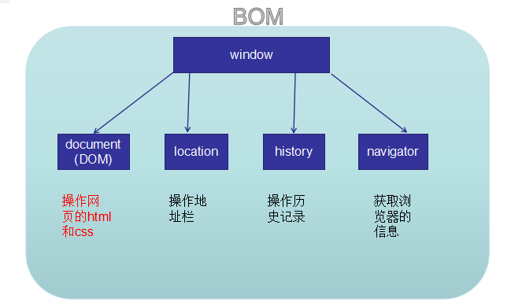

# webAPI

## 1 DOM 获取元素

## 2 注册事件

### 2.1 事件处理程序中的 this

> 事件处理程序中的 this 指向事件源 js 高级里有详解

### 2.2 取消 a 标签默认行为

```html
<body>
  <a href="http://www.baidu.com">链接</a>
  <a href="javascript:">链接2</a>
  <!--  第一种方式   -->
  <script type="text/javascript">
    //取消a的默认行为
    var link = document.querySelector('a')
    link.onclick = function(e) {
      alert(123)
      // return false;   //第二种方式
      e.preventDefault() //第三种方式（有兼容性问题）
    }
  </script>
</body>
```

## 3 操作元素的属性

```js
//className操作类名
var div = document.getElementById('box') // 获取类名
console.log(div.class) // undefined  注意：此时调用的是系统自带class 类似于var  要调用必须使用className
div.className = 'b' // 设置类名为b
console.log(div.className)
```

```js
//innerText和innerHTML的区别
var div = document.getElementById('box') //获取div元素
console.log(div.innerText) //  通过innerText获取,仅仅包含文本
console.log(div.innerHTML) //通过innerHTML获取，包含为本和标签
div.innerHTML = '<a href="#">我是div中的超链接</a>' // 设置时innerHTML可以渲染标签
// div.innerText = '<a href="#">我是div中的超链接</a>'; //innerText只能是文本，若有标签则当作文本显示
//ps:  textContent和innerText用法一致， textContent 低版本ie不支持   innerText兼容性好  常用
```

案例：webAPI day1

## 4 操作元素的样式

### 4.1 通过 style 属性设置样式

```html
<div>111</div>
<script>
  var div = document.querySelector('div')
  div.style.width = '300px'
  div.style.height = '300px'
  // background-color → backgroundColor
  div.style.backgroundColor = 'red'
  // div.style.fontSize = '50px';
  div.style.font = 'bold 50px "宋体"'

  // 若操作少量的样式时，适合用style属性操作
</script>
```

### 4.2 通过 className 更改类名设置样式

```html
<style>
  .a {
    width: 300px;
    height: 300px;
    background-color: red;
    font: bold 50px '宋体';
  }
  .b {
    width: 500px;
    height: 500px;
    background: purple;
  }
</style>
<div>111</div>
<script>
  var div = document.querySelector('div')
  div.className = 'b'
  // 若操作多个样式属性时，用className管理比较合适
</script>
```

案例：开关灯

```js
var btn = document.querySelector('input')
var flag = true
btn.onclick = function() {
  if (flag) {
    document.body.style.background = 'black' //body的使用可以不用声明  直接如右侧方式写
    btn.value = '开灯'
    flag = false
  } else {
    document.body.style.background = 'white'
    btn.value = '关灯'
    flag = true
  }
}
```

## 5 操作表单元素的属性

- value 操作表单元素的内容 - 获取：==元素.value;== 返回字符串 - 设置：==元素.value = 值;==
- disabled 操作表单元素是否禁用 - 获取：==元素.disabled;== 返回布尔值（true→ 禁用，false→ 不禁用）; - 设置：==元素.disabled = 布尔值;==
- checked 操作表单元素是否选中 - 获取：==元素.checked;== 返回布尔值（true→ 选中，false→ 不选中）; - 设置：==元素.checked = 布尔值;==
- selected 操作表单元素的是否选中 - 获取： ==元素.selected;== - 设置：==元素.selected = 布尔值;==

> add: input:checked 选择器

```html
<!DOCTYPE html>
<html lang="en">
  <head>
    <meta charset="UTF-8" />
    <title>Document</title>
    <style type="text/css">
      input:checked {
        /*当input被选中时所发生的变化*/
        width: 100px;
        height: 100px;
      }
    </style>
  </head>
  <body>
    <input type="checkbox" />幼圆 <input type="checkbox" />唱歌
    <input type="checkbox" />跳舞
  </body>
</html>
```

案例：webAPI day2

## 6 自定义行内属性 getAttribute()

```html

<script>
  var img = document.querySelector('img')
  // console.log(img.src); //可以直接输出图片的路径      系统支持：src ; 可以通过元素直接调用
  // console.log(img.bigSrc); // undefined             自定义的标签属性：bigSrc；不可以通过元素直接点的方式调用
  var v = img.getAttribute('bigSrc') // 获取
  console.log(v) //输出为big.jpg
  img.setAttribute('bigSrc', '10086.jpg') // 设置img的属性为 bigSrc='10086.jpg'
  img.removeAttribute('bigSrc') //// 移除bigSrc
  //注意：set/get/removeAttribute不仅可以操作自定义标签属性，还可以操作系统支持标签属性。
  var v = img.getAttribute('src') //获取src属性  console.log输出在控制台中
  console.log(v)
</script>
```

## 7 节点关系

```html
<!DOCTYPE html>
<html lang="en">
  <head>
    <meta charset="UTF-8" />
    <title>Document</title>
  </head>

  <body>
    <div id="d1">
      
      <p>段落</p>
      <span>span</span>
    </div>

    <script type="text/javascript">
      //通过父节点获取子元素：
      var d1 = document.getElementById('d1')
      // var re = d1.children;//仅仅获取d1中的元素 输出为数组
      var re = d1.childNodes //获取d1中所有的元素和文本 输出为数组
      console.log(re) // 输出为：text img text p text span text
      //查看输出节点的类型：nodeType
      console.log(re[0].nodeType) //文本类型输出为3
      console.log(re[1].nodeType) //元素类型输出为1
      for (var i = 0; i < re.length; i++) {
        if (re[i].nodeType == 1) {
          //条件要求为不等于1 即非文本类型
          console.log(re[i]) //节点元素可以通过遍历数组的方式筛选出来，和d1.children效果一样
        }
      }
      //查看输出节点的名字：
      console.log(re[0].nodeName) //文本类型输出为#text
      console.log(re[1].nodeName) //元素类型输出为大写的标签名IMG
      //查看节点的值
      console.log(re[0].nodeValue) //文本类型的输出为 文本的内容 re[0]为空
      console.log(re[1].nodeValue) //元素类型输出为null

      // console.log(d1.firstElementChild); //输出d1里第一个子元素(img)
      // console.log(d1.lastElementChild); //输出d1里最后一个子元素(span)

      //通过子节点获取父元素：
      var p = document.querySelector('p')
      console.log(p.parentNode) //获取p的父亲的节点  可以多次往上获取 p.parentNode.parentNode

      //通过同级兄弟元素获取：
      // var p = document.querySelector('p');
      // console.log(p.previousElementSibling); //获取上一个元素兄弟(p的上一个兄弟为img)   //previousSibling
      // console.log(p.nextElementSibling); //获取p的下一个元素兄弟(p的下一个兄弟为span)//newSibling
    </script>
  </body>
</html>
```

## 8 动态创建、追加、删除元素

### 8.1 createElement 创建

主要用这种方式创建（不拼接字符串，效率高）

```html
<!DOCTYPE html>
<html lang="en">
  <head>
    <meta charset="UTF-8" />
    <meta name="viewport" content="width=device-width, initial-scale=1.0" />
    <meta http-equiv="X-UA-Compatible" content="ie=edge" />
    <title>Document</title>
  </head>

  <body>
    <input type="button" value="按钮" />
    <ul></ul>
    <script>
      //首选createElement方式创建
      //不知道该放哪的知识点：lis[i].index=i 是往DOM树上加的  所以是可以的    img.src是往html上加的  所以不行
      var btn = document.querySelector('input')
      var ul = document.querySelector('ul')
      btn.onclick = function() {
        var newLi = document.createElement('li')
        ul.appendChild(newLi) //动态添加元素     ul.removeChild 动态删除元素
        newLi.innerHTML = '我是新来的'
      }
    </script>
  </body>
</html>
```

### 8.2 innerHTML

不常用 了解即可

```html
<!DOCTYPE html>
<html lang="en">
  <head>
    <meta charset="UTF-8" />
    <meta name="viewport" content="width=device-width, initial-scale=1.0" />
    <meta http-equiv="X-UA-Compatible" content="ie=edge" />
    <title>Document</title>
  </head>

  <body>
    <input type="button" value="按钮" />
    <ul></ul>
    <script>
      var btn = document.querySelector('input')
      var ul = document.querySelector('ul')
      btn.onclick = function() {
        var str = ul.innerHTML
        ul.innerHTML = str + '<li>我是新来的</li>'
      }
    </script>
  </body>
</html>
```

案例： webAPI day3

## 9 插入、替换、克隆元素

```html
<!DOCTYPE html>
<html lang="en">
  <head>
    <meta charset="UTF-8" />
    <title>Document</title>
  </head>

  <body>
    <input type="button" value="点击" />

    <ul>
      <li>1</li>
      <li id="d1">2</li>
      <li>3</li>
    </ul>
    <div class="c1" id="d2">
      <p>短裤</p>
      
      <span>span</span>
    </div>

    <script type="text/javascript">
      var btn = document.querySelector('input')
      var ul = document.querySelector('ul')
      var d1 = document.getElementById('d1')
      var div = document.querySelector('div')

      //插入元素    父节点.insertBefore(新的节点, 旧的子节点)
      //替换元素    父节点.replaceChild(新的节点,旧的子节点)
      btn.onclick = function() {
        var li = document.createElement('li') // 创建新元素li
        // ul.insertBefore(li,d1);//插入元素
        ul.replaceChild(li, d1) //替换元素
        li.innerText = '哇哈哈'
      }

      /*
 微博案例中 要往li下插入新的li 后面的参数含义：ul的第零个孩子
 var li = document.createElement('li');
 ul.insertBefore(li, ul.children[0]) */

      // 克隆元素 元素.cloneNode(true或false);
      //true克隆时标签内的内容及元素都克隆   false只克隆标签     默认为false
      btn.onclick = function() {
        var newDiv = div.cloneNode(true)
        document.body.appendChild(newDiv)
      }
    </script>
  </body>
</html>
```

## 10 事件监听和移除

```html
<!DOCTYPE html>
<html lang="en">
  <head>
    <meta charset="UTF-8" />
    <title>Document</title>
  </head>

  <body>
    <input type="button" value="点击" />

    <div class="c1">
      <div class="c2"></div>
    </div>

    <script type="text/javascript">
      //知识点
      //为什么要用事件监听：多个事件用onclick方式注册会发生覆盖问题 仅最后一个生效
      // btn.onclick = function () {
      // console.log(1);
      // }
      // btn.onclick = function () {
      // console.log(2);
      // }
      // btn.onclick = function () {
      // console.log(3);
      // }
      //btn.onclick = null;    //移除事件  事件未注册默认为null

      //实现代码
      var btn = document.querySelector('input')

      var fn1 = function() {
        console.log(1)
      }
      var fn2 = function() {
        console.log(2)
      }
      var fn3 = function() {
        console.log(3)
      }
      btn.addEventListener('click', fn1) //添加监听

      btn.addEventListener('click', fn2) //语法：事件源.addEventListener('事件类型',事件处理程序,是否捕获);
      //'click'不加on    函数      默认为false true是捕获 false是冒泡
      btn.addEventListener('click', fn3) //注意：事件类型，不加on

      // btn.addEventListener('click', function(){
      // console.log(3);
      // })

      //移除事件(前提：注册事件处理程序时，事件处理程序要有名字，而不是匿名函数 此案例中函数的名字为fn1 fn2 fn3
      btn.removeEventListener('click', fn1) //移除监听

      btn.removeEventListener('click', fn2) //事件源.removeEventListener('事件类型',事件处理程序的名称)

      btn.removeEventListener('click', fn3) //注意：事件类型，不加on
    </script>
  </body>
</html>
```

## 11 事件流

> 事件触发后的三个阶段（捕获阶段、目标阶段、冒泡阶段) 略写详细的自己去查吧（webAPI day4 笔记中有）

案例：webAIP day4

## 12 事件对象

什么是事件对象：事件对象，在事件触发后，在事件处理程序中（函数体），所获取并操作的对象。

- 获取事件对象

```js
btn.onclick = function(e) {
  console.log(e) // 打印点击时发生的所有事件 就是事件对象
}
```

### 12.1 鼠标事件对象相关属性

- 鼠标事件 - onclick - onmouseenter 不支持冒泡 - onmouseleave 不支持冒泡 - onmouseover 支持冒泡 - onmouseout 支持冒泡 - onmousemove 鼠标移动事件 - onmouseup 鼠标按钮弹起事件 - onmousedown 鼠标按键按下事件
- 键盘事件 - document.onkeydown 键盘按下事件 - document.onkeyup 键盘弹起事件

```html
<!DOCTYPE html>
<html lang="en">
  <head>
    <meta charset="UTF-8" />
    <title>Document</title>
    <style type="text/css">
      body {
        height: 5000px;
      }
      div {
        width: 100px;
        height: 100px;
        background-color: red;
        margin: 100px;
      }
    </style>
  </head>
  <body>
    <div></div>
    <script type="text/javascript">
      var div = document.querySelector('div')
      div.onclick = function(e) {
        // 打印参照浏览器xy坐标值
        console.log(e.clientY, e.clientX)
        // 打印参照文档的xy坐标值
        console.log(e.pageY, e.pageX)
        // 打印参照当前元素的xy坐标值
        console.log(e.offsetY, e.offsetX)
      }
    </script>
  </body>
</html>
```

案例：

```html
<!DOCTYPE html>
<html lang="en">
  <head>
    <meta charset="UTF-8" />
    <title>Document</title>
    <style type="text/css">
      div {
        height: 300px;
        background-color: black;
        color: white;
        cursor: crosshair;
      }
    </style>
  </head>

  <body>
    <div>坐标x,y</div>

    <script type="text/javascript">
      //需求：在div上移动，显示真实的X,Y【以浏览器为基准点】

      // 获取div
      var div = document.querySelector('div')

      // 添加事件
      div.onmousemove = function(e) {
        // 获取x和y的值
        var x = e.clientX
        var y = e.clientY
        // 赋值给div内容
        div.innerText = '坐标' + x + ',' + y
      }
    </script>
  </body>
</html>
```

案例：鼠标移动小鸟

```html
<!DOCTYPE html>
<html lang="en">
  <head>
    <meta charset="UTF-8" />
    <title>Document</title>
    <style type="text/css">
      img {
        width: 100px;
        position: absolute;
        border: 1px solid red;
      }
    </style>
  </head>

  <body>
    

    <script type="text/javascript">
      var img = document.querySelector('img')
      document.onmousemove = function(e) {
        // 获取鼠标x和y的值
        var x = e.clientX
        var y = e.clientY

        // 赋值给img，left，top
        img.style.left = x - 50 + 'px'
        img.style.top = y - 50 + 'px'
      }
    </script>
  </body>
</html>
```

### 12.2 键盘事件对象相关属性

案例：键盘移动小鸟

```html
<!DOCTYPE html>
<html lang="en">
  <head>
    <meta charset="UTF-8" />
    <title>Document</title>
    <style type="text/css">
      body {
        background-color: skyblue;
      }

      img {
        width: 100px;
        position: absolute;
        left: 0;
        top: 0;
      }

      .toLeft {
        transform: rotateY(180deg);
      }

      .toUp {
        transform: rotateZ(-90deg);
      }

      .toDown {
        transform: rotateZ(90deg);
      }
    </style>
  </head>

  <body>
    

    <script type="text/javascript">
      var img = document.querySelector('img')
      var x = 0
      var y = 0
      document.onkeydown = function(e) {
        if (e.keyCode == 37) {
          x -= 10
          img.className = 'toLeft'
        } else if (e.keyCode == 38) {
          y -= 10
          img.className = 'toUp'
        } else if (e.keyCode == 39) {
          x += 10
          img.className = ''
        } else if (e.keyCode == 40) {
          y += 10
          img.className = 'toDown'
        }

        // 设置img的left和top
        img.style.left = x + 'px'
        img.style.top = y + 'px'
      }
    </script>
  </body>
</html>
```

案例：拖拽案例

```html
<!DOCTYPE html>
<html lang="en">
  <head>
    <meta charset="UTF-8" />
    <meta name="viewport" content="width=device-width, initial-scale=1.0" />
    <meta http-equiv="X-UA-Compatible" content="ie=edge" />
    <title>Document</title>
    <style>
      * {
        margin: 0;
        padding: 0;
      }
      body {
        background: #000;
      }
      .login {
        width: 350px;
        height: 300px;
        background: #fff;
        position: absolute;
        text-align: center;
      }
      .login .tip {
        background: rgb(0, 119, 255);
        font: bold 16px/30px '宋体';
        color: #fff;
        user-select: none;
        cursor: move;
      }
      .login p {
        margin-top: 30px;
      }
      .login button {
        width: 150px;
        height: 30px;
        border-radius: 15px;
        outline: none;
        background: rgb(0, 119, 255);
        color: #fff;
        font-weight: bold;
      }
    </style>
  </head>

  <body>
    <div class="login">
      <div class="tip">登录</div>
      <div>
        <p>
          <label> 用户名：<input type="text" /> </label>
        </p>
        <p>
          <label> 密　码：<input type="text" /> </label>
        </p>
        <p>
          <button>Login</button>
        </p>
      </div>
    </div>

    <script type="text/javascript">
      // 需求：上方蓝色条按下可以移动，抬起不可以移动
      // 鼠标移动login移动【left，top】【按下后才可以移动】
      var login = document.querySelector('.login')
      // 获取tip添加事件
      var tip = document.querySelector('.tip')

      // 添加事件
      tip.onmousedown = function(e1) {
        //为了解决位置移动的bug
        //记录点击时参照元素的x和y的值
        var x1 = e1.offsetX
        var y1 = e1.offsetY

        // 移动事件
        document.onmousemove = function(e) {
          // 鼠标坐标值
          var x = e.clientX
          var y = e.clientY

          // 把坐标值赋值给login的left和top
          login.style.left = x - x1 + 'px'
          login.style.top = y - y1 + 'px'
        }
      }
      tip.onmouseup = function() {
        document.onmousemove = null
      }
    </script>
  </body>
</html>
```

## 13 事件对象

> 区别于 this: this 始终代表的事件源 e.target 代表的是最先触发的阶段

```js
e.target //获取最先触发的元素
e.preventDefault() //阻止默认行为
e.stopPropagation() //阻止冒泡
```

### 13.1 最先触发的元素

```html
<!DOCTYPE html>
<html lang="en">
  <head>
    <meta charset="UTF-8" />
    <title>Document</title>
    <style type="text/css">
      div {
        width: 300px;
        height: 100px;
        background-color: red;
      }

      div p {
        background-color: blue;
      }

      div h2 {
        background-color: yellow;
      }
    </style>
  </head>

  <body>
    <div>
      <p>段落</p>
      
      <h2>标题</h2>
    </div>

    <script type="text/javascript">
      var div = document.querySelector('div')

      div.onclick = function(e) {
        // console.log(this);
        console.log(e.target) //获取最先触发的元素
        //区别于this  this在事件处理程序中始终代表的是事件源  e.target代表不一定是事件源，代表的是最先触发的元素
      }
    </script>
  </body>
</html>
```

### 13.2 e.preventDefault()

```html
<!DOCTYPE html>
<html lang="en">
  <head>
    <meta charset="UTF-8" />
    <title>Document</title>
  </head>
  <body>
    <!-- 对象.属性
	     对象.方法() -->
    <a href="http://www.baidu.com">链接</a>

    <script type="text/javascript">
      var link = document.querySelector('a')

      link.onclick = function(e) {
        // return false;
        e.preventDefault() //事件对象.preventDefault();   阻止默认行为,存在兼容性问题
      }
    </script>
  </body>
</html>
```

### 13.3 e.stopPropagation()

```html
<!DOCTYPE html>
<html lang="en">
  <head>
    <meta charset="UTF-8" />
    <meta name="viewport" content="width=device-width, initial-scale=1.0" />
    <meta http-equiv="X-UA-Compatible" content="ie=edge" />
    <title>Document</title>
    <style>
      .box1 {
        width: 500px;
        height: 500px;
        border: 1px solid blue;
        background: blue;
        margin: 0 auto;
      }
      .box2 {
        width: 400px;
        height: 400px;
        border: 1px solid green;
        background: green;
        margin: 50px auto;
      }
      .box3 {
        width: 300px;
        height: 300px;
        border: 1px solid purple;
        background: purple;
        margin: 50px auto;
      }
      .box4 {
        width: 200px;
        height: 200px;
        border: 1px solid gold;
        background: gold;
        margin: 50px auto;
      }
    </style>
  </head>
  <body>
    <div class="box1">
      <div class="box2">
        <div class="box3">
          <div class="box4"></div>
        </div>
      </div>
    </div>
    <script>
      var divs = document.querySelectorAll('div')
      for (var i = 0; i < divs.length; i++) {
        divs[i].addEventListener(
          'click',
          function(e) {
            alert(this.className)
            e.stopPropagation() //事件对象.stopPropagation();  停止冒泡传播
          },
          false
        )
      }
    </script>
  </body>
</html>
```

### 13.4 事件委托

```html
<!DOCTYPE html>
<html lang="en">
  <head>
    <meta charset="UTF-8" />
    <title>Document</title>
    <style type="text/css">
      ul li {
        background-color: red;
        margin: 10px;
      }
    </style>
  </head>

  <body>
    <ul>
      <li>1</li>
      <li>2</li>
      <li>3</li>
      <li>4</li>
      <li>5</li>
      <li>6</li>
      <li>7</li>
      <li>8</li>
      <li>9</li>
      <li>10</li>
    </ul>
    <script type="text/javascript">
      //为什么要用事件委托：减少事件绑定，节省内存  只有下级委托上级

      // 给li的上级元素注册事件
      var ul = document.querySelector('ul')
      ul.onclick = function(e) {
        // 最先触发事件的元素
        // console.log(e.target.innerText);
        if (e.target.nodeName == 'LI') {
          console.log(e.target.innerText)
        }
      }

      // var lis = document.querySelectorAll('li');   //此种方法可行，但是占用内存多 浪费内存
      // for (var i = 0; i < lis.length; i++) {
      //lis[i].onclick = function () {
      //console.log(this.innerText);
      //}
      // }
    </script>
  </body>
</html>
```

## 14 window(顶级对象)



> window 对象被 称为顶级对象或全局对象
> 因为全局变量和全局函数本质上都是 window 对象的属性或方法。
> window 对象可以省略。

### 14.1 windon 下的对话框

```js
window.alert('我是一个弹出框')
window.prompt('请输入银行卡密码', '哇哈哈') //第二个参数是默认输入的字 取消输出为null 输入则正常输出输入的值
window.confirm('汉字ZZZ') //confirm输出的值类型为布尔值 false or true
```

### 14.2 windon 定时器

```js
// 一次性定时器
var btn = document.querySelector('input')
var num1 = window.setTimeout(function() {
  // 创建一次性定时器
  alert('一次性定时器')
}, 5000)
console.log(num1) //输出为1

var num2 = window.setTimeout(function() {
  alert(123)
}, 6000)
console.log(num2) //输出为2

btn.onclick = function() {
  window.clearTimeout(num1) // 点击清除一次性定时器
  window.clearTimeout(num2)
}

// 反复性定时器
var dsq = window.setInterval(function() {
  // 创建反复性定时器
  alert('反复性定时器')
}, 1000)
var btn = document.querySelector('input')
btn.onclick = function() {
  window.clearInterval(dsq) //清除
}
```

> 定时器代码晚于非定时器代码的执行

## 15 BOM 下的对象

### 15.1 location 对象

```js
var btn = document.querySelector('input')

btn.onclick = function() {
  // location对象【对象.属性,对象.方法()】
  alert(location.href)
  location.href = 'http://www.baidu.com' //注意：这是一个属性  属性的使用方式是   键名=键值
  // location.reload();  //刷新页面
  // location.assign('http://www.baidu.com');//加载到特定页面  有历史记录 可以返回
  // location.replace('http://www.baidu.com');//替换页面 没有历史记录 不能返回
}
```

### 15.2 history 对象

```js
var btn = document.querySelector('input')

btn.onclick = function() {
  console.log(history.length) //history.length 是属性
}

var d1 = document.getElementById('d1')
d1.onclick = function() {
  // history.back();//返回上一个历史记录
  // history.forward();//前进下一个历史记录
  history.go(1) //正数，表示前进； 负数，表示回退；
}
```

### 15.3 screen 对象

```js
var w = screen.width //检测屏幕宽度
var h = screen.height //检测屏幕高度
alert(w + ',' + h)
var w1 = screen.availWidth //去除任务栏后的宽度
var h1 = screen.availHeight //去除任务栏后的高度
alert(w1 + ',' + h1)
alert(navigator.userAgent) //获取浏览器的信息
```

### 15.4 navigator 对象

```js
if (navigator.userAgent.indexOf('Chrome') != -1) {
  // 注意区分大小写
  alert('你狠流行用谷歌')
} else if (navigator.userAgent.indexOf('Firefox') != -1) {
  alert('你很时髦用火狐')
} else {
  alert('杀马特非主流用IE')
}
```

### 15.5 window.onload()

```js
window.onload = function() {
  // 加载事件  一般绑定给window  正常调用
  var d1 = document.getElementById('d1')
  console.log(d1)
}
```

案例：计时器

```html
<!DOCTYPE html>
<html lang="en">
  <head>
    <meta charset="UTF-8" />
    <title>Document</title>
    <style type="text/css">
      div {
        font-size: 60px;
        text-align: center;
        color: red;
        background-color: yellow;
      }
    </style>
  </head>

  <body>
    <div>时间</div>

    <script type="text/javascript">
      // 获取div放入内容
      var div = document.querySelector('div')

      // 启动定时器
      window.setInterval(function() {
        // 获取当前时间
        var n = new Date()
        // 放到div中
        div.innerText = n.toLocaleString()
      }, 1000)

      // 获取当前时间
      var n = new Date()

      // 放到div中
      div.innerText = n.toLocaleString()
    </script>
  </body>
</html>
```

案例：webAPI day6

## 16 元素的 offset 属性

### 16.1 offset

```js
// offset获取元素大小
var div = document.querySelector('div')
console.log(div.style.width) // 该方法只能获取行内样式
console.log(div.offsetWidth) // 获取div元素  返回的是数字类型 获取的是div的 内容+padding+border 宽度
console.log(div.offsetHeight)
//div.offsetWidth只能获取   不能赋值  赋值用div.style.width

//  offset获取元素位置
var s = document.querySelector('.s')
console.log(s.offsetLeft) // 获取横向位置
console.log(s.offsetTop) // 获取纵向位置
console.log(s.parentNode) // parentNode  获取的父级div标签   参照的是标签关系
console.log(s.offsetParent) // offsetParent  获取父级元素  参照定位获取  若无定位 则获取整个body
```

### 16.2 client

```js
var div = document.querySelector('div')
console.log(div.offsetWidth) //                              width + padding + border
console.log(div.clientWidth) //区别于offset获取的内容没有border    width + padding
console.log(div.clientLeft) //获取的是边框的厚度
console.log(div.clientTop)
```

### 16.3 scroll

```js
var div = document.querySelector('div')
console.log(div.scrollWidth) // 内容 + padding + 溢出部分
console.log(div.clientWidth) // 内容 + padding
console.log(div.offsetWidth) // 内容 + padding + border
```

案例：

```html
<!DOCTYPE html>
<html lang="en">
  <head>
    <meta charset="UTF-8" />
    <title>Document</title>
    <style type="text/css">
      div {
        width: 500px;
        height: 500px;
        border: 1px solid #ccc;
        margin: 0 auto;
        overflow: auto;
      }
      input {
        float: right;
      }
    </style>
  </head>
  <body>
    <div>
      <p>内容</p>
      <p>内容</p>
      <p>内容</p>
      <p>内容</p>
      <p>内容</p>
      <p>内容</p>
      <p>内容</p>
      <p>内容</p>
      <p>内容</p>
      <p>内容</p>
      <p>内容</p>
      <p>内容</p>
      <p>内容</p>
      <p>内容</p>
      <p>内容</p>
      <p>内容</p>
      <p>内容</p>
      <p>内容</p>
      <p>内容</p>
      <p>内容</p>
      <p>内容</p>
      <p>内容</p>
      <p>内容</p>
      <p>内容</p>
      <p>内容</p>
      <p>内容</p>
      <p>内容</p>
      <p>内容</p>
      <p>内容</p>
      <p>内容</p>
      <p>内容</p>
      <p>内容</p>
      <p>内容</p>
      <p>内容</p>
      <p>内容</p>
      <p>内容</p>
      <p>内容</p>
      <p>内容</p>
      <p>内容</p>
      <p>内容</p>
      <p>内容</p>
      <p>内容</p>
      <p>内容</p>
      <p>内容</p>
      <p>内容</p>
      <p>内容</p>
      <p>内容</p>
      <p>内容</p>
      <p>内容</p>
      <p>内容</p>
      <p>内容</p>
      <p>内容</p>
      <p>内容</p>
      <p>内容</p>
      <p>内容</p>
      <p>内容</p>
      <p>内容</p>
      <p>内容</p>
      <p>内容</p>
      <p>内容</p>
      <p>内容</p>
      <p>内容</p>
      <p>内容</p>
      <p>内容</p>
      <p>内容</p>
      <p>内容</p>
      <p>内容</p>
      <p>内容</p>
      <p>内容</p>
      <p>内容</p>
      <p>内容</p>
      <p>内容</p>
      <p>内容</p>
      <p>内容</p>
      <p>内容</p>
      <p>内容</p>
      <p>内容</p>
      <p>内容</p>
      <p>内容</p>
      <p>内容</p>
      <p>内容</p>
      <p>内容</p>
      <p>内容</p>
      <p>内容</p>
      <p>内容</p>
      <p>内容</p>
      <p>内容</p>
      <p>内容</p>
      <p>内容</p>
      <p>内容</p>
      <p>内容</p>
      <p>内容</p>
      <p>内容</p>
      <p>内容</p>
      <p>内容</p>
      <p>内容</p>
      <p>内容</p>
      <p>内容</p>
      <p>内容</p>
      <p>内容</p>
    </div>
    <input type="button" value="点击" />
    <script type="text/javascript">
      var div = document.querySelector('div')

      div.onscroll = function() {
        // onscroll:滚动条在谁身上，事件源就加给谁

        console.log(div.scrollTop) //没用的部分
      }

      var btn = document.querySelector('input')

      btn.onclick = function() {
        // 点击按钮把div卷除去的距离设置为0

        div.scrollTop = 0 //注意：div.scrollTop可以赋值
      }
    </script>
  </body>
</html>
```

## 17 动画

封装：

```js
// 封装动画
/*

element：要移动的元素
targetVal：要移动的距离
speed：每次挪动距离

 */
var dsq
function moveElement(element, targetVal, speed) {
  // 在启动定时器前要把上面的一个定时器清除
  window.clearInterval(dsq)

  // 反复性定时器
  dsq = window.setInterval(function() {
    // 获取div当前左边的距离
    var leftVal = element.offsetLeft
    // 判断是否到大目的距离
    if (leftVal == targetVal) {
      window.clearInterval(dsq)
      return
    }

    if (Math.abs(targetVal - leftVal) < speed) {
      //不够挪的时候，直接把元素设置到目标地址
      element.style.left = targetVal + 'px'
    } else {
      // 够挪
      // 挪动10
      // 目标距离如果大于左端距离正方向，如果目标距离小于左端距离反方向
      if (targetVal - leftVal > 0) {
        leftVal = leftVal + speed
      } else {
        leftVal = leftVal - speed
      }

      // 赋值给div的left的值
      element.style.left = leftVal + 'px'
    }
  }, 100)
}
```

调用：

```html
<!DOCTYPE html>
<html lang="en">
  <head>
    <meta charset="UTF-8" />
    <title>Document</title>
    <style type="text/css">
      * {
        margin: 0;
        padding: 0;
      }

      div {
        width: 100px;
        height: 100px;
        background-color: pink;
        position: absolute;
        top: 50px;
      }
      p {
        width: 200px;
        height: 200px;
        background-color: yellow;
        position: absolute;
        top: 200px;
      }
    </style>
  </head>
  <body>
    <input type="button" value="正方向移动" id="btn1" />
    <input type="button" value="反方向移动" id="btn2" />
    <div></div>
    <p></p>

    <script type="text/javascript" src="moveElement.js"></script>
    <script type="text/javascript">
      // 获取元素
      var btn1 = document.getElementById('btn1')
      var btn2 = document.getElementById('btn2')
      var div = document.querySelector('div')
      var p = document.querySelector('p')

      // 正方向移动
      btn1.onclick = function() {
        moveElement(div, 1000, 36)
      }

      // 反方向移动
      btn2.onclick = function() {
        moveElement(div, 0, 66)
      }
    </script>
  </body>
</html>
```

案例：webAPI day7

## 18 touch 事件

### 18.1 touch 事件类型

```js
//移动端的touch事件需要配合事件监听使用
document.addEventListener('touchstart', function() {
  //手指按下事件
  console.log('按下')
})
document.addEventListener('touchmove', function() {
  //手指移动事件
  console.log('移动')
})
document.addEventListener('touchend', function() {
  //手指松开事件
  console.log('抬起')
})
```

### 18.2 touch 事件对象

```js
document.addEventListener('touchstart', function(e) {
  console.log(e.touches[0]) //位于屏幕上索引值为0的手指（第一个手指）的列表内容
  console.log(e.targetTouches[0]) //位于该元素上的第一个手指列表内容
  console.log(e.changedTouches[0]) //发生改变的手指列表内容
})
document.addEventListener('touchend', function(e) {
  //触摸结束时发生的事件
  console.log(e.touches[0]) //undefined
  console.log(e.targetTouches[0]) //undefined
  console.log(e.changedTouches[0]) //发生改变的手指列表的内容
})
```

### 18.3 touch 事件中获取手指位置

```js
document.addEventListener('touchstart', function(e) {
  console.log(e.touches[0].clientX, e.touches[0].clientY) //相较于可视区域的XY值    使用较多
  console.log(e.touches[0].pageX, e.touches[0].pageY) //整个文档的XY值
})
```

案例：判断点击与滑动

```html
<!DOCTYPE html>
<html lang="en">
  <head>
    <meta charset="UTF-8" />
    <title>Document</title>
    <style type="text/css">
      div {
        width: 100px;
        height: 100px;
        background-color: red;
      }
    </style>
  </head>

  <body>
    <div></div>
    <script type="text/javascript">
      // 按下事件，获取XY的值
      var startx, starty
      document.addEventListener('touchstart', function(e) {
        // 按下的x和y值
        startx = e.touches[0].clientX
        starty = e.touches[0].clientY
      })

      document.addEventListener('touchend', function(e) {
        // 抬起的x和y值
        var endx = e.changedTouches[0].clientX
        var endy = e.changedTouches[0].clientY

        // 判断
        if (startx == endx && starty == endy) {
          //&&与  一假则假
          //||或  一真则真
          console.log('点击')
        } else {
          console.log('滑动')
        }
      })
    </script>
  </body>
</html>
```

案例：判断滑动方向

```html
<!DOCTYPE html>
<html lang="en">
  <head>
    <meta charset="UTF-8" />
    <title>Document</title>
  </head>
  <body>
    <script type="text/javascript">
      var startx, starty
      // 按下位置
      document.addEventListener('touchstart', function(e) {
        // 按下位置
        startx = e.touches[0].clientX
        starty = e.touches[0].clientY
      })

      // 抬起位置
      document.addEventListener('touchend', function(e) {
        // 抬起位置
        var endx = e.changedTouches[0].clientX
        var endy = e.changedTouches[0].clientY

        // 计算
        var x = Math.abs(endx - startx)
        var y = Math.abs(endy - starty)

        // 判断方向
        if (x > y) {
          if (endx > startx) {
            console.log('右')
          } else if (endx < startx) {
            console.log('左')
          }
        } else if (x < y) {
          if (endy > starty) {
            console.log('下')
          } else {
            console.log('上')
          }
        }
      })
    </script>
  </body>
</html>
```

案例：拖拽

```html
<!DOCTYPE html>
<html lang="en">
  <head>
    <meta charset="UTF-8" />
    <title>Document</title>
    <style type="text/css">
      div {
        width: 100px;
        height: 100px;
        background-color: red;
        position: absolute;
      }
    </style>
  </head>
  <body>
    <div></div>

    <script type="text/javascript">
      var div = document.querySelector('div')
      // 按下时候的坐标值
      var x1, y1
      div.addEventListener('touchstart', function(e) {
        // 获取坐标值
        x1 = e.touches[0].clientX
        y1 = e.touches[0].clientY
      })

      // 移动时候的坐标值
      div.addEventListener('touchmove', function(e) {
        // 获取坐标值
        var x2 = e.touches[0].clientX
        var y2 = e.touches[0].clientY

        // 计算差值
        var x = x2 - x1
        var y = y2 - y1

        // 赋值给div
        div.style.left = div.offsetLeft + x + 'px'
        div.style.top = div.offsetTop + y + 'px'

        // x1和y1不能固定，根据元素移动改变x1和y1的值
        x1 = x2
        y1 = y2
      })
    </script>
  </body>
</html>
```

### 18.4 transitionend 事件

```js
div.addEventListener('transitionend', function() {
  //transitionend  检测过渡结束后的行为
  div.style.background = 'blue'
  div.style.transition = 'none'
})
```

轮播图等案例 webAPI day8
